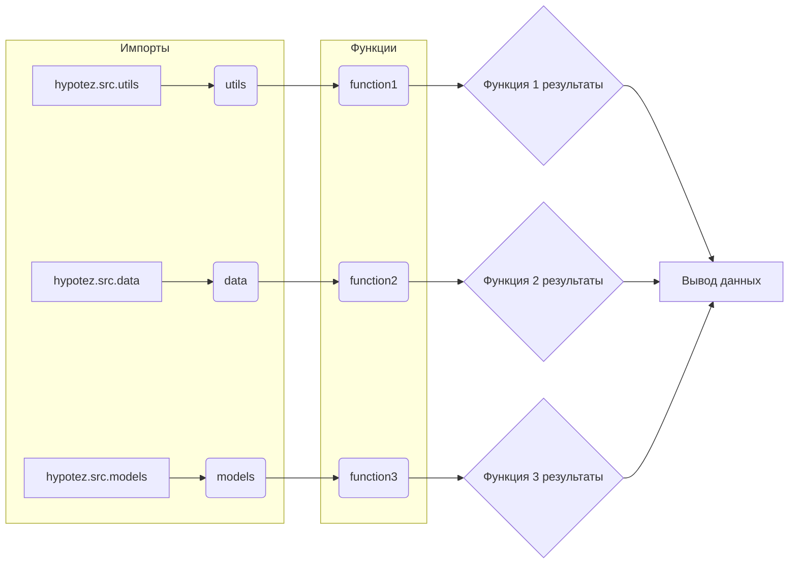

# Документация для instruction_code_explainer

## Обзор

Этот модуль предоставляет инструменты для анализа Python-кода и генерации подробной документации, включая алгоритмическое описание, диаграммы зависимостей (Mermaid) и объяснение кода. Он предназначен для помощи разработчикам в понимании и использовании предоставляемого кода.

## Алгоритм

Алгоритм анализа кода проходит следующие этапы:

1. **Парсинг входного кода:** Модуль принимает на вход Python-код.
2. **Анализ импортов:** Определяются используемые модули и библиотеки.
3. **Идентификация классов и функций:** Выявляются ключевые элементы кода (классы, методы, функции).
4. **Описание алгоритма:** Для каждой функции/метода строится пошаговая блок-схема, описывающая рабочий процесс.
5. **Генерация диаграммы зависимостей (Mermaid):** Создается диаграмма, показывающая взаимосвязь импортированных модулей и функций.
6. **Подробное объяснение:**  Описание импортов, классов, функций, переменных и потенциальных проблем.
7. **Анализ взаимосвязей с другими частями проекта:** Выявление связи с другими модулями/компонентами проекта.

**Пример блок-схемы (гипотетический):**

```mermaid
graph TD
    A[Получение входного кода] --> B{Анализ импортов};
    B --> C[Идентификация функций];
    C --> D[Описание функции 1];
    D --> E[Генерация Mermaid диаграммы];
    E --> F[Описание импортов];
    F --> G[Описание классов];
    G --> H[Описание переменных];
    H --> I[Выявление потенциальных проблем];
    I --> J[Генерация выходного текста (Markdown)];
    J --> K[Вывод результата];
```

## Mermaid



**Описание диаграммы:**

* Диаграмма показывает зависимости между модулями `utils`, `data` и `models` в проекте `hypotez`.
* Функции `function1`, `function2` и `function3` используют данные из соответствующих модулей.
* Результаты функций передаются в общую точку вывода.

## Объяснение

**Импорты:**

Модули `utils`, `data` и `models` (гипотетически) содержат вспомогательные функции, данные и модели, необходимые для анализа кода. Они расположены в пакете `hypotez.src`.

**Классы (если есть):**

Описание структуры и функциональности классов, если они присутствуют в коде.

**Функции:**

Описание функций, их аргументов, возвращаемых значений и области применения.

**Переменные:**

Описание переменных, их типов и роли в коде.

**Возможные ошибки:**

Недостаточно информации для анализа ошибок или улучшений.

**Взаимосвязь с другими частями проекта:**

Модуль может взаимодействовать с другими частями проекта через вызовы функций или доступ к данным.


**Примечания:**  Для полноценного описания требуется сам Python-код.  Это описание является шаблоном и должно быть адаптировано под конкретный входной файл.