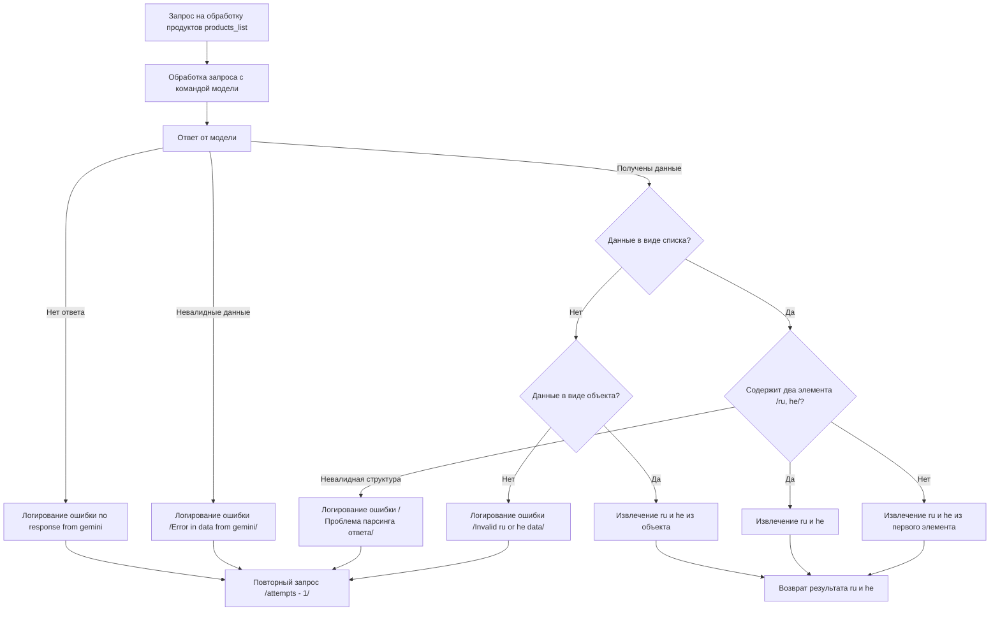

# Сценарии обработки запросов к модели Gemini

## Обзор

Данный файл описывает различные сценарии обработки запросов к модели Gemini, направленных на извлечение данных.  Документация охватывает этапы обработки, включая валидацию ответа, проверку структуры данных и логирование ошибок.

## Диаграмма состояний



## Логирование ошибок

- **`no response from gemini`**: Ошибка, возникающая при отсутствии ответа от модели Gemini.
- **`Error in data from gemini`**: Ошибка, возникающая при получении невалидных данных от Gemini.
- **`Проблема парсинга ответа`**: Ошибка, возникающая при некорректной структуре данных ответа.
- **`Invalid ru or he data`**: Ошибка, возникающая при отсутствии или некорректном формате данных `ru` и `he` в ответе.


## Этапы обработки запросов

1. **Запрос на обработку продуктов (`products_list`)**:  Инициализация запроса к модели Gemini.

2. **Обработка запроса с командой модели**: Обработка запроса с заданными параметрами.

3. **Получение ответа от модели**: Получение ответа от модели Gemini.

4. **Проверка на отсутствие ответа**: Проверка ответа на наличие. При отсутствии запускается повторный запрос.

5. **Проверка валидности данных**: Проверка ответа на валидность полученных данных.

6. **Проверка структуры данных**: Проверка на полученный тип данных (список или объект). Проверка списка на наличие нужных элементов (`ru`, `he`). Если они есть, извлекаются, иначе извлекаются из первого элемента списка.

7. **Извлечение данных**: Извлечение данных `ru` и `he` из полученного ответа.

8. **Возврат результата**: Возвращение извлеченных значений `ru` и `he`.

## Примечания

-  Данная документация описывает общую логику обработки запросов. Конкретные реализации могут отличаться в зависимости от контекста.
-  В каждом из этапов обработки (особенно в блоках логирования ошибок) необходима дополнительная детализация для корректной отладки.


```