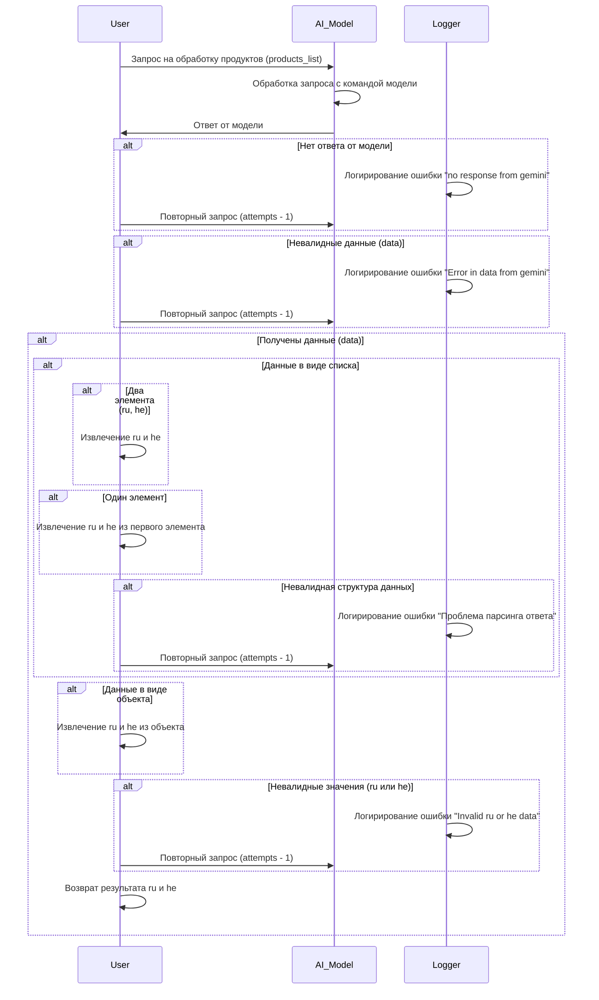

# Диаграмма процесса обработки списка продуктов (scenario_picelist.process_ai.mmd)

## Обзор

Данная диаграмма описывает процесс обработки запроса пользователя на обработку списка продуктов (products_list) с помощью AI-модели.  Процесс включает в себя обработку ошибок, повторные запросы и проверку валидности данных.

## Диаграмма

## Обрабатываемые типы данных

Данный процесс может принимать данные в виде списка или объекта. При получении списка, проверяется соответствие структуре:

* Если в списке два элемента (например,  `[ru_data, he_data]`), они будут извлечены напрямую.
* Если в списке один элемент,  извлекаются ru и he из первого элемента этого списка.
* В случае несоответствия ожидаемой структуре, регистрируется ошибка "Проблема парсинга ответа".

Если данные передаются в виде объекта, то происходит извлечение полей ru и he из объекта.

## Возможные ошибки

Процесс обрабатывает следующие возможные ошибки:

* **"no response from gemini"**: Ошибка, возникающая, если AI-модель не отвечает на запрос.
* **"Error in data from gemini"**: Ошибка, если полученные данные не соответствуют ожидаемому формату.
* **"Проблема парсинга ответа"**: Ошибка, если полученный список или объект не имеет ожидаемой структуры для извлечения значений ru и he.
* **"Invalid ru or he data"**: Ошибка, если значения ru или he не имеют корректного формата или отсутствуют.

## Логирование ошибок

В процессе используется модуль `Logger` для регистрации всех ошибок.

## Результат

В случае успешной обработки, процесс возвращает извлеченные значения `ru` и `he`.