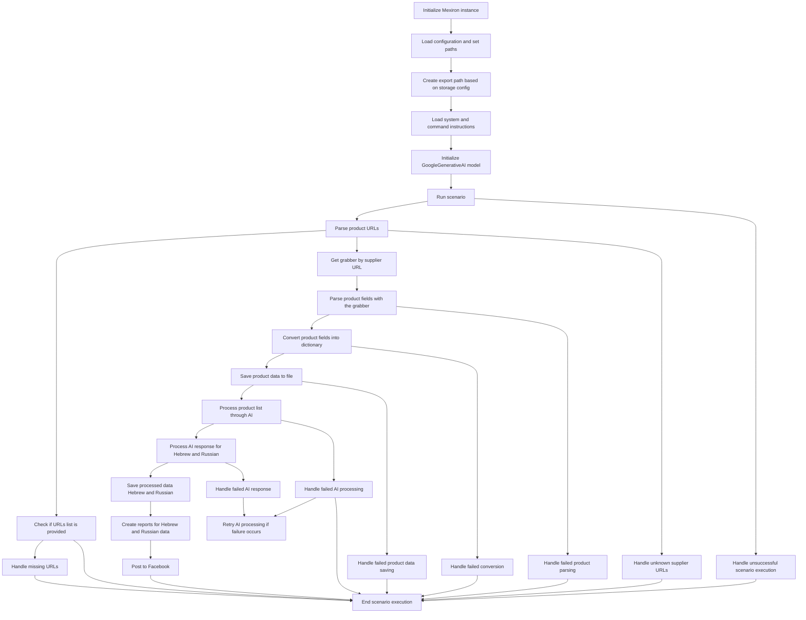

# Сценарий формирования прайс-листа (mermaid)

## Обзор

Данный сценарий описывает процесс автоматизированного формирования прайс-листа с использованием внешних сервисов и API. Он включает в себя этапы загрузки конфигурации, инициализации моделей, извлечения данных, обработки и, в конечном счете, публикации результатов.

## Диаграмма потока

## Этапы сценария

### Инициализация Mexiron

- Инициализируется экземпляр класса Mexiron.

### Загрузка конфигурации

- Загружаются параметры конфигурации и задаются пути к необходимым файлам и ресурсам.

### Создание пути к экспорту

- Создается путь к экспорту данных, основанный на конфигурации хранения.

### Загрузка инструкций

- Загружаются инструкции для обработки данных и выполнения сценария.

### Инициализация модели AI

- Инициализируется модель GoogleGenerativeAI для обработки данных.

### Запуск сценария

- Выполняется основной сценарий обработки данных.

### Парсинг URL

- Получаются URL-адреса для извлечения данных о товарах.

### Проверка списка URL

- Проверяется, что список URL-адресов не пустой.

### Обработка отсутствующих URL

- Обработка ситуаций, когда URL-адреса отсутствуют или недоступны.

### Получение граббера

- Получается инструмент (граббер) для извлечения данных с определенного поставщика.

### Парсинг полей

- Извлекаются необходимые поля данных о товарах с помощью граббера.

### Преобразование в словарь

- Преобразуются извлеченные данные в формат словаря.

### Сохранение данных

- Сохраняются данные о товарах в файл.

### Обработка данных AI

- Данные о товарах передаются на обработку AI-модели.

### Обработка ответа AI

- Обрабатывается ответ от AI-модели для русского и иврита.

### Сохранение обработанных данных

- Сохраняются обработанные данные на русском и иврите.

### Генерация отчетов

- Создаются отчеты на основе обработанных данных на русском и иврите.

### Публикация на Facebook

- Публикуются отчеты на Facebook.

### Завершение сценария

- Завершается выполнение сценария.

### Обработка ошибок

- Включает в себя обработку различных ошибок, включая:
    - Ошибки при парсинге данных.
    - Ошибки при преобразовании данных в словарь.
    - Ошибки при сохранении данных в файл.
    - Ошибки при обработке данных AI.
    - Ошибки при получении данных с неизвестных поставщиков.
    - Ошибки при работе с пустым списком URL.
- Для каждой ошибки предусмотрен отдельный механизм обработки и, при необходимости, повторной попытки.