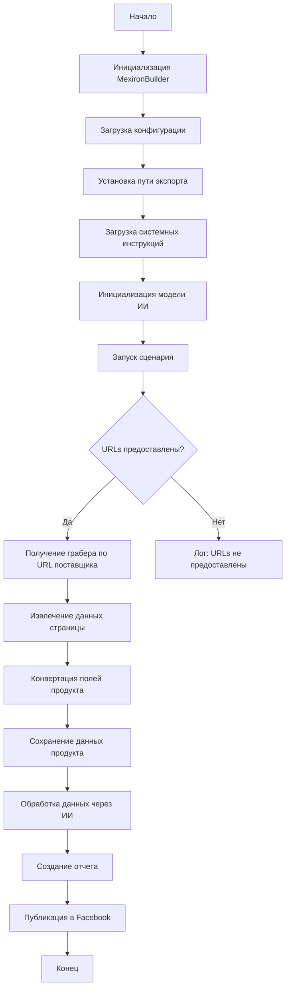

# Сценарий создания мехирона для Сергея Казаринова

## Обзор

Этот скрипт предназначен для автоматизации создания "мехирона" для Сергея Казаринова. Он извлекает, парсит и обрабатывает данные о продуктах от различных поставщиков, подготавливает данные, обрабатывает их через ИИ и интегрирует с Facebook для публикации продуктов.

## Оглавление

- [Сценарий создания мехирона для Сергея Казаринова](#сценарий-создания-мехирона-для-сергея-казаринова)
    - [Обзор](#обзор)
    - [Основные возможности](#основные-возможности)
    - [Блок-схема модуля](#блок-схема-модуля)
    - [Легенда](#легенда)
    - [Класс: `MexironBuilder`](#класс-mexironbuilder)
        - [`__init__(self, driver: Driver, mexiron_name: Optional[str] = None)`](#__init__self-driver-driver-mexiron_name-optionalstr--none))
        - [`run_scenario(self, system_instruction: Optional[str] = None, price: Optional[str] = None, mexiron_name: Optional[str] = None, urls: Optional[str | List[str]] = None, bot = None) -> bool`](#run_scenarioself-system_instruction-optionalstr--none-price-optionalstr--none-mexiron_name-optionalstr--none-urls-optionalstr--liststr--none-bot--none--bool)]
        - [`get_graber_by_supplier_url(self, url: str)`](#get_graber_by_supplier_urlself-url-str)]
        - [`convert_product_fields(self, f: ProductFields) -> dict`](#convert_product_fieldsself-f-productfields--dict)]
        - [`save_product_data(self, product_data: dict)`](#save_product_dataself-product_data-dict)]
        - [`process_ai(self, products_list: List[str], lang: str, attempts: int = 3) -> tuple | bool`](#process_aiself-products_list-liststr-lang-str-attempts-int--3--tuple--bool)]
        - [`post_facebook(self, mexiron: SimpleNamespace) -> bool`](#post_facebookself-mexiron-simplenamespace--bool)]
        - [`create_report(self, data: dict, html_file: Path, pdf_file: Path)`](#createreself-data-dict-html_file-path-pdf_file-path)]
    - [Использование](#использование)
    - [Пример](#пример)
    - [Зависимости](#зависимости)
    - [Обработка ошибок](#обработка-ошибок)
    - [Вклад](#вклад)
    - [Лицензия](#лицензия)

## Основные возможности

1. **Извлечение и парсинг данных**: Извлекает и парсит данные о продуктах от различных поставщиков.
2. **Обработка данных через ИИ**: Обрабатывает извлеченные данные через модель Google Generative AI.
3. **Хранение данных**: Сохраняет обработанные данные в файлы.
4. **Генерация отчетов**: Генерирует HTML и PDF отчеты из обработанных данных.
5. **Публикация в Facebook**: Публикует обработанные данные в Facebook.

## Блок-схема модуля

## Легенда

(Описание элементов блок-схемы - смотри исходный код)

## Класс: `MexironBuilder`

### `__init__(self, driver: Driver, mexiron_name: Optional[str] = None)`

**Назначение**: Инициализирует класс `MexironBuilder` с необходимыми компонентами.

**Параметры**:
- `driver`: Экземпляр `Selenium WebDriver`.
- `mexiron_name`: Пользовательское имя для процесса мехирона (необязательно).

### `run_scenario(self, system_instruction: Optional[str] = None, price: Optional[str] = None, mexiron_name: Optional[str] = None, urls: Optional[str | List[str]] = None, bot = None) -> bool`

**Назначение**: Выполняет сценарий: парсит продукты, обрабатывает их через ИИ и сохраняет данные.

**Параметры**:
- `system_instruction`: Системные инструкции для модели ИИ (необязательно).
- `price`: Цена для обработки (необязательно).
- `mexiron_name`: Пользовательское имя мехирона (необязательно).
- `urls`: Список URL страниц продуктов (необязательно).
- `bot`: (Описание параметра)

**Возвращает**: `True`, если сценарий выполнен успешно, иначе `False`.

**(Подробное описание с блок-схемой - смотри исходный код)**

### `get_graber_by_supplier_url(self, url: str)`

**(Описание - смотри исходный код)**

### `convert_product_fields(self, f: ProductFields) -> dict`

**(Описание - смотри исходный код)**

### `save_product_data(self, product_data: dict)`

**(Описание - смотри исходный код)**

### `process_ai(self, products_list: List[str], lang: str, attempts: int = 3) -> tuple | bool`

**(Описание - смотри исходный код)**

### `post_facebook(self, mexiron: SimpleNamespace) -> bool`

**(Описание - смотри исходный код)**

### `create_report(self, data: dict, html_file: Path, pdf_file: Path)`

**(Описание - смотри исходный код)**

## Использование

**(Описание - смотри исходный код)**

## Пример

**(Описание - смотри исходный код)**

## Зависимости

**(Описание - смотри исходный код)**

## Обработка ошибок

**(Описание - смотри исходный код)**

## Вклад

**(Описание - смотри исходный код)**

## Лицензия

**(Описание - смотри исходный код)**