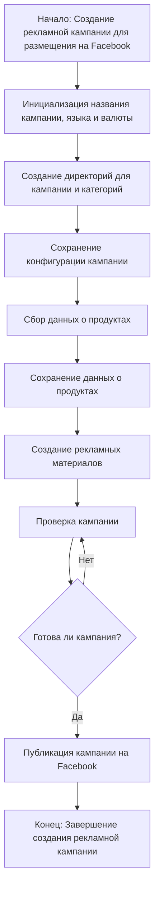

# Модуль `campaign` - Управление рекламными кампаниями на Facebook

## Обзор

Модуль `campaign` предназначен для управления процессом создания и публикации рекламных кампаний на Facebook. Он включает функционал для инициализации параметров кампании (название, язык, валюта), создания структуры директорий, сохранения конфигураций для новой кампании, сбора и сохранения данных о продуктах через `ali` или `html`, генерации рекламных материалов, проверки кампании и публикации ее на Facebook.  Графическая схема процесса представлена ниже.

## Функции

### `initialize_campaign`

**Описание**: Инициализирует параметры новой рекламной кампании.

**Параметры**:

- `campaign_name` (str): Название кампании.
- `language` (str): Язык кампании.
- `currency` (str): Валюта кампании.

**Возвращает**:

- `dict`: Словарь с параметрами кампании или `None`, если произошла ошибка.

**Вызывает исключения**:

- `ValueError`: Если переданные параметры некорректны.

### `create_directories`

**Описание**: Создает структуру директорий для кампании.

**Параметры**:

- `campaign_name` (str): Название кампании.

**Возвращает**:

- `bool`: `True`, если директории созданы успешно, `False` в противном случае.

**Вызывает исключения**:

- `OSError`: Если возникли проблемы с созданием директорий.

### `save_config`

**Описание**: Сохраняет конфигурацию кампании в файл.

**Параметры**:

- `campaign_data` (dict): Данные о кампании.
- `filepath` (str): Путь к файлу для сохранения.

**Возвращает**:

- `bool`: `True`, если конфигурация сохранена успешно, `False` в противном случае.

**Вызывает исключения**:

- `IOError`: Если возникли проблемы при записи в файл.

### `collect_product_data`

**Описание**:  Собирает данные о продуктах из разных источников (али или html).

**Параметры**:

- `source` (str): Источник данных (`ali` или `html`).
- `params` (dict): Параметры для запроса данных.

**Возвращает**:

- `list[dict]`: Список словарей с данными о продуктах. Возвращает пустой список, если данные не найдены.

**Вызывает исключения**:

- `ValueError`: Если некорректный источник данных.
- `Exception`: Если возникла ошибка при сборе данных из указанного источника.

### `generate_ads_materials`

**Описание**: Генерирует рекламные материалы на основе данных о продуктах.

**Параметры**:

- `products` (list[dict]): Список данных о продуктах.

**Возвращает**:

- `list[dict]`: Список словарей с сгенерированными рекламными материалами. Возвращает пустой список, если нет данных о продуктах.

**Вызывает исключения**:

- `TypeError`: Если передан некорректный тип данных.

### `check_campaign`

**Описание**: Проверяет готовность кампании к публикации.

**Параметры**:

- `campaign_data` (dict): Данные о кампании.

**Возвращает**:

- `bool`: `True`, если кампания готова, `False` в противном случае. Возвращает `False` в случае ошибок при проверке.

**Вызывает исключения**:

- `Exception`: При любых проблемах при проверке.

### `publish_campaign`

**Описание**: Публикует кампанию на Facebook.

**Параметры**:

- `campaign_data` (dict): Данные о кампании.

**Возвращает**:

- `bool`: `True`, если кампания опубликована успешно, `False` в противном случае.

**Вызывает исключения**:

- `FacebookAPIError`: При проблемах с API Facebook.
- `Exception`: При любых других проблемах.