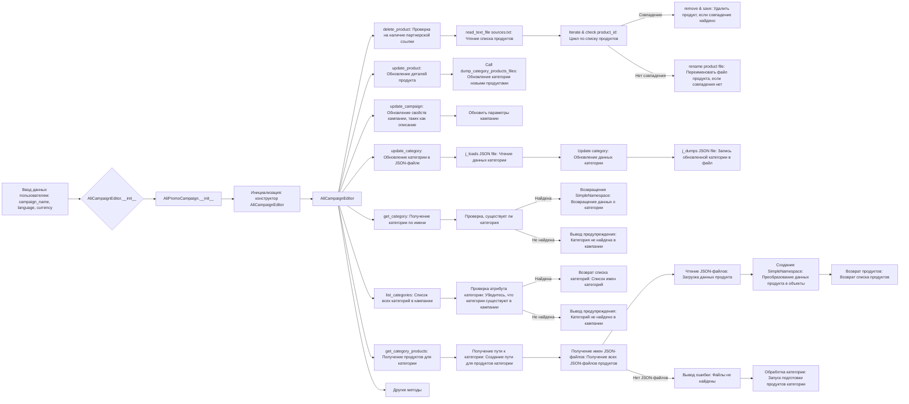
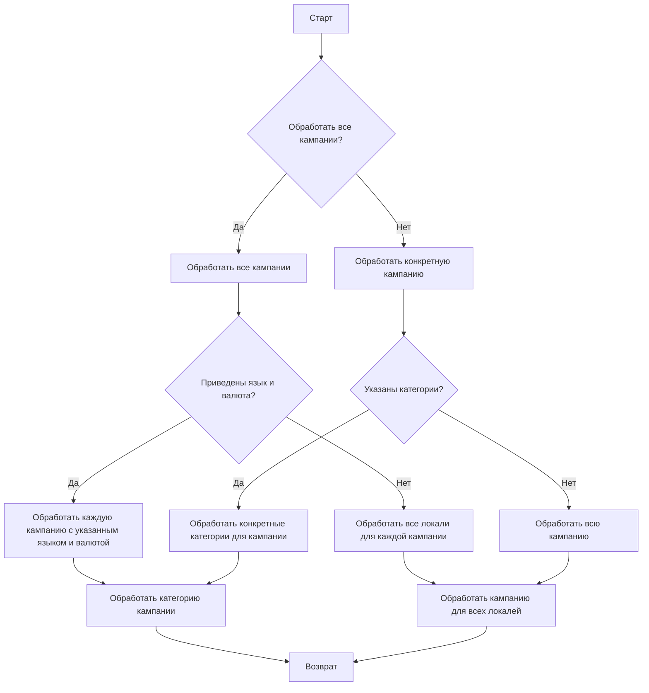

# Модуль `src.suppliers.aliexpress.campaign`

## Обзор

Модуль `src.suppliers.aliexpress.campaign` предназначен для управления процессом создания и публикации рекламных кампаний на Facebook. Он включает функциональность для инициализации параметров кампании (название, язык, валюта), создания директорий, сохранения конфигурации новой кампании, сбора и сохранения данных о продуктах через `ali` или `html`, генерации рекламных материалов, проверки кампании и публикации ее на Facebook.

```mermaid
flowchart TD
    A[Start: Создание рекламной кампании для размещения на Facebook] --> B[Инициализировать Название, Язык и Валюту кампании]
    B --> C[Создать Директории кампании и категорий]
    C --> D[Сохранить Конфигурацию кампании]
    D --> E[Собрать Данные о продуктах]
    E --> F[Сохранить Данные о продуктах]
    F --> G[Создать Рекламные материалы]
    G --> H[Проверить кампанию]
    H --> I{Готова ли кампания?}\
    I -- Да --> J[Опубликовать кампанию на Facebook]
    I -- Нет --> H
    J --> K[Конец: Завершение создания рекламной кампании]
```

**Этапы создания кампании:**

- **Шаг 1**: Начало - процесс начинается.
- **Шаг 2**: Инициализация параметров кампании - определяется название, язык и валюта кампании. Пример: Название кампании: "Летняя распродажа", Язык: "Русский", Валюта: "RUB".
- **Шаг 3**: Создание директорий кампании и категорий - создаются необходимые директории или файлы для кампании. Пример: Создается структура папок на файловой системе для хранения активов кампании.
- **Шаг 4**: Сохранение конфигурации кампании - сохранены инициализированные данные о кампании. Пример: Данные записываются в базу данных или файл конфигурации.
- **Шаг 5**: Сбор данных о продуктах - собираются данные о продуктах, которые будут рекламироваться в рамках кампании. Пример: ID продукта, описания, изображения и цены извлекаются из системы инвентаризации.
- **Шаг 6**: Сохранение данных о продуктах - сохранены собранные данные о продуктах. Пример: Данные записываются в таблицу базы данных, предназначенную для продуктов кампании.
- **Шаг 7**: Создание рекламных материалов - генерируются или выбираются графические изображения, баннеры и другие рекламные материалы. Пример: Изображения и описания адаптированы для привлечения клиентов.
- **Шаг 8**: Проверка кампании - процесс проверки подтверждает готовность компонентов кампании. Пример: Человек или система проверяют качество и полноту всех компонентов кампании.
- **Шаг 9**: Готова ли кампания? - проверка для определения того, завершена ли кампания и готова ли она к публикации. Пример: Логический флаг сигнализирует "Да", если все в порядке, в противном случае "Нет", что запускает цикл обратно к предыдущему шагу для внесения исправлений.
- **Шаг 10**: Публикация кампании - кампания запускается в работу на платформе, готовая к маркетинговым усилиям. Пример: Производятся API-вызовы для публикации кампании на соответствующей платформе.
- **Шаг 11**: Конец - процесс создания кампании завершен.


## Редактирование кампании



## Подготовка кампании

