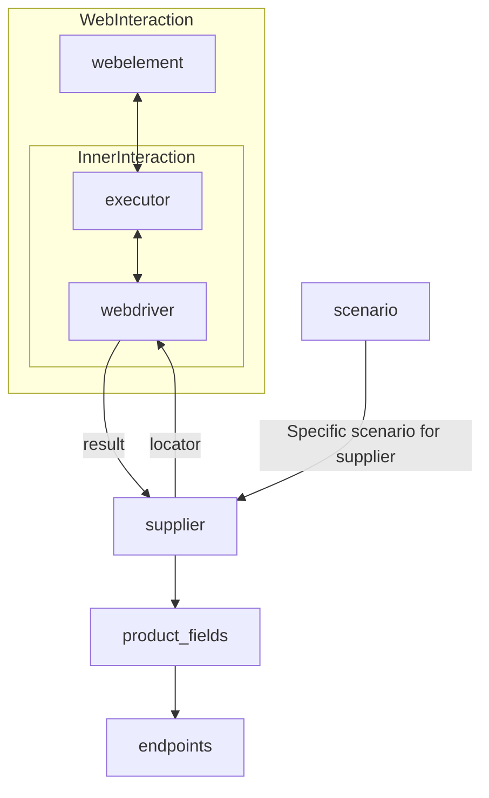

# Модуль `suppliers`

## Обзор

Этот модуль предоставляет базовый класс `Supplier` для взаимодействия с различными поставщиками данных. Класс `Supplier` унифицирует операции по работе с поставщиками, предоставляя стандартный интерфейс для получения данных с различных источников (сайтов, документов, баз данных). Каждый поставщик имеет уникальный префикс. Подробности о префиксах можно найти в файле `prefixes.md`.

## Классы

### `Supplier`

**Описание**: Базовый класс для всех поставщиков. Представляет собой провайдера информации, который может быть производителем товаров, данных или информации. Источниками данных могут быть главная страница сайта, документ, база данных или таблица.  Этот класс объединяет различные поставщиков под единым набором операций.  У каждого поставщика есть уникальный префикс.

**Атрибуты**:

- `supplier_id` (int): Уникальный идентификатор поставщика.
- `supplier_prefix` (str): Префикс поставщика, например, `'amazon'`, `'aliexpress'`.
- `supplier_settings` (dict): Настройки поставщика, загружаемые из файла JSON.
- `locale` (str): Код локализации (по умолчанию: `'en'`).
- `price_rule` (str): Правила расчета цен (например, правила НДС).
- `related_modules` (module): Модули для вспомогательных операций с конкретным поставщиком.
- `scenario_files` (list): Список файлов сценариев, которые нужно выполнить.
- `current_scenario` (dict): Сценарий, который выполняется в данный момент.
- `login_data` (dict): Данные для аутентификации.
- `locators` (dict): Словарь локаторов веб-элементов.
- `driver` (Driver): Экземпляр WebDriver для взаимодействия с сайтом поставщика.
- `parsing_method` (str): Метод парсинга данных (например, `'webdriver'`, `'api'`, `'xls'`, `'csv'`).

**Методы**:

#### `__init__`

**Конструктор класса `Supplier`.**

```python
def __init__(self, supplier_prefix: str, locale: str = 'en', webdriver: str | Driver | bool = 'default', *attrs, **kwargs):
    """Инициализирует экземпляр Supplier.

    Args:
        supplier_prefix (str): Префикс поставщика.
        locale (str, optional): Код локализации. По умолчанию 'en'.
        webdriver (str | Driver | bool, optional): Тип WebDriver. По умолчанию 'default'.

    Raises:
        DefaultSettingsException: Если настройки по умолчанию не настроены должным образом.
    """
```

#### `_payload`

**Загружает настройки поставщика и инициализирует WebDriver.**

```python
def _payload(self, webdriver: str | Driver | bool, *attrs, **kwargs) -> bool:
    """Загружает настройки, локаторы и инициализирует WebDriver.

    Args:
        webdriver (str | Driver | bool): Тип WebDriver.

    Returns:
        bool: Возвращает `True`, если загрузка прошла успешно.
    """
```

#### `login`

**Обрабатывает аутентификацию на сайте поставщика.**

```python
def login(self) -> bool:
    """Производит аутентификацию пользователя на сайте поставщика.

    Returns:
        bool: Возвращает `True`, если вход выполнен успешно.
    """
```

#### `run_scenario_files`

**Выполняет один или несколько файлов сценариев.**

```python
def run_scenario_files(self, scenario_files: str | List[str] = None) -> bool:
    """Выполняет предоставленные файлы сценариев.

    Args:
        scenario_files (str | List[str], optional): Список или путь к файлам сценариев.

    Returns:
        bool: Возвращает `True`, если сценарии были успешно выполнены.
    """
```

#### `run_scenarios`

**Выполняет указанные сценарии.**

```python
def run_scenarios(self, scenarios: dict | list[dict]) -> bool:
    """Выполняет указанные сценарии.

    Args:
        scenarios (dict | list[dict]): Сценарии для выполнения.

    Returns:
        bool: Возвращает `True`, если все сценарии были успешно выполнены.
    """
```


## Список реализованных поставщиков

(Список поставщиков с указанием используемых рабочих процессов)

* [aliexpress](aliexpress) - Реализован с двумя рабочими процессами: `webdriver` и `api`
* [amazon](amazon) - `webdriver`
* ... (и другие поставщики)


## Как это работает

(Описание этапов работы с поставщиком)

1. **Инициализация**: Метод `__init__` настраивает префикс поставщика, локаль и WebDriver.
2. **Загрузка настроек**: `_payload` загружает конфигурацию, инициализирует локаторы и WebDriver.
3. **Аутентификация**: `login` выполняет вход на сайт поставщика.
4. **Выполнение сценариев**: `run_scenario_files`/`run_scenarios` выполняет сценарии.


## Диаграмма

