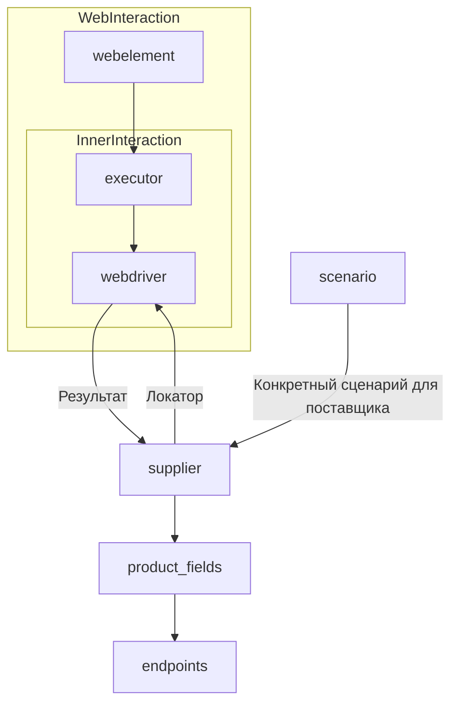

# Класс `Supplier`

## Обзор

Класс `Supplier` служит основой для управления взаимодействием с поставщиками информации. Он выполняет инициализацию, настройку, аутентификацию и запуск сценариев для различных источников данных (например, `amazon.com`, `walmart.com`, `mouser.com`, `digikey.com`).  Пользователь может определить дополнительных поставщиков.  Каждый поставщик имеет уникальный префикс (подробнее см. [prefixes.md](prefixes.md)).

## Список реализованных поставщиков

* [aliexpress](aliexpress/README.RU.MD) - Реализован в двух вариантах сценариев: `webriver` и `api`.
* [amazon](amazon/README.RU.MD) - `webdriver`.
* [bangood](bangood/README.RU.MD) - `webdriver`.
* [cdata](cdata/README.RU.MD) - `webdriver`.
* [chat_gpt](chat_gpt/README.RU.MD) - Работа с чатом chatgpt (НЕ С МОДЕЛЬЮ!).
* [ebay](ebay/README.RU.MD) - `webdriver`.
* [etzmaleh](etzmaleh/README.RU.MD) - `webdriver`.
* [gearbest](gearbest/README.RU.MD) - `webdriver`.
* [grandadvance](grandadvance/README.RU.MD) - `webdriver`.
* [hb](hb/README.RU.MD) - `webdriver`.
* [ivory](ivory/README.RU.MD) - `webdriver`.
* [ksp](ksp/README.RU.MD) - `webdriver`.
* [kualastyle](kualastyle/README.RU.MD) - `webdriver`.
* [morlevi](morlevi/README.RU.MD) - `webdriver`.
* [visualdg](visualdg/README.RU.MD) - `webdriver`.
* [wallashop](wallashop/README.RU.MD) - `webdriver`.
* [wallmart](wallmart/README.RU.MD) - `webdriver`.
* [Подробно о веб-драйвере (Driver)](../webdriver/README.RU.MD).
* [Подробно о сценариях (Scenario)](../scenarios/README.RU.MD).



## Атрибуты

* `supplier_id` (int): Уникальный идентификатор поставщика.
* `supplier_prefix` (str): Префикс поставщика (например, `'amazon'`, `'aliexpress'`).
* `supplier_settings` (dict): Настройки поставщика (из JSON-файла).
* `locale` (str, optional): Код локализации (по умолчанию: `'en'`).
* `price_rule` (str): Правила расчета цен (например, правила НДС).
* `related_modules` (module): Модули-помощники для работы с конкретным поставщиком.
* `scenario_files` (list): Список файлов сценариев для выполнения.
* `current_scenario` (dict): Текущий выполняемый сценарий.
* `login_data` (dict): Данные для аутентификации.
* `locators` (dict): Словарь локаторов веб-элементов.
* `driver` (Driver): Экземпляр WebDriver для взаимодействия с сайтом поставщика.
* `parsing_method` (str): Метод парсинга данных (например, `'webdriver'`, `'api'`, `'xls'`, `'csv'`).


## Методы

### `__init__`

**Конструктор класса `Supplier`.**

```python
def __init__(self, supplier_prefix: str, locale: str = 'en', webdriver: str | Driver | bool = 'default', *attrs, **kwargs):
    """Инициализация экземпляра Supplier.

    Args:
        supplier_prefix (str): Префикс поставщика.
        locale (str, optional): Код локализации. По умолчанию 'en'.
        webdriver (str | Driver | bool, optional): Тип WebDriver. По умолчанию 'default'.

    Raises:
        DefaultSettingsException: Если настройки по умолчанию не настроены корректно.
    """
```

### `_payload`

**Загружает настройки поставщика и инициализирует WebDriver.**

```python
def _payload(self, webdriver: str | Driver | bool, *attrs, **kwargs) -> bool:
    """Загружает настройки, локаторы и инициализирует WebDriver.

    Args:
        webdriver (str | Driver | bool): Тип WebDriver.

    Returns:
        bool: Возвращает `True`, если загрузка выполнена успешно.
    """
```

### `login`

**Обрабатывает аутентификацию на сайте поставщика.**

```python
def login(self) -> bool:
    """Производит аутентификацию пользователя на сайте поставщика.

    Returns:
        bool: Возвращает `True`, если вход выполнен успешно.
    """
```

### `run_scenario_files`

**Выполняет один или несколько файлов сценариев.**

```python
def run_scenario_files(self, scenario_files: str | List[str] = None) -> bool:
    """Запускает предоставленные файлы сценариев.

    Args:
        scenario_files (str | List[str], optional): Список или путь к файлам сценариев.

    Returns:
        bool: Возвращает `True`, если сценарии выполнены успешно.
    """
```

### `run_scenarios`

**Выполняет указанные сценарии.**

```python
def run_scenarios(self, scenarios: dict | list[dict]) -> bool:
    """Запускает указанные сценарии.

    Args:
        scenarios (dict | list[dict]): Сценарии для выполнения.

    Returns:
        bool: Возвращает `True`, если все сценарии выполнены успешно.
    """
```

## Как это работает

(Описание работы, аналогичное в исходном коде, с улучшенной структурой)
```
```