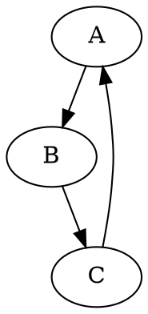

# Модуль hypotez/src/utils/convertors/dot.py

## Обзор

Модуль `hypotez/src/utils/convertors/dot.py` предоставляет функцию `dot2png` для преобразования файлов в формате DOT в изображения PNG с помощью библиотеки Graphviz.  Модуль предназначен для использования в командной строке и автоматически обрабатывает ошибки при чтении файла DOT и во время преобразования.

## Функции

### `dot2png`

**Описание**: Функция `dot2png` преобразует файл DOT в файл PNG.

**Параметры**:

- `dot_file` (str): Путь к входному файлу DOT.
- `png_file` (str): Путь к выходному файлу PNG.

**Возвращает**:

- `None`: Функция не возвращает значение, но выполняет сохранение файла PNG.

**Вызывает исключения**:

- `FileNotFoundError`: Возникает, если файл DOT не найден.
- `Exception`: Возникает при других ошибках во время преобразования.

**Пример использования**:

```python
dot2png('example.dot', 'output.png')
```

Этот пример преобразует файл `example.dot` в изображение `output.png`.

**Образец контента файла `example.dot`**:



**Использование в командной строке**:

Для запуска скрипта из командной строки необходимо использовать следующую команду:

```bash
python dot2png.py example.dot output.png
```

Эта команда создаст файл PNG с именем `output.png` из графа, определенного в файле `example.dot`.

## Обработка аргументов командной строки

Функция `if __name__ == "__main__":` обрабатывает аргументы командной строки.  Она проверяет корректность ввода и вызывает функцию `dot2png` с полученными аргументами.  Если аргументов не 3, выводится сообщение об ошибке и скрипт завершается с кодом 1.


```