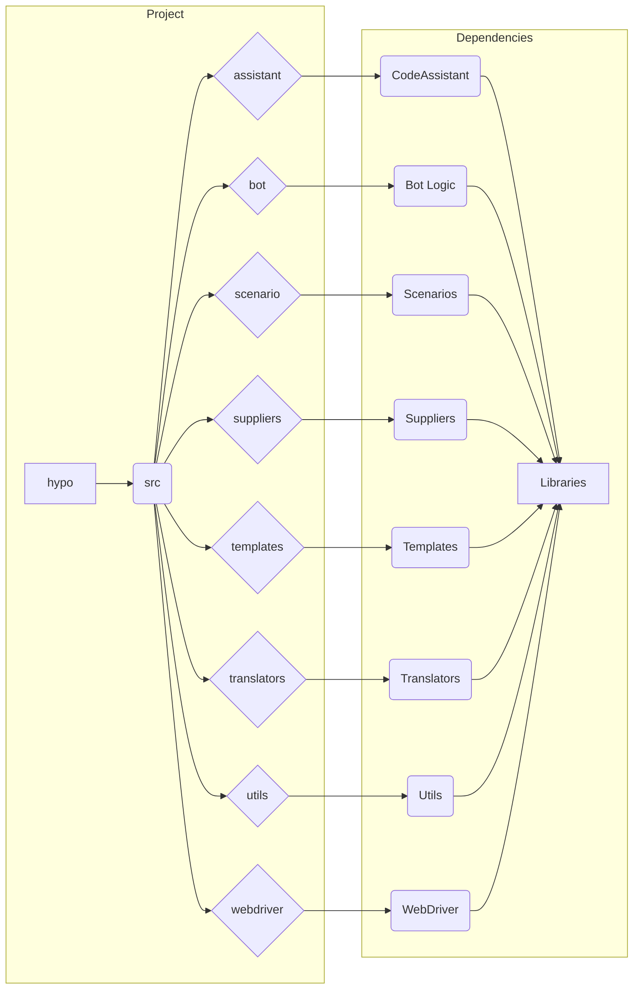

# Анализ кода (README.md)

## 1. <input code>

```rst
.. module: src
```

```
<TABLE >
<TR>
<TD>
<A HREF = 'https://github.com/hypo69/hypo/blob/master/README.MD'>[Root ↑]</A>
</TD>

<TD>
<A HREF = 'https://github.com/hypo69/hypo/blob/master/src/readme.ru.md'>Русский</A>
</TD>
</TABLE>


This document provides an overview of main progam modules

## assistant
Module for interacting with the `CodeAssistant` class, which helps with processing code tasks.

- [Module code](https://github.com/hypo69/hypo/blob/master/src/assistant/readme.en.md) - Source code for the `assistant` module.
- [Documentation](https://github.com/hypo69/hypo/blob/master/docs/gemini/en/doc/src/assistant/readme.en.md) - Documentation for the `assistant` module.
- [Tests](https://github.com/hypo69/hypo/blob/master/pytest/gemini/src/assistant) - Tests for the `assistant` module.
- [Examples](https://github.com/hypo69/hypo/blob/master/docs/examples/assistant) - Examples of using the `assistant` module.

## bot
Module for the bot logic, including message processing and handling bot commands.

- [Module code](https://github.com/hypo69/hypo/blob/master/src/bot/readme.en.md) - Source code for the `bot` module.
- [Documentation](https://github.com/hypo69/hypo/blob/master/docs/gemini/en/doc/src/bot/readme.en.md) - Documentation for the `bot` module.
- [Tests](https://github.com/hypo69/hypo/blob/master/pytest/gemini/src/bot) - Tests for the `bot` module.
- [Examples](https://github.com/hypo69/hypo/blob/master/docs/examples/bot) - Examples of using the `bot` module.

## scenario
Module for working with scenarios, including scenario generation and execution.

- [Module code](https://github.com/hypo69/hypo/blob/master/src/scenario/readme.en.md) - Source code for the `scenario` module.
- [Documentation](https://github.com/hypo69/hypo/blob/master/docs/gemini/en/doc/src/scenario/readme.en.md) - Documentation for the `scenario` module.
- [Tests](https://github.com/hypo69/hypo/blob/master/pytest/gemini/src/scenario) - Tests for the `scenario` module.
- [Examples](https://github.com/hypo69/hypo/blob/master/docs/examples/scenario) - Examples of using the `scenario` module.

## suppliers
Module for working with suppliers, including managing their data and relationships.

... (and so on for other modules)
```

## 2. <algorithm>

No algorithm can be presented as there is no code to analyze.  The provided text is a structured documentation/README file, listing modules within the `src` directory of a project, along with links to their documentation, source code, tests and examples.

## 3. <mermaid>



**Explanation of Mermaid Diagram:**

The diagram shows the project structure with the `hypo` project at the top. The `src` folder contains various modules (assistant, bot, etc.).  Each module likely has its own classes and functions. The `CodeAssistant` class, `Bot Logic`, `Scenarios` and so on, are likely important components within their respective modules.  The diagram suggests a dependency structure with various libraries.

## 4. <explanation>

This README file serves as a documentation for the modules within the `src` folder of a larger Python project named `hypo`.  It provides a high-level overview of each module, including links to the actual source code, documentation, tests, and examples.  The `.. module: src`  line in the rst syntax is used to mark the modules under `src`. It does *not* contain any executable Python code.

* **Imports:** There are no imports directly shown.  The imports would be defined in the corresponding Python files within each module.  The documentation simply directs the user to the source code for the specific module to examine these details.
* **Classes:**  The documentation mentions `CodeAssistant`, `Bot Logic`, `Scenarios` and others, which strongly suggests these are classes or key components within classes in the respective modules. The precise definition of these components would be found in the linked Python files.
* **Functions:** Likewise, the functions within each module aren't listed, but their existence is implied by the descriptions, highlighting different functionalities. Example: `generate scenario`, `process message`, etc.
* **Variables:** No specific variables are named, though their existence in functions and classes is implied. Details on variable types and usage would be in the module source code itself.
* **Errors/Improvements:** Without the source code, it's impossible to identify possible errors or areas for improvement. This documentation is a preparatory step for understanding what needs to be coded.

**Interdependencies:**  The organization through modules and links (e.g. to tests, examples, and documentation) strongly suggests a layered architecture. Each module would have its own dependencies and potentially interact with other modules through function calls and data passing.


**Important Considerations:**

The README file is a critical component for understanding the project structure and the role of different modules. It facilitates collaboration and maintainability by clearly delineating the modules and their functionality.  To get a full understanding of the project, one would need to examine the code and the associated documentation files linked within the README.