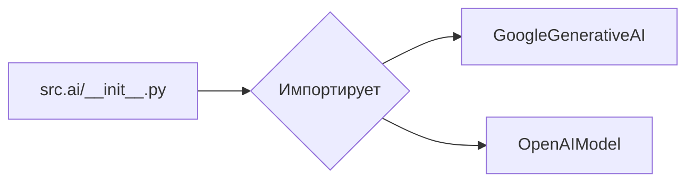
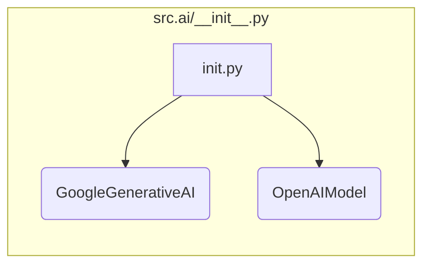

# <input code>

```python
## \file /src/ai/__init__.py
# -*- coding: utf-8 -*-

#! venv/bin/python/python3.12

"""
module: src.ai
	:platform: Windows, Unix
	:synopsis: Модуль интерфейса моделей ИИ.
	"""


from .gemini import GoogleGenerativeAI
from .openai import OpenAIModel
```

# <algorithm>

Этот код представляет собой инициализационный модуль для пакета `src.ai`.  Он импортирует классы из подмодулей `gemini` и `openai`.  Алгоритм прост – это импорт необходимых классов, необходимых для взаимодействия с моделями ИИ.  Блок-схема не требуется, так как алгоритм состоит из единственной операции - импорта.




# <mermaid>



# <explanation>

**1. Импорты:**

- `from .gemini import GoogleGenerativeAI`: Импортирует класс `GoogleGenerativeAI` из файла `gemini.py`, который находится в подкаталоге `src/ai`.  `.` указывает на поиск в текущей директории (папке `src/ai`).  Это позволяет использовать класс `GoogleGenerativeAI` в данном файле.

- `from .openai import OpenAIModel`:  Аналогично, импортирует класс `OpenAIModel` из файла `openai.py` в подкаталоге `src/ai`.

**2. Классы (не определены в данном файле):**

- `GoogleGenerativeAI`: Вероятно, представляет собой интерфейс для взаимодействия с моделью Gemini от Google.  Подробности о его функциональности будут в файле `gemini.py`.
- `OpenAIModel`: Вероятно, представляет собой интерфейс для взаимодействия с моделью OpenAI. Подробности о его функциональности будут в файле `openai.py`.

**3. Функции (отсутствуют):**

Данный файл не содержит функций.  Он только импортирует классы, которые определены в других файлах.

**4. Переменные:**

- ``:  Глобальная переменная, вероятно, задаёт режим работы (например, 'dev', 'prod').  Это может быть конфигурационное значение, которое используется в других частях проекта.


**5. Возможные ошибки или улучшения:**

- Нет явного использования `MODE`.  Было бы полезно, если бы `MODE` влиял на выбор модели или на какие-то параметры при её использовании.
- Нет проверки корректности импортов.  Если `gemini.py` или `openai.py` не существуют, возникнет ошибка.  В реальном проекте можно добавить `try...except` блоки для обработки таких ситуаций.

**6. Взаимосвязи с другими частями проекта:**

Файл `src/ai/__init__.py` служит точкой входа для использования моделей ИИ.  Файлы `gemini.py` и `openai.py` содержат реализацию конкретных API моделей.  Данные файлы будут использоваться в других частях приложения для работы с моделями ИИ.  Например, в `main.py` или другом модуле.  `src/ai/__init__.py`  обеспечивает удобный способ доступа к этим функциям без необходимости импортировать `gemini` и `openai` напрямую.


В целом, код представляет собой стандартный способ организации импорта классов в Python, позволяющий удобно использовать модули моделей ИИ.