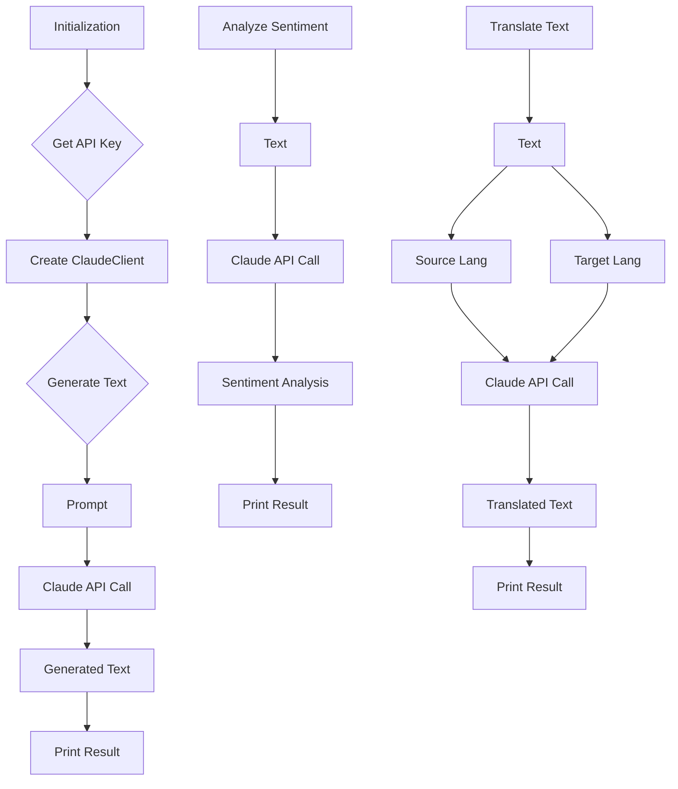

```MD
# Анализ кода Claude Anthropic Client

## <input code>

```rst
.. module: src.ai.anthropic
```
<TABLE >
<TR>
<TD>
<A HREF = 'https://github.com/hypo69/hypo/blob/master/README.MD'>[Root ↑]</A>
</TD>
<TD>
<A HREF = 'https://github.com/hypo69/hypo/blob/master/src/README.MD'>src</A> /
<A HREF = 'https://github.com/hypo69/hypo/blob/master/src/ai/README.MD'>ai</A>
</TD>
<TD>
<A HREF = 'https://github.com/hypo69/hypo/blob/master/src/ai/anthropic/readme.ru.md'>Русский</A>
</TD>
</TABLE>

### README.md

# Claude Anthropic Client

This Python module provides a simple interface to interact with the Claude language model from Anthropic. It includes basic functions for text generation, sentiment analysis, and text translation.

## Installation

To use this module, you need to install the `anthropic` library:

```bash
pip install anthropic
```

## Usage

### Initialization

First, initialize the `ClaudeClient` with your Anthropic API key:

```python
from claude_client import ClaudeClient

api_key = "your-api-key"
claude_client = ClaudeClient(api_key)
```

### Generate Text

Generate text based on a given prompt:

```python
prompt = "Write a short story about a robot learning to love."
generated_text = claude_client.generate_text(prompt)
print("Generated Text:", generated_text)
```

... (rest of the code)
```

## <algorithm>



**Example:**

1.  **Initialization (A):**  The user provides their API key (`your-api-key`).
2.  **API Key Extraction (B):** The API key is stored in a variable.
3.  **Client Creation (C):** A `ClaudeClient` object is instantiated, using the API key to connect to the Anthropic API.
4.  **Text Generation (D):** A `generate_text` method is called with the prompt.  
5.  **API Call (F):** The `ClaudeClient` sends a request to the Anthropic API to generate text based on the provided prompt.
6.  **Result (G):** The Anthropic API returns the generated text.
7.  **Output (H):** The generated text is printed to the console.

Similar steps occur for Sentiment Analysis and Translation.


## <mermaid>

```mermaid
classDiagram
    class ClaudeClient {
        + api_key : str
        + generate_text(prompt) : str
        + analyze_sentiment(text) : str
        + translate_text(text, source_language, target_language) : str
    }
    ClaudeClient --> AnthropicAPI : API call
    note right of AnthropicAPI: Anthropic Language Model API
```

This diagram shows the `ClaudeClient` class interacting with the `AnthropicAPI`.  The `ClaudeClient` acts as an intermediary, making API calls to the Anthropic language model on behalf of the user.


## <explanation>

**Импорты:**

- `from claude_client import ClaudeClient`: This line imports the `ClaudeClient` class from the `claude_client` module.  It's crucial to understand that `claude_client` is assumed to be a module in the current project (likely within the `src` folder).


**Классы:**

- `ClaudeClient`: This class encapsulates the interaction logic with the Anthropic Claude API. It stores the API key, and methods (`generate_text`, `analyze_sentiment`, `translate_text`) to call the API with various requests.  A crucial aspect is that this class likely uses a Python library (e.g., the `anthropic` library) to interact with the Anthropic API, handling low-level details and making the API calls.


**Функции:**

- `generate_text(prompt, max_tokens_to_sample=100)`: This method takes a `prompt` string and an optional `max_tokens_to_sample` integer. It uses the client to generate text based on the prompt and returns the generated text.
- `analyze_sentiment(text)`: This method analyzes the sentiment of the input `text` and returns the analysis result (likely a string representing the sentiment).
- `translate_text(text, source_language, target_language)`:  This method translates the input `text` from the `source_language` to the `target_language`, returning the translated text.


**Переменные:**

- `api_key`:  Holds the API key for authentication with the Anthropic API.


**Возможные ошибки и улучшения:**

- **API key security:** Hardcoding the API key directly in the code is a serious security risk.  The API key should be stored securely (e.g., environment variable or configuration file).
- **Error handling:**  The code lacks error handling.  If the API call fails, the program will crash. Robust error handling (catching exceptions) is essential.
- **Input validation:** Input validation (e.g., checking for empty prompts) is crucial for preventing unexpected behavior.
- **Rate limiting:** The Anthropic API has rate limits. The client code should implement mechanisms to handle rate limiting, such as delays between requests.
- **Dependencies:**  The code relies on an `anthropic` library. The documentation or project structure should explicitly mention this dependency.


**Взаимосвязь с другими частями проекта:**

The `claude_client` module is likely part of the `src.ai` package, which is part of a larger application or library (`hypo`).  The project's architecture is implied to use the Anthropic API for various AI tasks within the `hypo` application.

**Примечание:**  The provided code snippets are documentation examples, and the actual `claude_client` implementation is not shown.  It's assumed that the implementation internally uses the `anthropic` library to interact with the Anthropic API.