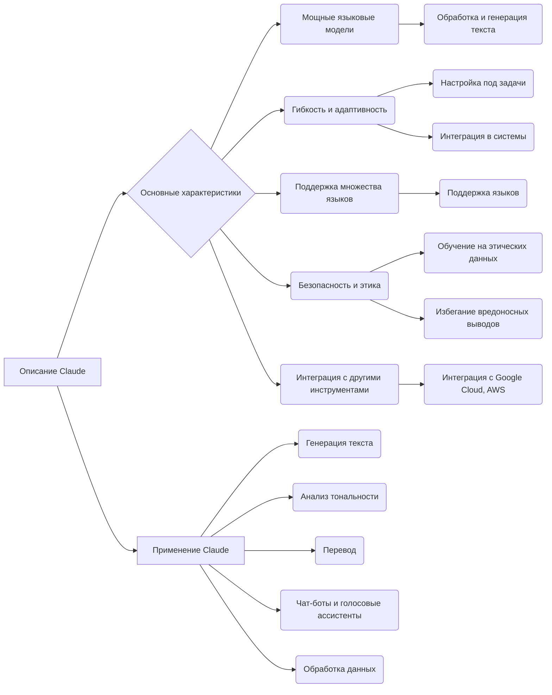

```MD
# Анализ кода

Этот код не является кодом в традиционном смысле (нет ни переменных, ни функций в формате языка программирования).  Это текстовое описание семейства языковых моделей Claude от Anthropic.

## <input code>

```
Claude от Anthropic — это семейство мощных языковых моделей, разработанных компанией Anthropic. Эти модели предназначены для решения широкого спектра задач, связанных с обработкой естественного языка (NLP), таких как генерация текста, анализ тональности, перевод, и другие.
Благодаря своей гибкости, адаптивности и поддержке множества языков, Claude подходит для широкого спектра приложений, от генерации текста до создания чат-ботов и голосовых ассистентов. Компания Anthropic уделяет большое внимание этике и безопасности, что делает Claude надежным выбором для разработчиков и бизнеса.
### Основные характеристики Claude:
… (Описание характеристик и применений)
### Заключение:
…
```

## <algorithm>

В данном случае алгоритма как такового нет.  Код представляет собой текстовое описание, а не набор инструкций для выполнения.  Описание Claude структурировано, но не содержит шагов для вычислений.

## <mermaid>



**Объяснение диаграммы:**

Диаграмма показывает структуру описания Claude.  Связи между блоками представляют логическую связь между описанными характеристиками и применениями.  Нет зависимостей в смысле подключения к другим частям проекта, так как это чистое описание продукта.

## <explanation>

**Импорты:**  Нет импортов, так как это текстовое описание, а не код.

**Классы:**  Нет классов. Текст описывает концепцию "Claude", но не содержит деклараций классов.

**Функции:** Нет функций.

**Переменные:** Нет переменных.

**Возможные ошибки/улучшения:**  Нет ошибок в описании.  Можно было бы добавить более подробное техническое описание архитектуры моделей Claude, если это было бы целесообразно.  Текст достаточно хорошо написан и представляет собой понятное объяснение.

**Взаимосвязь с другими частями проекта:**  Нет явных взаимосвязей с другими частями проекта.  Это описание продукта, а не часть кода или проекта.