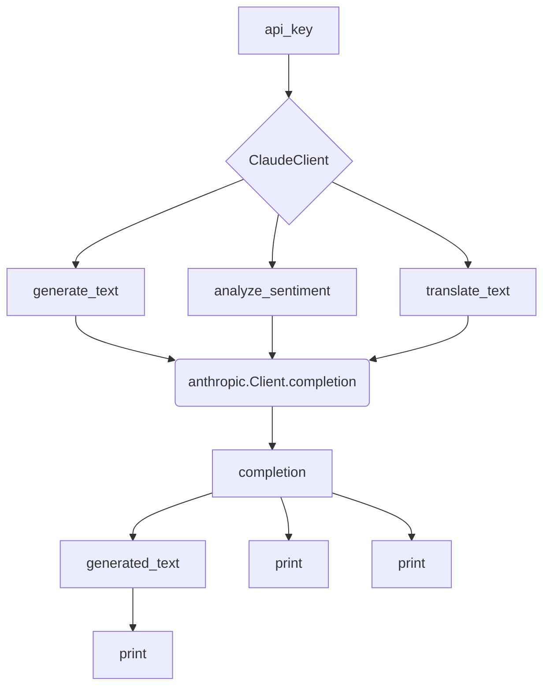

# <input code>

```python
## \file /src/ai/anthropic/claude.py
# -*- coding: utf-8 -*-
#! venv/Scripts/python.exe
#! venv/bin/python/python3.12

"""
module: src.ai.anthropic.claude
	:platform: Windows, Unix
	:synopsis: Модуль определяющий корневой путь к проекту. Все импорты строятся относительно этого пути.
    :TODO: В дальнейшем перенести в системную переменную"""


import anthropic

class ClaudeClient:
    def __init__(self, api_key):
        self.client = anthropic.Client(api_key)

    def generate_text(self, prompt, max_tokens_to_sample=100):
        """
        Generates text based on the given prompt.

        :param prompt: The prompt to generate text from.
        :param max_tokens_to_sample: The maximum number of tokens to generate.
        :return: The generated text.
        """
        response = self.client.completion(
            prompt=prompt,
            model="claude-v1",
            max_tokens_to_sample=max_tokens_to_sample,
            stop_sequences=["\n\nHuman:"]
        )
        return response['completion']

    def analyze_sentiment(self, text):
        """
        Analyzes the sentiment of the given text.

        :param text: The text to analyze.
        :return: The sentiment analysis result.
        """
        response = self.client.completion(
            prompt=f"Analyze the sentiment of the following text: {text}",
            model="claude-v1",
            max_tokens_to_sample=50,
            stop_sequences=["\n\nHuman:"]
        )
        return response['completion']

    def translate_text(self, text, source_language, target_language):
        """
        Translates the given text from the source language to the target language.

        :param text: The text to translate.
        :param source_language: The source language code.
        :param target_language: The target language code.
        :return: The translated text.
        """
        response = self.client.completion(
            prompt=f"Translate the following text from {source_language} to {target_language}: {text}",
            model="claude-v1",
            max_tokens_to_sample=100,
            stop_sequences=["\n\nHuman:"]
        )
        return response['completion']


# Пример использования класса
if __name__ == "__main__":
    api_key = "your-api-key"
    claude_client = ClaudeClient(api_key)

    # Пример генерации текста
    prompt = "Write a short story about a robot learning to love."
    generated_text = claude_client.generate_text(prompt)
    print("Generated Text:", generated_text)

    # Пример анализа тональности
    text_to_analyze = "I am very happy today!"
    sentiment_analysis = claude_client.analyze_sentiment(text_to_analyze)
    print("Sentiment Analysis:", sentiment_analysis)

    # Пример перевода текста
    text_to_translate = "Hello, how are you?"
    source_language = "en"
    target_language = "es"
    translated_text = claude_client.translate_text(text_to_translate, source_language, target_language)
    print("Translated Text:", translated_text)
```

# <algorithm>

**Шаг 1: Инициализация `ClaudeClient`**

* Вход: `api_key`
* Выход: Экземпляр `ClaudeClient` с подключённым клиентом `anthropic.Client`
* Пример: `api_key = "your-api-key"` -> `claude_client = ClaudeClient(api_key)`

**Шаг 2: Генерация текста**

* Вход: `prompt`, `max_tokens_to_sample`
* Выход: сгенерированный текст
* Действия:
    * Формирование запроса к `anthropic.Client.completion` с параметрами: `prompt`, `model`, `max_tokens_to_sample`, `stop_sequences`
    * Получение ответа от сервера `anthropic`
    * Возврат значения `completion` из ответа.
* Пример: `prompt = "Write a short story..."` -> `generated_text = claude_client.generate_text(prompt)`

**Шаг 3: Анализ тональности**

* Аналогично шагу 2, но с другим `prompt`.
* Вход: `text`
* Выход: результат анализа тональности
* Пример: `text_to_analyze = "I am happy"` -> `sentiment_analysis = claude_client.analyze_sentiment(text_to_analyze)`


**Шаг 4: Перевод текста**

* Аналогично шагу 2, но с другими параметрами.
* Вход: `text`, `source_language`, `target_language`
* Выход: переведенный текст
* Пример: `text_to_translate = "Hello"`, `source_language = "en"`, `target_language = "es"` -> `translated_text = claude_client.translate_text(...)`


# <mermaid>



**Объяснение диаграммы:**

* `api_key` - входное значение, необходимое для инициализации `ClaudeClient`.
* `ClaudeClient` - класс, содержащий метод `__init__` для инициализации клиента `anthropic`.
* `generate_text`, `analyze_sentiment`, `translate_text` - методы класса `ClaudeClient`, вызывающие `anthropic.Client.completion` с различными запросами.
* `anthropic.Client.completion` - отправляет запрос на сервер `anthropic` для выполнения задач.
* `completion` - результат выполнения запроса, содержащий необходимую информацию.
* `print` - оператор вывода в консоль.

# <explanation>

**Импорты:**

* `import anthropic`: Импортирует необходимую библиотеку `anthropic`, предоставляющую API для доступа к моделям языка, таким как Claude.  Связь с другими пакетами проекта устанавливается через API библиотеки.

**Класс `ClaudeClient`:**

* **Роль:** Предоставляет методы для взаимодействия с API моделей Claude.
* **Атрибуты:** `client` - экземпляр `anthropic.Client`, используемый для взаимодействия с API.
* **Методы:**
    * `__init__(self, api_key)`: Инициализирует экземпляр `ClaudeClient`, создаёт подключение к API `anthropic` с использованием предоставленного `api_key`.
    * `generate_text(self, prompt, max_tokens_to_sample=100)`: Генерирует текст на основе `prompt` с помощью модели Claude.
    * `analyze_sentiment(self, text)`: Анализирует тональность входного текста.
    * `translate_text(self, text, source_language, target_language)`: Переводит текст с одного языка на другой.
* **Взаимодействие:** Класс взаимодействует с библиотекой `anthropic` для выполнения запросов к API.

**Функции:**

* Все функции являются методами класса `ClaudeClient`, принимают данные и отправляют их в `anthropic.Client.completion`.

**Переменные:**

* ``:  Переменная, вероятно, для отладки или контроля режима работы, но её использование в коде не наблюдается.
* `api_key`: Строковая переменная, хранящая API ключ для доступа к сервису.  Важный атрибут, требующий защиты.
* `prompt`: Строковая переменная, хранит запрос для обработки моделью.
* `max_tokens_to_sample`: Целая переменная, ограничение на длину ответа, в токенах.

**Возможные ошибки и улучшения:**

* **API ключ:** В примере использования класса `api_key` задан как строковая константа в `if __name__ == "__main__":`. Это небезопасно.  В реальных приложениях API ключи должны храниться в защищённом формате (например, в переменных окружения или с помощью безопасных менеджеров конфигурации).
* **Обработка ошибок:** Отсутствие обработки потенциальных ошибок при запросах к API. Необходимо добавить обработку исключений (например, `try...except`) для устойчивости кода.
* **Логирование:** Добавление логирования (например, с помощью `logging`) для отслеживания запросов и ответов, что поможет в отладке и мониторинге.
* **Универсальность:** Добавить возможность работы с различными моделями Claude.
* **Документация:** Документация должна быть более подробной и исчерпывающей.


**Цепочка взаимосвязей:**

Код использует `anthropic` для взаимодействия с API моделей Claude. Проект вероятно имеет зависимости от `anthropic`, которые определяют функционал для работы с API.