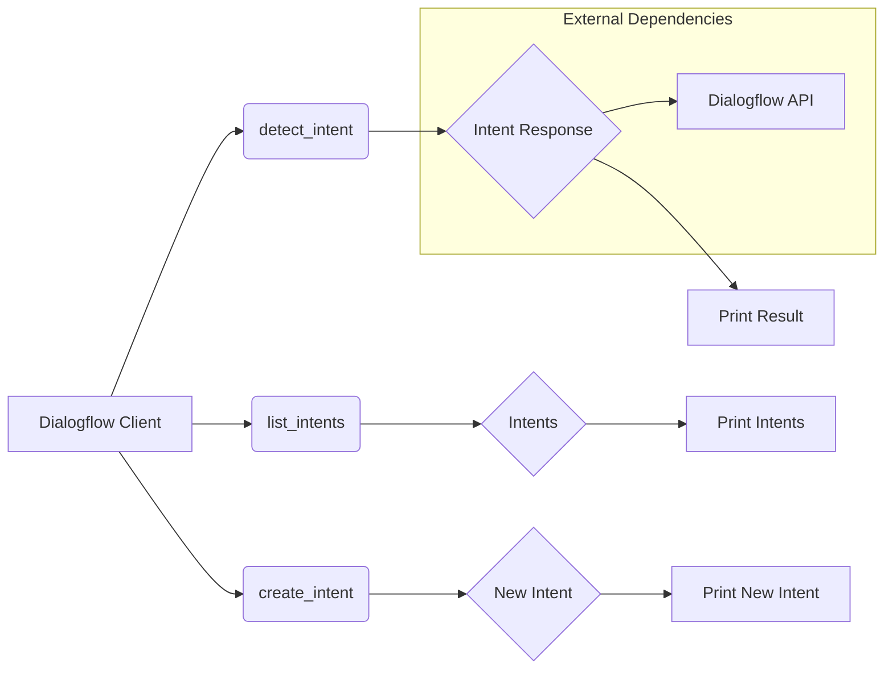

# Анализ кода модуля `src.ai.dialogflow`

## <input code>

```rst
.. module: src.ai.dialogflow
```

```
<TABLE >
<TR>
<TD>
<A HREF = 'https://github.com/hypo69/hypo/blob/master/README.MD'>[Root ↑]</A>
</TD>
<TD>
<A HREF = 'https://github.com/hypo69/hypo/blob/master/src/README.MD'>src</A> /
<A HREF = 'https://github.com/hypo69/hypo/blob/master/src/ai/README.MD'>ai</A> /
</TD>
<TD>
<A HREF = 'https://github.com/hypo69/hypo/blob/master/src/ai/dialogflow/about.md'>About dialogflow model</A>
</TD>
<TD>
<A HREF = 'https://github.com/hypo69/hypo/blob/master/src/ai/dialogflow/readme.ru.md'>Русский</A>
</TD>
</TABLE>

https://dialogflow.com/docs/getting-started/basics

### **dialogflow**

Dialogflow integration module.  
Provides capabilities for natural language understanding (NLU) 
and creating conversational AI applications. It includes the following main features:

- **Intent Detection:** Determines user intents based on the input text.
- **Entity Recognition:** Extracts key data from user phrases.
- **Contexts:** Manages the conversation by retaining information about the current state of the dialogue.
- **Integrations:** Supports integration with various platforms such as Google Assistant, Facebook Messenger, Slack, Telegram, and others.
- **Webhook:** Supports Webhook integrations for calling external services and APIs.

Example usage of the **dialogflow** submodule:

```python
from src.ai.dialogflow import Dialogflow

project_id = "your-project-id"
session_id = "unique-session-id"

dialogflow_client = Dialogflow(project_id, session_id)

# Example usage of methods
intent_response = dialogflow_client.detect_intent("Hello")
print("Detected Intent:", intent_response)

intents = dialogflow_client.list_intents()
print("List of Intents:", intents)

new_intent = dialogflow_client.create_intent(
    display_name="NewIntent",
    training_phrases_parts=["new phrase", "another phrase"],
    message_texts=["This is a new intent"]
)
print("Created Intent:", new_intent)

# Deleting an intent (make sure to replace intent_id with a real ID)
# dialogflow_client.delete_intent("your-intent-id")
```
```

## <algorithm>

**Шаг 1:** Инициализация клиента Dialogflow.  
    - Ввод `project_id` и `session_id`.
    - Создание объекта `Dialogflow`.  
    Пример: `dialogflow_client = Dialogflow("my-project-id", "my-session-id")`

**Шаг 2:** Вызов метода `detect_intent`.
   - Передача текстового запроса ("Hello").
   - Возвращение ответа с обнаруженным интентом.
   Пример: `intent_response = dialogflow_client.detect_intent("Hello")`

**Шаг 3:** Вывод результата `intent_response`.
   Пример: `print("Detected Intent:", intent_response)`

**Шаг 4:** Вызов метода `list_intents`.
   - Возвращение списка интентов.
   Пример: `intents = dialogflow_client.list_intents()`, `print("List of Intents:", intents)`

**Шаг 5:** Вызов метода `create_intent`.
   - Создание нового интента с именем, фразами и сообщениями.
   Пример: `new_intent = dialogflow_client.create_intent(...)`

**Шаг 6:** Вывод результата `new_intent`.
   Пример: `print("Created Intent:", new_intent)`


## <mermaid>



## <explanation>

**Импорты:**

Модуль не содержит импортов, необходимых для работы с внешней библиотекой Dialogflow.  Он предполагает существование класса `Dialogflow` в модуле `src.ai.dialogflow`, который, очевидно, импортирует необходимые библиотеки для взаимодействия с API Dialogflow.


**Классы:**

- `Dialogflow`:  Этот класс отвечает за взаимодействие с сервисом Dialogflow. Он, вероятно, имеет методы для отправки запросов, получения ответов, создания и управления интентами.  Примерные методы: `detect_intent`, `list_intents`, `create_intent`, `delete_intent` (последний метод указан в комментарии).  Необходимые атрибуты: `project_id`, `session_id` (и, возможно, другие для подключения к API).  Подробная реализация класса находится внутри `src.ai.dialogflow`.


**Функции:**

- `detect_intent`: Принимает строку с текстом запроса, использует API Dialogflow для определения интента и возвращает результат ответа. Необходимо знать, какие данные API Dialogflow возвращает.
- `list_intents`: Возвращает список имеющихся интентов. Необходимо знать, как API Dialogflow структурирует данную информацию.
- `create_intent`: Создает новый интент с заданными параметрами (имя, фразы для обучения, сообщения).  Подразумевается, что эти параметры соответствуют требованиям API Dialogflow.
- `delete_intent`: Удаляет интент. Подразумевает наличие `intent_id`, который идентифицирует интент в базе данных Dialogflow.

**Переменные:**

- `project_id`: Идентификатор проекта Dialogflow.  
- `session_id`: Идентификатор сессии диалога.
- `intent_response`, `intents`, `new_intent`: Переменные, содержащие результат выполнения методов `detect_intent`, `list_intents`, `create_intent` соответственно.

**Возможные ошибки и улучшения:**

- **Обработка ошибок:**  Код не содержит обработку возможных ошибок (например, проблемы с подключением к API Dialogflow, некорректные ответы от API).  Нужна реализация `try...except` блоков для перехвата исключений.
- **Верификация входных данных:** Необходимо убедиться, что `project_id` и `session_id` валидны.
- **Документация:**  Не хватает более подробной документации по классам и методам.
- **Зависимости:** Неясно, какие библиотеки используются для работы с API Dialogflow. Необходима информация о подключении к API Dialogflow.


**Цепочка взаимосвязей:**

Модуль `src.ai.dialogflow` напрямую взаимодействует с API Dialogflow для выполнения запросов.  Он, вероятно, использует библиотеку для взаимодействия с этим API.  Другие части проекта (например, модули для обработки пользовательских запросов) могут использовать этот модуль для получения информации о намерениях пользователя, основанной на NLP.