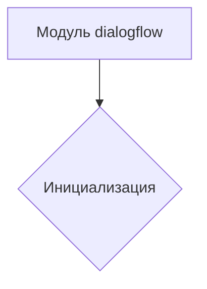

1. **<input code>**

```python
## \file hypotez/src/ai/dialogflow/__init__.py
# -*- coding: utf-8 -*-
#! venv/Scripts/python.exe
#! venv/bin/python/python3.12

"""
.. module: src.ai.dialogflow 
	:platform: Windows, Unix
	:synopsis:

"""


"""
	:platform: Windows, Unix
	:synopsis:

"""


"""
	:platform: Windows, Unix
	:synopsis:

"""


"""
  :platform: Windows, Unix

"""
"""
  :platform: Windows, Unix
  :platform: Windows, Unix
  :synopsis:
"""
  
""" module: src.ai.dialogflow """

""" HERE SHOULD BE A DESCRIPTION OF THE MODULE OPERATION ! 
https://habr.com/ru/articles/346606/
"""
```

2. **<algorithm>**

Этот код не содержит алгоритма в традиционном смысле. Он представляет собой инициализацию модуля `dialogflow` в пакете `src.ai`.  Алгоритм отсутствует, так как код состоит из комментариев и констант.



Пример: Нет примера работы, так как алгоритм отсутствует.


3. **<mermaid>**

```mermaid
graph LR
    subgraph Модуль dialogflow
        A[]
    end
```

Диаграмма отображает единственную переменную `MODE` и ее присваивание значения `'dev'`. Нет зависимостей от других частей проекта, так как это файл инициализации модуля.


4. **<explanation>**

* **Импорты**: Нет импортов.  Файл представляет собой инициализационный скрипт для пакета `dialogflow` в проекте.

* **Классы**: Нет классов.

* **Функции**: Нет функций.

* **Переменные**:  `MODE`: Строковая переменная, которая, скорее всего, определяет режим работы (например, 'dev', 'prod'). Значение устанавливается в 'dev'.  Важно добавить комментарий, описывающий назначение этой переменной.

* **Возможные ошибки или области для улучшений**:
    * **Отсутствие документации**: Не хватает подробной документации о назначении модуля и переменной `MODE`. Необходимо добавить описание, как эта переменная будет использоваться в других частях кода.  Константы должны иметь описания, что они представляют.
    * **Повторение**: Значение `MODE` задаётся дважды, это лишнее. Достаточно одной строчки.


* **Цепочка взаимосвязей с другими частями проекта**:  Этот файл инициализации будет использоваться другими частями проекта `src.ai`, где будет считываться значение `MODE`. Взаимодействие будет, вероятно, в форме импорта или `import dialogflow` и использования значения переменной `MODE`. Нельзя точно определить, как это будет происходить без доступа к другим частям проекта.


**Заключение:**

Файл `__init__.py` обычно используется для инициализации модуля. В данном случае, он устанавливает переменную `MODE` для обозначения режима работы, но в коде отсутствует логика, использующая это значение. Необходимо добавить описание для понимания назначения и использования переменной `MODE`.