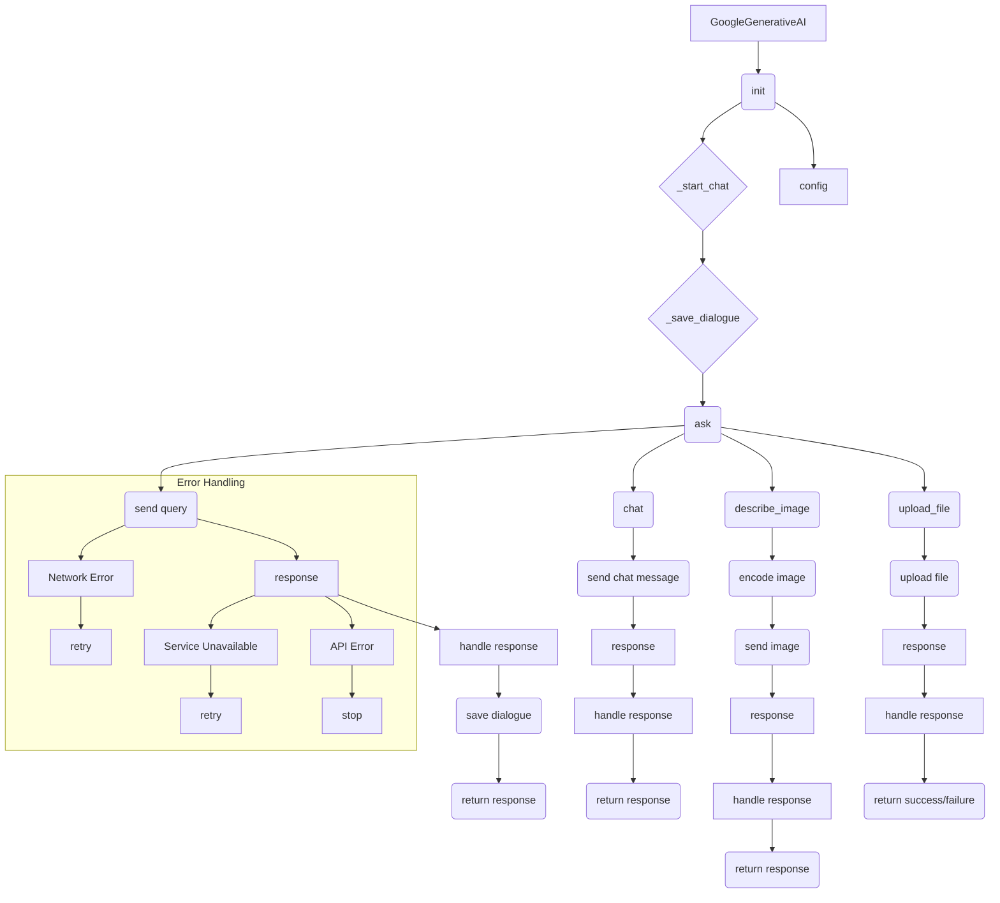

# <input code>

```rst
.. module: src.ai.gemini
```
[Русский](https://github.com/hypo69/hypo/tree/master/src/ai/gemini/readme.ru.md)

# Google Generative AI Integration Module

## Overview

The `GoogleGenerativeAI` class is designed to facilitate interaction with Google's Generative AI models. This class provides methods for sending queries, handling responses, managing dialogues, and integrating with various AI functionalities. It includes robust error handling, logging, and configuration options to ensure seamless operation.

## Key Functions

### `__init__(self, api_key: str, model_name: Optional[str] = None, generation_config: Optional[Dict] = None, system_instruction: Optional[str] = None, **kwargs)`

**Purpose**: Initializes the `GoogleGenerativeAI` class with the necessary configurations.

**Details**:
- Sets up the API key, model name, generation configuration, and system instruction.
- Defines paths for logging dialogues and storing history.
- Initializes the Google Generative AI model.

### `config()`

**Purpose**: Retrieves the configuration from a settings file.

**Details**:
- Reads and parses the configuration file located at `gs.path.src / 'ai' / 'gemini' / 'generative_ai.json'`.

### `_start_chat(self)`

**Purpose**: Starts a chat session with the AI model.

**Details**:
- Initializes a chat session with an empty history.

### `_save_dialogue(self, dialogue: list)`

**Purpose**: Saves a dialogue to both text and JSON files.

**Details**:
- Appends each message in the dialogue to a text file.
- Appends each message in JSON format to a JSON file.

### `ask(self, q: str, attempts: int = 15) -> Optional[str]`

**Purpose**: Sends a text query to the AI model and retrieves the response.

**Details**:
- Handles multiple attempts in case of network errors or service unavailability.
- Logs errors and retries with exponential backoff.
- Saves the dialogue to history files.

### `chat(self, q: str) -> str`

**Purpose**: Sends a chat message to the AI model and retrieves the response.

**Details**:
- Uses the chat session initialized by `_start_chat`.
- Logs errors and returns the response text.

### `describe_image(self, image_path: Path) -> Optional[str]`

**Purpose**: Generates a textual description of an image.

**Details**:
- Encodes the image in base64 and sends it to the AI model.
- Returns the generated description or logs an error if the operation fails.

### `upload_file(self, file: str | Path | IOBase, file_name: Optional[str] = None) -> bool`

**Purpose**: Uploads a file to the AI model.

**Details**:
- Handles file upload and logs the success or failure.
- Provides retry logic in case of errors.

## Error Handling

The class includes comprehensive error handling for various scenarios:
- **Network Errors**: Retries with exponential backoff.
- **Service Unavailability**: Logs errors and retries.
- **Quota Limits**: Logs and waits before retrying.
- **Authentication Errors**: Logs and stops further attempts.
- **Invalid Input**: Logs and retries with a timeout.
- **API Errors**: Logs and stops further attempts.

## Logging and History

All interactions with the AI models are logged, and dialogues are saved in both text and JSON formats for future analysis. This ensures that all operations are traceable and can be reviewed for debugging or auditing purposes.

## Dependencies

- `google.generativeai`
- `requests`
- `grpc`
- `google.api_core.exceptions`
- `google.auth.exceptions`
- `src.logger`
- `src.utils.printer`
- `src.utils.file`
- `src.utils.date_time`
- `src.utils.convertors.unicode`
- `src.utils.jjson`

## Usage Example

```python
ai = GoogleGenerativeAI(api_key="your_api_key", system_instruction="Instruction")
response = ai.ask("Как дела?")
print(response)
```

This example initializes the `GoogleGenerativeAI` class and sends a query to the AI model, printing the response.

---

For more detailed information, refer to the source code and comments within the `GoogleGenerativeAI` class.
```

# <algorithm>

Unfortunately, a detailed algorithm and flowchart cannot be created without the actual Python code. The provided RST documentation describes the functionality but lacks the implementation details necessary for a visual representation of the execution flow.


# <mermaid>



**Explanation of Mermaid Diagram Dependencies:**

The diagram shows the main flow of the `GoogleGenerativeAI` class, its interactions, and error handling paths.  Crucially, it depicts the flow between different methods and the dependencies between parts of the code (`config`, `ask`, `chat`, `describe_image`, `upload_file`).  It's important to note that the `src` package dependencies (e.g., `src.logger`, `src.utils`) are not directly represented in this diagram.  They would be shown as external modules if their code were included.  

# <explanation>

* **Imports:** The document lists dependencies (`google.generativeai`, `requests`, `grpc`, `src.logger`, `src.utils`, etc.).  These are likely Python packages or modules, part of the larger `hypo` project.  The `src` prefix indicates that these are internal packages to the project, providing utilities for logging, file handling, and date/time conversions.  Without the complete project structure, we can't precisely determine their inner workings.


* **Classes:** The `GoogleGenerativeAI` class is the central part of the module. It manages interactions with the Google Generative AI API.


* **Functions:**
    * `__init__`: Initializes the object, setting up API keys, model configurations, logging, and chat history.
    * `config()`: Loads configurations from a JSON file (`generative_ai.json`).
    * `_start_chat()`: Prepares a dialogue session.
    * `_save_dialogue()`: Handles the saving of dialogue to file history.
    * `ask()`: Sends a text query to the AI model, handling retries on errors.
    * `chat()`: Handles a chat interaction with the AI model.
    * `describe_image()`: Processes image descriptions.
    * `upload_file()`: Uploads files.

* **Variables:**  Variables (like `api_key`, `model_name`, etc.) are used to store configuration settings, input data, and the results of API calls.  Type hints (e.g., `api_key: str`) are used to improve code clarity and maintainability.

* **Possible Errors/Improvements:**
    * **Error Handling:** The code uses extensive error handling, which is a good practice.  However, without seeing the actual implementation, we can't assess the comprehensiveness of the retry logic (e.g., exponential backoff, appropriate timeouts).  More specific exception handling (e.g., different types of API errors) might be beneficial.
    * **Configuration:**  Storing API keys directly in the code is a security concern. Ideally, these would be managed securely via environment variables or a configuration management system.
    * **Robustness:** The description doesn't mention input validation (e.g., ensuring the `image_path` exists and the `file` input is valid). Adding validations would enhance reliability.
    * **Dependency Management:**  The `src` dependencies highlight the modular design of the `hypo` project.  Using a package management system (e.g., `pip`) would be essential for deployment.


* **Relationship to other parts of the project:** The `GoogleGenerativeAI` module depends on other parts of the `hypo` project (internal modules via `src`) for functionalities like logging, file handling, and potentially model management.   It's part of a larger architecture. This is a critical relationship for understanding its role in the overall project.