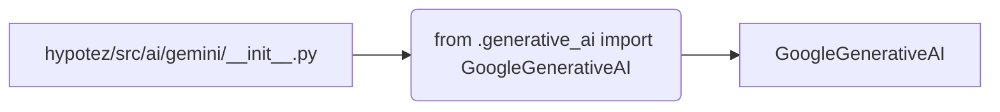

# <input code>

```python
## \file hypotez/src/ai/gemini/__init__.py
# -*- coding: utf-8 -*-
#! venv/Scripts/python.exe
#! venv/bin/python/python3.12

"""
.. module: src.ai.gemini 
	:platform: Windows, Unix
	:synopsis: Модуль модели `gemini`

"""


from .generative_ai import GoogleGenerativeAI
```

# <algorithm>

Алгоритм работы крайне прост. Этот файл `__init__.py` — это инициализирующий файл для модуля `gemini` в пакете `ai`.  Он импортирует класс `GoogleGenerativeAI` из подпакета `generative_ai`.  В сущности, он просто делает доступным этот класс для использования в других частях проекта.  Нет циклов, рекурсий или сложных вычислений.

**Шаг 1:** Импорт класса `GoogleGenerativeAI`

```
from .generative_ai import GoogleGenerativeAI
```

**Пример данных:** Никаких данных не передаются и не обрабатываются.


# <mermaid>



**Описание диаграммы:**

* **A:** Файл `__init__.py` в модуле `gemini`.
* **B:** Строка импорта `GoogleGenerativeAI`. Эта строка является ключевым элементом. Она устанавливает связь между текущим модулем и модулем `generative_ai`, делая доступным класс `GoogleGenerativeAI` для использования.
* **C:** Класс `GoogleGenerativeAI`.  Этот класс, скорее всего, определен в файле `generative_ai.py` (который находится в подпапке `generative_ai`) и содержит реализацию логики работы с Google AI.

# <explanation>

* **Импорты:**

    * `from .generative_ai import GoogleGenerativeAI`: Этот импорт подключает класс `GoogleGenerativeAI` из подпакета `generative_ai` в текущий пакет `gemini`.  Символ `.` перед именем подпакета указывает, что модуль находится в текущей директории. Это стандартная практика для импорта модулей из вложенных пакетов.  Предполагается, что внутри пакета `ai` есть подпапка `generative_ai` с файлом `generative_ai.py`, содержащим определение класса `GoogleGenerativeAI`.

* **Классы:**

    * `GoogleGenerativeAI`:  Этот класс, скорее всего, реализует взаимодействие с сервисом Google AI (например, для генерации текста, изображений и т.п.).  Детали реализации находятся в файле `generative_ai.py`.  В данном `__init__.py` он просто делается доступным.

* **Функции:** Нет функций.

* **Переменные:**

    * ``:  Это строковая переменная, вероятно, определяющая режим работы (например, 'dev' — для разработки, 'prod' — для производства). Значение может быть использовано в других частях проекта.

* **Возможные ошибки или улучшения:**

    * **Отсутствие документации:**  В файле `generative_ai.py` необходимо добавить полное описание класса `GoogleGenerativeAI`.
    * **Неявные зависимости:** Необходимо убедиться, что все импортируемые модули доступны.  Проблема может возникнуть, если `generative_ai` зависит от других пакетов, которые не указаны в этом файле.  Это важно для корректной работы всего проекта.

**Цепочка взаимосвязей:**

Этот файл `__init__.py` является частью иерархии пакетов.  Модуль `gemini` в свою очередь является частью пакета `ai`, который, скорее всего, входит в более крупный проект `hypotez`.  Вызов `GoogleGenerativeAI` из других частей проекта (например, из скриптов в `hypotez`) будет подразумевать цепочку: `hypotez` -> `ai` -> `gemini` -> `generative_ai` -> `GoogleGenerativeAI`.


```
hypotez
└── src
    └── ai
        └── gemini
            └── __init__.py
            └── generative_ai.py  # (предполагаемый файл)