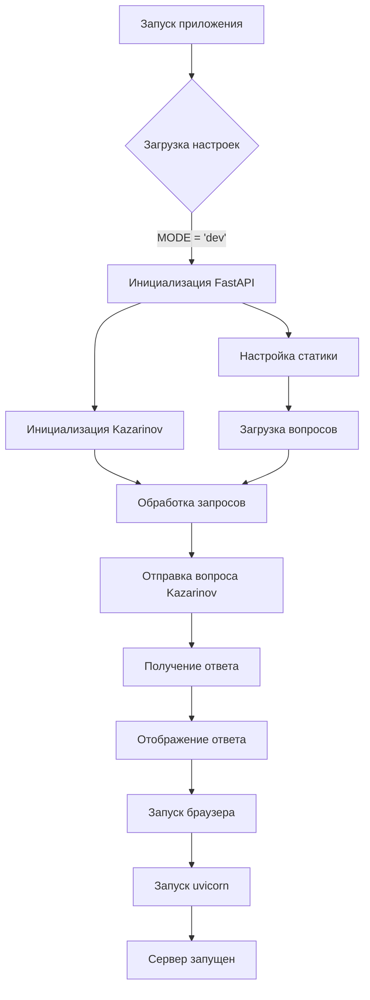

# <input code>

```python
## \file hypotez/src/ai/gemini/html_chat/app.py
# -*- coding: utf-8 -*-\
#! venv/Scripts/python.exe
#! venv/bin/python/python3.12

"""
.. module: src.ai.gemini.html_chat 
	:platform: Windows, Unix
	:synopsis:

"""
MODE = 'dev'


"""
	:platform: Windows, Unix
	:synopsis:

"""


"""
	:platform: Windows, Unix
	:synopsis:

"""


"""
  :platform: Windows, Unix

"""
"""
  :platform: Windows, Unix
  :platform: Windows, Unix
  :synopsis:
"""MODE = 'dev'
  
""" module: src.ai.gemini.html_chat """


""" HERE SHOULD BE A DESCRIPTION OF THE MODULE OPERATION ! """

import header
import webbrowser  # Для автоматического открытия браузера
import threading  # Для запуска браузера в отдельном потоке

from fastapi import FastAPI, Request
from fastapi.templating import Jinja2Templates
from fastapi.staticfiles import StaticFiles
from pydantic import BaseModel
from src.ai.gooogle_generativeai.kazarinov import Kazarinov
import random
from pathlib import Path
from src import gs

# Инициализация FastAPI
app = FastAPI()

# Папка с HTML шаблонами
templates = Jinja2Templates(directory=gs.path.src / 'ai' / 'gooogle_generativeai' / 'chat' / 'templates')

# Подключение статики (CSS Bootstrap)
app.mount("/static", StaticFiles(directory=gs.path.src / 'ai' / 'gooogle_generativeai' / 'chat' / 'static'), name="static")


# Инициализация модели Kazarinov
k = Kazarinov(system_instruction=None, generation_config={'response_mime_type': 'text/plain'})

# Вопросы для чата
questions_list = [
    q_file.read_text() for q_file in (Path(gs.path.google_drive / 'kazarinov' / 'prompts' / 'q').rglob('*.*'))
]

# Модель для данных из формы (вопрос пользователя)
class Question(BaseModel):
    question: str

# Главная страница чата
@app.get("/")
async def get_chat(request: Request):
    return templates.TemplateResponse("chat.html", {"request": request, "response": ""})

# Эндпоинт для отправки вопросов
@app.post("/ask")
async def ask_question(question: Question, request: Request):
    user_question = question.question

    # Если вопрос не задан, загрузить случайный
    if user_question.lower() == "--next":
        q_list = questions_list[random.randint(0, len(questions_list) - 1)].split('\n')
        user_question = q_list[random.randint(0, len(q_list) - 1)]

    # Отправляем вопрос модели Kazarinov
    response = k.ask(user_question, no_log=False, with_pretrain=False)
    
    return templates.TemplateResponse("chat.html", {"request": request, "response": response})

# Функция для открытия браузера
def open_browser():
    webbrowser.open("http://127.0.0.1:8000")

# Запуск приложения FastAPI и браузера
if __name__ == "__main__":
    # Запуск браузера в отдельном потоке
    threading.Timer(1.5, open_browser).start()
    
    # Запуск приложения с uvicorn
    import uvicorn
    uvicorn.run(app, host="127.0.0.1", port=8000)
```

# <algorithm>

**Шаг 1**: Импортируются необходимые библиотеки (FastAPI, Jinja2Templates, StaticFiles, BaseModel, Kazarinov, random, Path, gs).  
   - Пример: `from fastapi import FastAPI`.

**Шаг 2**: Определяется константа `MODE` со значением 'dev'.  
   - Пример: `MODE = 'dev'`.

**Шаг 3**: Инициализируется `FastAPI` приложение `app`.  
   - Пример: `app = FastAPI()`.

**Шаг 4**: Настраивается отображение статических файлов (CSS Bootstrap) с использованием `app.mount()`.  
   - Пример: Подключаются файлы из папки `static` для отображения стилей в `chat.html`.

**Шаг 5**: Инициализируется `Kazarinov` модель с параметрами `system_instruction` и `generation_config`.
   - Пример: `k = Kazarinov(...)`.

**Шаг 6**: Загружаются вопросы из файла `google_drive/kazarinov/prompts/q`.
   - Пример: `questions_list = [...]`.

**Шаг 7**: Определяется класс `Question` для обработки входных данных.  
   - Пример: `class Question(BaseModel):`.

**Шаг 8**: Определяется маршрут `get("/")` для главной страницы чата.  
   - Пример: Загрузка страницы `chat.html` с пустым ответом.

**Шаг 9**: Определяется маршрут `post("/ask")` для обработки запросов.
   - Пример: Получение вопроса из запроса, случайный выбор вопроса при запросе "--next" и отправка вопроса модели `Kazarinov`.

**Шаг 10**: Запуск браузера в отдельном потоке с задержкой 1.5 секунды для отображения страницы.
   - Пример:  `threading.Timer(1.5, open_browser).start()`.

**Шаг 11**: Запуск приложения `uvicorn`.  
   - Пример: Запуск сервера FastAPI на порту 8000.


# <mermaid>



**Описание диаграммы:**

- **Запуск приложения:** Инициализация всех необходимых компонентов.
- **Загрузка настроек**: Чтение констант (`MODE`).
- **Инициализация FastAPI**: Настройка приложения.
- **Настройка статики**: Подключение статических файлов (CSS).
- **Инициализация Kazarinov**: Создание экземпляра модели.
- **Загрузка вопросов**: Загрузка вопросов из файла.
- **Обработка запросов**: Обработка запросов `get("/")` и `post("/ask")`.
- **Отправка вопроса Kazarinov**: Отправка вопроса модели.
- **Получение ответа**: Получение ответа от модели.
- **Отображение ответа**: Отображение ответа на странице.
- **Запуск браузера**: Автоматический запуск браузера на странице.
- **Запуск uvicorn**: Запуск сервера.
- **Сервер запущен**: Запуск сервера для обработки запросов.


# <explanation>

**Импорты:**

- `header`:  Вероятно, содержит дополнительные настройки или вспомогательные функции для приложения.  Подробности о `header` неизвестны без доступа к этому файлу.
- `webbrowser`: Для автоматического открытия браузера.
- `threading`: Для запуска браузера в отдельном потоке, чтобы не блокировать работу сервера.
- `fastapi`, `Jinja2Templates`, `StaticFiles`, `BaseModel`: Части фреймворка FastAPI для создания веб-приложения.
- `Kazarinov`: Модель для обработки запросов пользователя. Расположена в подпапке `src.ai.gooogle_generativeai`.
- `random`: Для случайного выбора вопроса из списка.
- `pathlib`: Для работы с путями к файлам.
- `gs`: Вероятно, модуль для работы с файловой системой и Google Drive.  Необходимы дальнейшие детали для понимания его назначения.

**Классы:**

- `Question(BaseModel)`: Класс для валидации данных вопроса, полученного от пользователя. Использует `pydantic.BaseModel` для проверки типов и валидации входных данных, что повышает безопасность и надежность приложения.

**Функции:**

- `open_browser()`: Открывает браузер по указанному URL.
- `get_chat()`: Обрабатывает GET-запрос на главную страницу, загружает шаблон `chat.html` и возвращает его.
- `ask_question()`: Обрабатывает POST-запрос для отправки вопроса модели Kazarinov и возвращает обновленный шаблон.

**Переменные:**

- `MODE`: Стрвочная константа, хранит режим работы приложения (например, 'dev' или 'prod').
- `questions_list`: Список вопросов, загруженных из файлов.
- `k`: Экземпляр модели `Kazarinov` для обработки запросов.
- `templates`: Экземпляр `Jinja2Templates` для работы с HTML шаблонами.


**Возможные ошибки и улучшения:**

- Недостаточно комментариев в коде для пояснения логики и целей отдельных частей.
- Отсутствует проверка корректности загруженных вопросов.
- В коде используются относительные пути к файлам (`gs.path`), что может привести к проблемам при переносe приложения.
- Не реализовано обработка ошибок.
- Не указано поведение при отсутствии ответа от модели `Kazarinov`.


**Взаимосвязи с другими частями проекта:**

- `gs`: Этот модуль, по всей видимости, отвечает за работу с файловой системой и, возможно, доступом к данным из Google Drive. Необходим анализ модуля `gs` для понимания полного контекста.
- `Kazarinov`: Модуль для обработки запросов пользователя. Взаимодействие с ним происходит через вызов метода `ask()`. Необходимо понять функциональность и архитектуру модели `Kazarinov`.
- `header`: Ожидаются дополнительные импорты или настройки, которые влияют на поведение приложения.
- `chat.html` и `static`: Шаблоны и статические файлы, необходимые для отображения и функционирования веб-интерфейса.

Без доступа к `header` и `gs` анализ остается частичным. Полноценное понимание приложения требует дополнительной информации о структуре проекта и работе данных модулей.