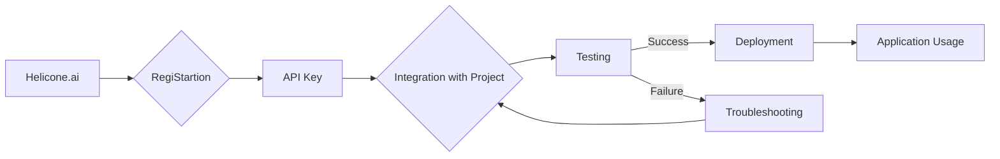

```MD
# Анализ кода

## <input code>

```
## Helicone.ai: Overview

### What is Helicone.ai?

Helicone.ai is a platform that provides access to specialized artificial intelligence (AI) functionalities. It is designed for developers and businesses looking for tools to create custom AI solutions. Helicone.ai offers integration with various AI models, providing flexibility and scalability in developing AI-based applications.

### Key Features

1. **AI Model Integration**:
   - Helicone.ai facilitates integration with a wide range of AI models, including those from OpenAI, Google, and other providers. This allows developers to use the most suitable models for their tasks.

2. **Custom Solutions**:
   - The platform provides tools for creating custom AI solutions. Developers can adapt models to specific project needs, whether it's natural language processing, data analysis, or content generation.

3. **API and SDK**:
   - Helicone.ai offers APIs and SDKs to simplify integration with various programming languages. This allows developers to quickly and efficiently incorporate AI functions into their applications.

4. **Error Handling and Monitoring**:
   - The platform includes tools for error handling and performance monitoring of AI models. This helps developers quickly identify and resolve issues, ensuring stable application operation.

5. **Security and Privacy**:
   - Helicone.ai places a strong emphasis on data security and privacy. The platform provides tools for data encryption and access management to protect users' confidential information.

### Use Cases

1. **Natural Language Processing**:
   - Helicone.ai can be used to create chatbots, sentiment analysis systems, and other NLP-related applications.

2. **Data Analysis**:
   - The platform can be used to analyze large volumes of data, identify patterns, and provide valuable insights for business decision-making.

3. **Content Generation**:
   - Helicone.ai enables content generation, such as articles, product descriptions, and more, which can be useful for marketing campaigns and content creation.

### Getting Started with Helicone.ai

1. **RegiStartion and API Key**:
   - Sign up on the Helicone.ai platform and obtain an API key to access the platform's functions.

2. **Integration with Your Project**:
   - Use the provided API key and SDK to integrate Helicone.ai with your project. Follow the documentation to configure and use various platform functions.

3. **Testing and Deployment**:
   - Test the integration in a test environment, ensuring that all functions work correctly. After successful testing, deploy the solution in a production environment.

### Benefits of Helicone.ai

- **Flexibility**: Ability to integrate with various AI models and create custom solutions.
- **Ease of Use**: Accessible APIs and SDKs simplify integration and development.
- **Reliability**: Error handling and monitoring tools ensure stable application operation.
- **Security**: Strong emphasis on data protection and privacy.

### Conclusion

Helicone.ai is a powerful platform for developers and businesses looking to leverage artificial intelligence for creating innovative solutions. With its flexibility, ease of use, and reliability, Helicone.ai provides all the necessary tools for successful AI implementation in various projects.
```

## <algorithm>

(Unfortunately, the provided text is a description, not code.  Therefore, a flowchart or algorithm cannot be created.)


## <mermaid>



## <explanation>

The provided text is not code; it's a marketing description of a platform called Helicone.ai.  It outlines the platform's features, use cases, and how to get started.  It doesn't contain any actual code to analyze.

* **No imports, classes, functions, or variables are present in the text** which means no analysis of their nature or relationships can be done within the provided context.
* **The Mermaid diagram** illuStartes a high-level overview of the process of using the platform, starting with regiStartion and API key acquisition, followed by integration, testing, and finally, deployment and use.  This diagram, however, is based on the *description* of the platform's usage, not on actual code.

**Possible relationships with other parts of the project:**

* The platform likely has documentation, API specifications, and possibly SDKs for various programming languages (not included in the provided text).
* Integration with various AI models (OpenAI, Google, etc.) would involve communication protocols and specific model APIs.
* The platform's security measures would have dependencies on the underlying infrastructure for data encryption and access control.


**In summary:** The provided text describes the Helicone.ai platform, explaining its functionalities and capabilities, but does not contain any code for analysis.