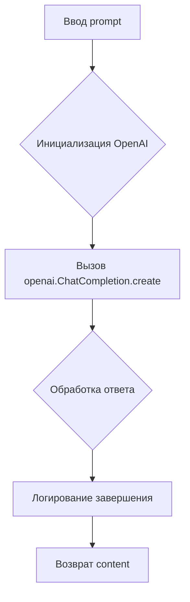
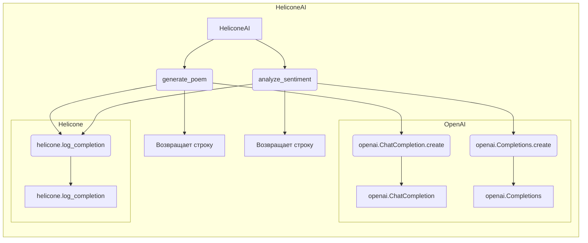

# <input code>

```rst
.. module: src.ai.helicone
```
[English](https://github.com/hypo69/hypo/blob/master/src/ai/helicone/README.MD)
[что такое `helicone.ai`](https://github.com/hypo69/hypo/blob/master/src/ai/helicone/about.ru.md)
# HeliconeAI: Интеграция с Helicone.ai и OpenAI

## Обзор

Класс `HeliconeAI` предназначен для упрощения взаимодействия с Helicone.ai и моделями OpenAI. Этот класс предоставляет методы для генерации стихов, анализа тональности текста, создания краткого изложения текста и перевода текста. Он также включает логирование завершений с использованием Helicone.ai.

## Основные особенности

1. **Генерация стихотворения**:
   - Генерирует стихотворение на основе заданного промпта с использованием модели `gpt-3.5-turbo`.

2. **Анализ тональности**:
   - Анализирует тональность заданного текста с использованием модели `text-davinci-003`.

3. **Краткое изложение текста**:
   - Создает краткое изложение заданного текста с использованием модели `text-davinci-003`.

4. **Перевод текста**:
   - Переводит заданный текст на указанный целевой язык с использованием модели `text-davinci-003`.

5. **Логирование завершений**:
   - Логирует все завершения с использованием Helicone.ai для мониторинга и анализа.

## Установка

Для использования класса `HeliconeAI` убедитесь, что у вас установлены необходимые зависимости. Вы можете установить их с помощью pip:

```bash
pip install openai helicone
```

## Использование

### Инициализация

Инициализируйте класс `HeliconeAI`:

```python
from helicone import Helicone
from openai import OpenAI

class HeliconeAI:
    def __init__(self):
        self.helicone = Helicone()
        self.client = OpenAI()
```

### Методы

#### Генерация стихотворения

Сгенерируйте стихотворение на основе заданного промпта:

```python
def generate_poem(self, prompt: str) -> str:
    response = self.client.chat.completions.create(
        model="gpt-3.5-turbo",
        messages=[
            {"role": "user", "content": prompt}
        ]
    )
    self.helicone.log_completion(response)
    return response.choices[0].message.content
```

#### Анализ тональности

Проанализируйте тональность заданного текста:

```python
def analyze_sentiment(self, text: str) -> str:
    response = self.client.completions.create(
        model="text-davinci-003",
        prompt=f"Analyze the sentiment of the following text: {text}",
        max_tokens=50
    )
    self.helicone.log_completion(response)
    return response.choices[0].text.strip()
```

... (остальные методы)

# <algorithm>

Блок-схема алгоритма для метода `generate_poem`:



Пример:

`prompt = "Напиши стихотворение о любви"`

A: `prompt = "Напиши стихотворение о любви"`
B: Создается экземпляр OpenAI
C: Отправляется запрос с prompt
D: Получается ответ от OpenAI.
E: Записывается информация о завершении в систему логирования Helicone.
F: Возвращается сгенерированное стихотворение.

# <mermaid>



# <explanation>

**Импорты:**

- `from helicone import Helicone`: Импортирует класс `Helicone` из модуля `helicone`, вероятно, предоставляющего инструменты для взаимодействия с сервисом Helicone.ai. Этот импорт необходим для логирования завершений.
- `from openai import OpenAI`: Импортирует класс `OpenAI` из модуля `openai`. Этот импорт необходим для использования API OpenAI, который используется для доступа к моделям искусственного интеллекта.

**Классы:**

- `HeliconeAI`:  Основной класс для интеграции с Helicone.ai и OpenAI. Он хранит экземпляры `Helicone` и `OpenAI`, предоставляя методы для различных задач (генерация, анализ тональности, краткое изложение, перевод).

**Функции:**

- `generate_poem(self, prompt: str) -> str`: Генерирует стихотворение на основе заданного `prompt`. Использует модель `gpt-3.5-turbo` для создания ответа.  Возвращает сгенерированное стихотворение.
- `analyze_sentiment(self, text: str) -> str`: Анализирует тональность текста. Использует модель `text-davinci-003`, возвращает строку с определением тональности.

**Переменные:**

- `self.helicone`, `self.client`: Хранят экземпляры классов `Helicone` и `OpenAI` соответственно, обеспечивая доступ к их функциям.

**Возможные ошибки и улучшения:**

- **Обработка ошибок:**  Код не содержит обработки ошибок (например, если запрос к OpenAI не удался). Необходимо добавить обработку исключений для повышения устойчивости кода.
- **Временные ограничения:**  Нет ограничений по времени выполнения запросов к API.  Необходимо добавить контроль времени ожидания или максимальной длительности запросов.
- **Ограничения токенов:**  Методы `summarize_text` и `translate_text` могут не учитывать ограничения токенов модели. Это может привести к сбоям или неполному выполнению запроса.
- **Параметры модели:**  Вместо `max_tokens` можно использовать параметры модели для большей гибкости и точности результатов.

**Взаимосвязи с другими частями проекта:**

Модуль `src.ai.helicone` взаимодействует с `src.ai` и `src.utils`. Он использует OpenAI API и Helicone.ai для выполнения своих задач.  Возможно, есть другие модули в проекте, которые используют результаты, предоставленные этим модулем.

**Выводы:**

Код представляет собой базовую реализацию интеграции с OpenAI и Helicone.ai.  Он нуждается в улучшениях для обработки ошибок, повышения устойчивости, оптимизации производительности и учета ограничений моделей.  Добавление обработки исключений, использования более сложных параметров моделей и корректной обработки возвращаемых значений значительно повысит качество и надежность кода.