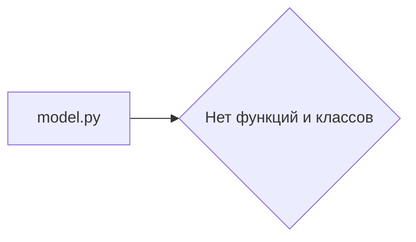

# Анализ кода из hypotez/src/ai/llama/model.py

## <input code>

```python
## \file hypotez/src/ai/llama/model.py
# -*- coding: utf-8 -*-\

#! venv/bin/python/python3.12

"""
.. module: src.ai.llama 
	:platform: Windows, Unix
	:synopsis:

"""


"""
	:platform: Windows, Unix
	:synopsis:

"""


"""
	:platform: Windows, Unix
	:synopsis:

"""


"""
  :platform: Windows, Unix

"""
"""
  :platform: Windows, Unix
  :platform: Windows, Unix
  :synopsis:
"""
  
""" module: src.ai.llama """


```

## <algorithm>

Код представляет собой пустой файл, содержащий только комментарии и константу MODE.  Алгоритм работы отсутствует, так как нет ни одной функции или класса.


## <mermaid>




## <explanation>

Этот файл `hypotez/src/ai/llama/model.py`  является пустым или содержит только комментарии.  Он не определяет ни классов, ни функций, ни каких-либо операций.

* **Импорты:** Отсутствуют импорты, что логично, так как в файле нет кода, который требует импорта модулей.
* **Классы:** Нет определённых классов.
* **Функции:** Нет определённых функций.
* **Переменные:** Единственная переменная – `MODE` -  имеет строковое значение 'dev'.  Используется для определения режима работы.  Значение переменной  уже объявлено дважды, что вероятно является ошибкой или лишним кодом.  Переменная `MODE` не используется далее в коде, она просто определена.
* **Возможные ошибки или области для улучшения:**
    * **Лишние комментарии:**  Комментирование уже имеющихся строк кода с описаниями, явно повторяется.
    * **Недостаток функциональности:** Файл не выполняет никаких задач и является пустым.  Он, скорее всего, должен содержать класс или функции, связанные с Llama.
    * **Несоответствие имени файла:**  Имя файла `model.py` предполагает, что он должен содержать модель или классы для работы с моделью.  Пустой файл не соответствует ожиданиям.


**Цепочка взаимосвязей с другими частями проекта:**  Если в проекте есть другие файлы, которые используют этот файл,  то связь отсутствует, так как этот файл не содержит никакой функциональности.  Вполне возможно, что этот файл предназначен для будущей реализации, но пока пуст.  Это, возможно, временный файл.

**Вывод:**  Файл является пустым или содержит ненужные/повторяющиеся комментарии.  Он не выполняет никакой функциональности.  Нужно добавить в него содержательные классы и методы для работы с моделью Llama.