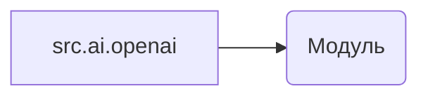

# Анализ кода (hypotez/src/ai/openai/README.MD)

## <input code>

```rst
.. module: src.ai.openai
```
```

## <algorithm>

Алгоритм работы кода в данном случае не описан.  Код представляет собой всего лишь заголовок, указывающий на модуль `src.ai.openai`.  Блок-схема не применима.

## <mermaid>



**Описание диаграммы:**

Диаграмма показывает, что `src.ai.openai` - это модуль.  Более подробная диаграмма невозможна, так как код не содержит функций или классов.

## <explanation>

**Импорты**:

В предоставленном фрагменте кода *нет* импортов.  Он просто указывает на существование модуля `src.ai.openai`.  Для понимания его роли, необходимо посмотреть на код этого модуля (файлы в папке `hypotez/src/ai/openai`).

**Классы**:

Нет ни одного класса.

**Функции**:

Нет функций.

**Переменные**:

Нет переменных.

**Связь с другими частями проекта:**

Без анализа кода модуля `src.ai.openai` невозможно установить связи с другими частями проекта.  Указание `.. module: src.ai.openai` говорит о том, что в файлах, расположенных в папке `hypotez/src/ai/openai` будут содержаться функции, классы, переменные и константы.  Этот модуль предполагается использует библиотеку `openai`, предоставляющую доступ к API.

**Возможные ошибки и улучшения:**

Код, представляющий собой только заголовок, не содержит ошибок в рамках данного фрагмента.  Чтобы понять возможные ошибки, необходимо проанализировать код самого модуля `src.ai.openai`.  Возможно, нужны проверки типа данных, или  использование  API openai.  Также необходимо проверить документацию или комментарии, чтобы понять назначение и работу функций и классов.


**Дополнительные замечания:**

Важно, чтобы файлы README в проекте имели достаточную информацию для понимания функциональности кода.  В идеале README должен содержать примеры использования, описание аргументов функций, атрибутов классов и т.д.