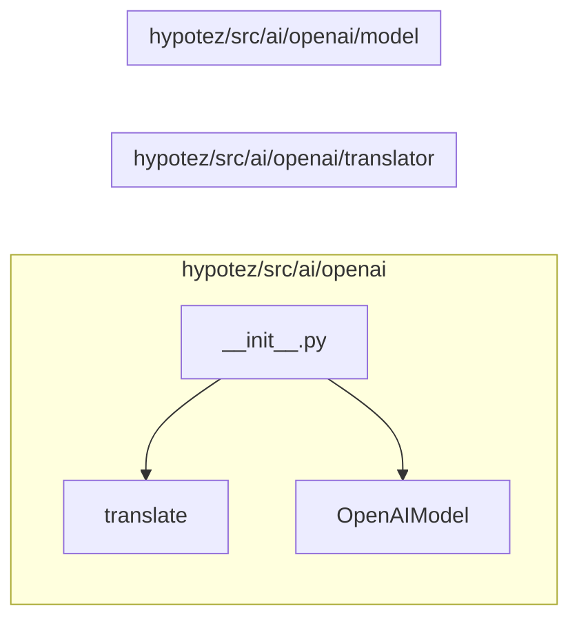

# <input code>

```python
## \file hypotez/src/ai/openai/__init__.py
# -*- coding: utf-8 -*-

#! venv/bin/python/python3.12

"""
.. module: src.ai.openai 
	:platform: Windows, Unix
	:synopsis: Модуль модели `openai`

"""


from .translator import translate
from .model import OpenAIModel
```

# <algorithm>

Нет явного алгоритма в данном файле. Файл представляет собой инициализационную часть модуля `openai`. Он импортирует функции и классы из других модулей в текущем подпакете.

**Пример:** Предположим, что `translator.py` содержит функцию `translate` и `model.py` содержит класс `OpenAIModel`.  Этот `__init__.py` импортирует их, делая `translate` и `OpenAIModel` доступными в других частях проекта, которые импортируют `src.ai.openai`.


# <mermaid>



**Объяснение диаграммы:**

*   `__init__.py` (A) импортирует функции из `translator.py` (B) и классы из `model.py` (C).
*   Стрелки указывают на зависимости: `__init__.py` зависит от `translator.py` и `model.py`.


# <explanation>

*   **Импорты**:
    *   `from .translator import translate`: Импортирует функцию `translate` из модуля `translator.py` в текущем подпакете (`src.ai.openai`).  Это позволяет использовать функцию `translate` в других частях проекта, которые импортируют `src.ai.openai`.
    *   `from .model import OpenAIModel`: Импортирует класс `OpenAIModel` из модуля `model.py` в текущем подпакете. Это позволяет использовать класс `OpenAIModel` в других частях проекта.

*   **Классы**:
    *   `OpenAIModel`: Данный класс (подробнее его код нужно видеть в `model.py`) реализует логику взаимодействия с моделью OpenAI.  Возможные методы: инициализация, запрос к модели, обработка ответа, и т.д.  Без кода `model.py` сложно сказать больше.


*   **Функции**:
    *   `translate`: Функция (из `translator.py`) отвечает за перевод текста.  Её использование без кода неясно. Без  подробностей из `translator.py` трудно сделать более точные выводы.

*   **Переменные**:
    *   ``: Строковая переменная, вероятно, используется для управления режимами работы (например, разработка, продакшен). Без контекста сложно сказать о её использовании.


*   **Возможные ошибки или области для улучшений**:
    *   Не хватает кода для полной оценки.  Полезно добавить аннотации типов для переменных и функции, а также документацию.  Отсутствие явного алгоритма в `__init__.py` не мешает работе, но сделало бы код более понятным.

*   **Цепочки взаимосвязей**:  Файл `__init__.py` в `src/ai/openai` служит  входом для взаимодействия с модулем OpenAI.  Дальнейшие вызовы будут происходить через функции и классы, определенные в `translator.py` и `model.py` соответственно, для доступа к функциональности `openai`  в данном проекте.   Без кода из `translator.py` и `model.py` трудно дать более подробную цепочку вызовов.