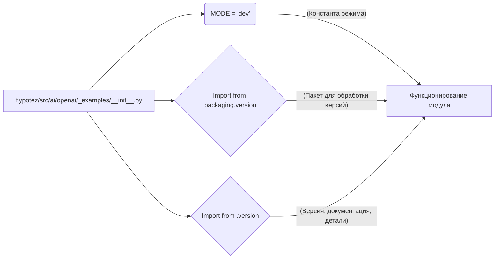

```MD
# Анализ кода hypotez/src/ai/openai/_examples/__init__.py

## <input code>

```python
## \file hypotez/src/ai/openai/_examples/__init__.py
# -*- coding: utf-8 -*-\n#! venv/Scripts/python.exe\n#! venv/bin/python/python3.12\n\n"""
.. module: src.ai.openai._examples 
	:platform: Windows, Unix
	:synopsis:

"""
MODE = 'dev'

"""
	:platform: Windows, Unix
	:synopsis:

"""


"""
	:platform: Windows, Unix
	:synopsis:

"""


"""
  :platform: Windows, Unix

"""
"""
  :platform: Windows, Unix
  :platform: Windows, Unix
  :synopsis:
"""MODE = 'dev'
  
""" module: src.ai.openai._examples """


from packaging.version import Version
from .version import __version__, __doc__, __details__
```

## <algorithm>

Код представляет собой инициализационный модуль, скорее всего, для подмодуля `_examples` внутри пакета `openai`.  Алгоритм работы состоит в импорте необходимых компонентов и, вероятно, в определении некоторых констант.  Пошаговая блок-схема не подходит для такой простой структуры, так как она выполняется при импорте модуля, а не при его запуске.

## <mermaid>



## <explanation>

**Импорты:**

- `from packaging.version import Version`: Импортирует класс `Version` из пакета `packaging.version`. Этот пакет используется для работы с версиями программного обеспечения.  В данном контексте, импорт необходим для обработки и/или сравнения версий, но в данном файле не используется.
- `from .version import __version__, __doc__, __details__`: Импортирует переменные `__version__`, `__doc__`, и `__details__` из подмодуля `version`.  Вероятно, эти переменные содержат информацию о версии, документацию и дополнительные детали модуля `_examples`, что типично для метаданных пакетов Python.  Связь с пакетом `openai` напрямую здесь не прослеживается, но предполагается, что модуль `version` находится внутри той же иерархии папок (как `hypotez/src/ai/openai/_examples/version.py`).

**Классы:**

В коде нет объявлений классов.

**Функции:**

В коде нет определений функций.

**Переменные:**

- `MODE = 'dev'`: Глобальная переменная, скорее всего, определяющая режим работы.  Значение `'dev'` предполагает, что это тестовый или разработочной режим.

**Возможные ошибки или улучшения:**

- **Недостаточно информации:**  В файле много пустых строк и комментариев.  Это может быть результатом того, что код находится в процессе разработки или в нём есть дополнительные детали, которые пока не представлены.
- **Отсутствие функциональности:** Нет кода, который напрямую выполняет какие-либо действия. Файл содержит только метаданные и импорты. Для полноценного модуля необходима дополнительная логика.
- **Непонятная цель:** Пустые строчки и комментарии без контекста затрудняют понимание целей и задач модуля. Необходимо дополнить этот код реализациями логики.

**Цепочка взаимосвязей:**

Файл `hypotez/src/ai/openai/_examples/__init__.py` является инициализационным модулем для папки `_examples` внутри пакета `openai`.  Он импортирует информацию о версии из модуля `version`.  Взаимосвязь с другими частями проекта неясна без дополнительного контекста.  Без доступа к `hypotez/src/ai/openai/_examples/version.py` невозможно полностью понять взаимосвязь с остальным проектом.