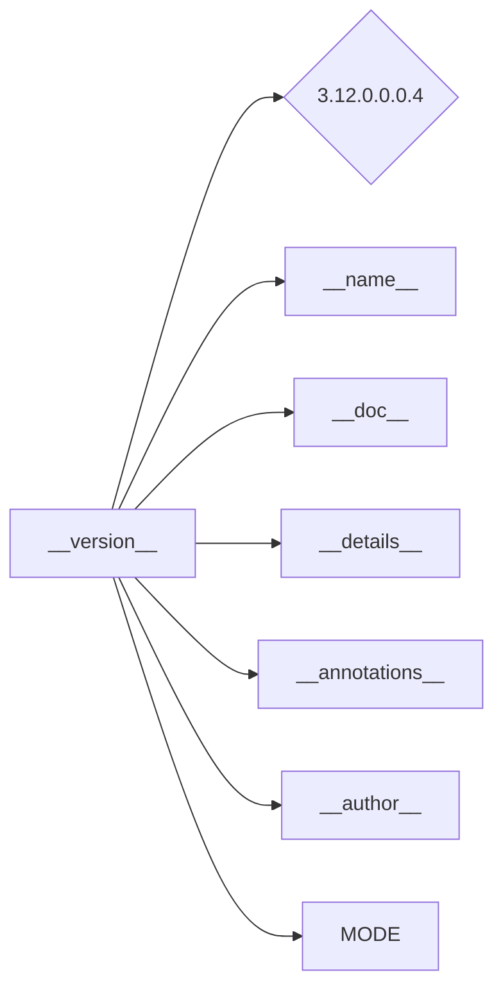

# <input code>

```python
## \file hypotez/src/ai/openai/_examples/version.py
# -*- coding: utf-8 -*-\
#! venv/Scripts/python.exe
#! venv/bin/python/python3.12

"""
.. module: src.ai.openai._examples 
	:platform: Windows, Unix
	:synopsis:

"""
MODE = 'dev'

"""
	:platform: Windows, Unix
	:synopsis:

"""


"""
	:platform: Windows, Unix
	:synopsis:

"""


"""
  :platform: Windows, Unix

"""
"""
  :platform: Windows, Unix
  :platform: Windows, Unix
  :synopsis:
"""MODE = 'dev'
  
""" module: src.ai.openai._examples """


""" @namespace src.ai._examples """


"""
- `__version__`: This variable holds the version of the module or package.
- `__name__`: Contains the name of the module. If the script is being run directly, the value will be `"__main__"`.
- `__doc__`: The module's documentation string.
- `__details__`: This variable likely contains additional details about the module, but the exact purpose depends on the specific module or package.
- `__annotations__`: Contains type annotations for variables and functions in the module.
- `__author__`: The name(s) of the author(s) of the module.
"""
__name__:str
__version__="3.12.0.0.0.4"
__doc__:str
__details__:str="Details about version for module or class"
__annotations__

__author__='hypotez '
```

# <algorithm>

Этот код представляет собой определение модуля или пакета, содержащий переменные, которые могут быть использованы в других частях проекта. Алгоритм работы заключается в простом определении переменных.  Не существует  пошагового процесса, так как нет функций или циклов.


# <mermaid>



# <explanation>

Этот код определяет модуль `version.py` в пакете `src.ai.openai._examples`.  Он содержит несколько строковых переменных, включая:

* **`__version__`**:  Переменная, хранящая версию модуля. Значение `3.12.0.0.0.4` указывает на версию.  Это  важно для управления версией и отслеживания изменений.
* **`__name__`**: Переменная, хранящая имя текущего модуля. В данном случае, тип данных str не явный, и предполагается, что она будет содержать строковое представление имени.
* **`__doc__`**:  Документационная строка модуля.
* **`__details__`**:  Строковая переменная, вероятно, содержащая подробные сведения о версии, но точное назначение зависит от проекта.
* **`__annotations__`**:  Строковая переменная, указывающая на возможность использования  тип аннотаций. 
* **`__author__`**:  Имя или имена авторов модуля.
* **`MODE`**: Переменная, хранящая строковое значение `'dev'`, которое вероятно указывает на режим работы, например, `development` (разработка).

**Импорты:**  В данном коде нет импортируемых модулей.

**Классы:** Нет классов.

**Функции:** Нет функций.

**Переменные:** Все переменные являются строковыми ( `str`).

**Возможные ошибки или области для улучшений:**

* Отсутствует явное назначение переменной `__name__`.  Рекомендуется установить имя модуля явно, например `__name__ = 'version'`
* Отсутствует явное определение типов данных для переменных `__name__`, `__doc__`, `__details__`, `__annotations__`.  Это может привести к неявной типизации и проблемам в будущем. 

**Взаимосвязи с другими частями проекта:**

Этот файл `version.py`  вероятно используется для определения информации о версии внутри проекта `hypotez`.  Он играет роль описания версионности для связанных модулей и файлов в `src/ai/openai/_examples`.