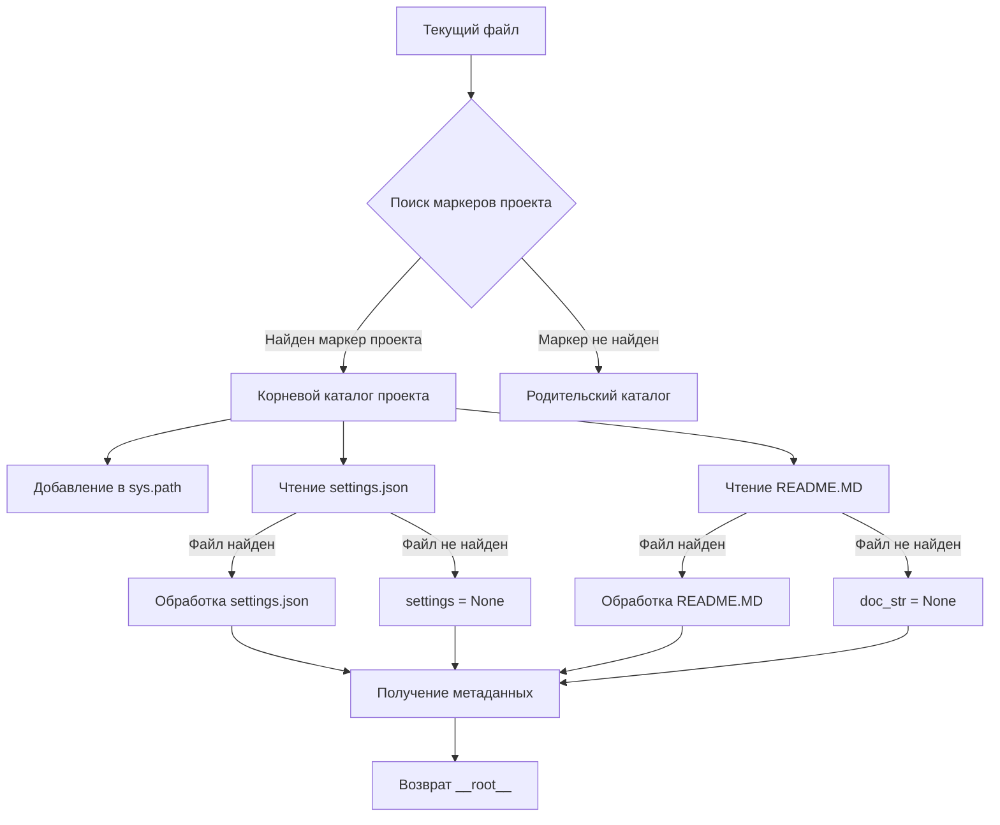

# <input code>

```python
## \file hypotez/src/logger/header.py
# -*- coding: utf-8 -*-\n#! venv/Scripts/python.exe
#! venv/bin/python/python3.12
"""
module: src.logger 
	:platform: Windows, Unix
	:synopsis: Модуль определяющий корневой путь к проекту. Все импорты строятся относительно этого пути.
    :TODO: В дальнейшем перенести в системную переменную"""


import sys
import json
from packaging.version import Version

from pathlib import Path
def set_project_root(marker_files=('__root__')) -> Path:
    """
    Finds the root directory of the project starting from the current file's directory,
    searching upwards and stopping at the first directory containing any of the marker files.

    Args:
        marker_files (tuple): Filenames or directory names to identify the project root.
    
    Returns:
        Path: Path to the root directory if found, otherwise the directory where the script is located.
    """
    __root__:Path
    current_path:Path = Path(__file__).resolve().parent
    __root__ = current_path
    for parent in [current_path] + list(current_path.parents):
        if any((parent / marker).exists() for marker in marker_files):
            __root__ = parent
            break
    if __root__ not in sys.path:
        sys.path.insert(0, str(__root__))
    return __root__


# Get the root directory of the project
__root__ = set_project_root()
"""__root__ (Path): Path to the root directory of the project"""

from src import gs

settings:dict = None
try:
    with open(gs.path.root / 'src' / 'settings.json', 'r') as settings_file:
        settings = json.load(settings_file)
except (FileNotFoundError, json.JSONDecodeError):
    ...

doc_str:str = None
try:
    with open(gs.path.root / 'src' / 'README.MD', 'r') as settings_file:
        doc_str = settings_file.read()
except (FileNotFoundError, json.JSONDecodeError):
    ...


__project_name__ = settings.get("project_name", 'hypotez') if settings  else 'hypotez'
__version__: str = settings.get("version", '')  if settings  else ''
__doc__: str = doc_str if doc_str else ''
__details__: str = ''
__author__: str = settings.get("author", '')  if settings  else ''
__copyright__: str = settings.get("copyrihgnt", '')  if settings  else ''
__cofee__: str = settings.get("cofee", "Treat the developer to a cup of coffee for boosting enthusiasm in development: https://boosty.to/hypo69")  if settings else "Treat the developer to a cup of coffee for boosting enthusiasm in development: https://boosty.to/hypo69"
```

# <algorithm>

**Алгоритм работы:**

1. **Инициализация:** Определяется набор файлов-маркеров проекта (`marker_files`).
2. **Поиск корневого каталога:** Начиная с текущего каталога, код итеративно проходит вверх по иерархии каталогов. Для каждого родительского каталога проверяется наличие файлов-маркеров. Если файл найден, корневой каталог запоминается, и поиск завершается.
3. **Добавление в путь:** Если корневой каталог не найден в пути поиска (`sys.path`), он добавляется в начало.
4. **Чтение настроек:**  Пытается прочитать файл `settings.json` в корневой директории проекта. Если файл существует, данные декодируются в словарь `settings`.
5. **Чтение документации:** Пытается прочитать файл `README.MD` в корневой директории проекта. Если файл существует, содержимое загружается в переменную `doc_str`.
6. **Получение метаданных:** Из словаря `settings` извлекаются значения для переменных проекта (например, `__project_name__`, `__version__`, ...). Значения по умолчанию используются, если соответствующий ключ отсутствует.
7. **Возвращение корневого каталога:** Возвращается объект `Path` корневого каталога проекта.

**Пример:**

Если текущий файл находится в `hypotez/src/logger/header.py`, а корень проекта в `hypotez`, функция `set_project_root` найдет его, и добавит в `sys.path`.

**Передача данных:**

- Функция `set_project_root` возвращает корневой каталог проекта.
- Результат функции используется для получения данных из файлов настроек и документации.

# <mermaid>



**Объяснение диаграммы:**

- Начальная точка - `Текущий файл`.
- В `Поиск маркеров проекта` ищется корневой каталог по заданным маркерам.
- Если корень проекта найден, происходит чтение файлов `settings.json` и `README.MD`.
- Если файлы не найдены, значения по умолчанию устанавливаются в соответствующие переменные.
- В конечном итоге возвращается объект `Path`, представляющий корневой каталог проекта.

# <explanation>

**Импорты:**

- `sys`: Модуль, предоставляющий доступ к системным переменным, в частности, `sys.path`.
- `json`: Модуль для работы с JSON-файлами.
- `packaging.version`: Модуль для работы с версиями.
- `pathlib`: Модуль для работы с путями к файлам.

**Классы:**

- Нет классов.

**Функции:**

- `set_project_root(marker_files)`:
    - Назначение: Находит корневой каталог проекта.
    - Аргументы: `marker_files` (кортеж имен файлов/каталогов для поиска).
    - Возвращаемое значение: `Path` к корневому каталогу.
    - Пример: `set_project_root(('pyproject.toml',))` будет искать `pyproject.toml`.

**Переменные:**

- `__root__`: `Path` корневого каталога проекта.
- `settings`: Словарь с настройками проекта (типа `dict`).
- `doc_str`: Строка, содержащая содержимое `README.MD` (типа `str`).
- `MODE`: Переменная, содержащая строку, скорее всего, режима работы.


**Возможные ошибки и улучшения:**

- **Обработка ошибок:** Обработка `FileNotFoundError` и `json.JSONDecodeError` при чтении файлов `settings.json` и `README.MD` — важный момент, чтобы программа не завершалась с ошибкой.
- **Улучшение поиска корневого каталога:** Можно добавить логику для поиска файлов `pyproject.toml` в пакетах `requirements.txt`, чтобы добавить поиск в родительские директории.

**Взаимосвязь с другими частями проекта:**

- Функция `set_project_root` позволяет определить корневой каталог проекта.
- Полученные данные из `settings.json` могут использоваться в других модулях для настройки проекта.
- `gs.path.root` подразумевает импорт из `hypotez/src/gs/path.py`. Этот модуль, скорее всего, содержит методы для работы с путями в проекте.


**Общий вывод:**

Код выполняет важную функцию определения корневого каталога проекта и инициализации переменных для дальнейшего использования. Примеры обработки исключений и использование значения по умолчанию делают код более устойчивым к ошибкам.  Определенная переменная `MODE` и функции для поиска проекта в родительских каталогах указывают на общий контекст проекта.