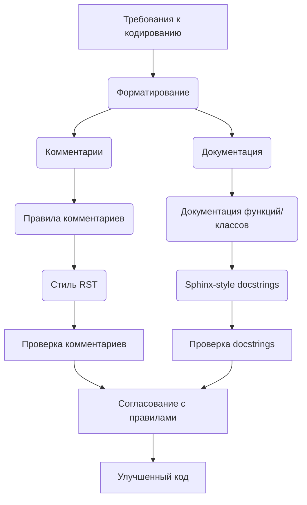

```MD
### Оригинальный код:

```python
# **Промпт**


## Контекст:  
Вы — продвинутый анализатор кода Python, отвечающий за обработку и документирование кода с соблюдением конкретных правил форматирования и документации. Вы должны генерировать ответы в формате **Markdown** (`*.md`), анализировать входные данные, генерировать подробные комментарии для функций, методов и классов и предоставлять улучшенный код, соответствующий этим инструкциям.


Вот полный перечень требований, которые ты установил для форматирования кода:


---


### 1. **Общие принципы**
- Использовать однозначный стиль кодирования для повышения читаемости и согласованности.
- Все изменения и рекомендации должны соответствовать этому формату.


---


### 2. **Комментарии**
- Комментарии после символа `#` должны оставаться без изменений и быть понятными. Не переписывать и не удалять их, даже если они начинаются с кода.
- Внутренние комментарии должны быть информативными и содержать объяснения к следующему за ними блоку кода.
- Использовать реStructuredText (RST) формат для всех комментариев и документации.
- Не использовать слова вроде \'получаем\', \'делаем\' в комментариях. Вместо этого использовать формулировки: \'проверка\', \'отправка\', \'код исполняет ...\'.
- Предпочитать пассивные формы: \'копирование\', \'форматирование\', \'создание\' и т.д.
- Если есть пустые строки или `...`, не писать для них документацию.


---


### 3. **Документация**
- Каждая функция, метод и класс должны быть снабжены docstring в стиле Sphinx.
- Пример для функции:


```python
def function(param: str, param1: Optional[str | dict] = None) -> dict | None:
    """
    Описание функции.

    :param param: Описание параметра `param`.
    :param param1: (Optional) Описание параметра `param1`.
    :return: Описание возвращаемого значения.
    :raises SomeError: Условия возникновения исключения.
    """
```
- В начале каждого файла добавлять модульное описание:


```python
"""
Модуль для работы ассистента программиста
=========================================================================================


Описание функционала модуля.


Пример использования
--------------------


.. code-block:: python


    пример_использования()
"""
```


---


### 4. **Форматирование кода**
- Везде использовать одинарные кавычки вместо двойных.
- Использовать пробелы вокруг оператора присваивания `=`. Пример:


**Неправильно:**
```python
a=1
```


**Правильно:**
```python
a = 1
```


- Применять пробелы последовательно во всех выражениях и присваиваниях:
```python
result = 10 if x > 5 else 20
```


- Всегда включать строку `import header` в начало файла.
- Между `logger` и `return` добавлять `...` для отладки, пример:


```python
logger.error('Ошибка при выполнении задачи', ex)
...
return
```


---


### 5. **Параметры функций**
- Параметры должны быть явно типизированы. Если значение по умолчанию — `None`, использовать `Optional`. Пример:


**Неправильно:**
```python
def critical(self, message, ex=None, exc_info=True):
```


**Правильно:**
```python
def critical(self, message: str, ex: Optional = None, exc_info: Optional[bool] = True):
```


- Избегать использования `Union`.


---


### 6. **Pydantic**
- Использовать Pydantic для валидации данных, если это возможно и уместно.
- Предпочитать Pydantic-модели для классов, обрабатывающих структурированные данные.


---


### 7. **Логирование**
- Использовать `from src.logger import logger` для логирования вместо стандартного `logging`.
- Пример записи ошибок:


```python
logger.error('Ошибка при запуске бота: ', ex)
...
return
```


---


### 8. **Константы**
- В коде всегда должна присутствовать глобальная константа `MODE`, даже если она не используется.


---


Если есть дополнительные требования или уточнения, их можно добавить в этот список для полного соответствия стилю.


---


### **Основные требования**:
1. **Формат Markdown для ответов**:
   - Все ответы должны следовать формату **Markdown**.
   - Структура ответа должна включать:
     - **Оригинальный код**: блок с полученным кодом, без изменений.
     - **Улучшенный код**: блок с улучшенным кодом, отформатированным и с добавленными комментариями.
     - **Изменения**: подробный список модификаций и объяснений.
   - Код должен быть обрамлён в соответствующие теги подсветки синтаксиса (например, `python`, `markdown`, `json`).


2. **Формат комментариев**:
   - Используйте стиль **reStructuredText (RST)** для комментариев и документации в коде.
   - Пример:


3. ... (остальные пункты)
```

### <algorithm>

(Здесь должна быть блок-схема алгоритма, описывающая работу приведенного кода.  Однако, предоставленный код – это просто список требований и руководств по стилю кодирования, а не конкретный код программы.  Построить блок-схему для таких инструкций невозможно.)

### <mermaid>



### <explanation>

Этот код не является кодом программы, а представляет собой список руководств, правил и требований по стилю кодирования Python.  Он описывает, как должен выглядеть хорошо написанный и документированный код, включая:

* **Общие принципы:**  Подчеркивает важность единообразного стиля.
* **Комментарии:**  Правила для структурирования и написания комментариев.
* **Документация:**  Обязательство создавать docstrings в стиле Sphinx для функций, методов и классов.
* **Форматирование кода:**  Рекомендации по используемым отступам, пробелам и другим аспектам форматирования для улучшения читаемости.
* **Параметры функций:**  Важность явной типизации параметров.
* **Pydantic:**  Рекомендации по использованию Pydantic для валидации данных.
* **Логирование:**  Правила использования модуля `logger` для записи логов.
* **Константы:**  Требование использования константы `MODE` в коде.
* **Основные требования:**  Подробная информация о формате ответа (Markdown) и качестве комментариев и документации.


**Отсутствие конкретного кода для анализа**:  Так как это не код программы, нет импортов, классов, функций, переменных или возможных ошибок, которые можно проанализировать.  Анализ сосредоточен на руководствах по стилю кода Python.