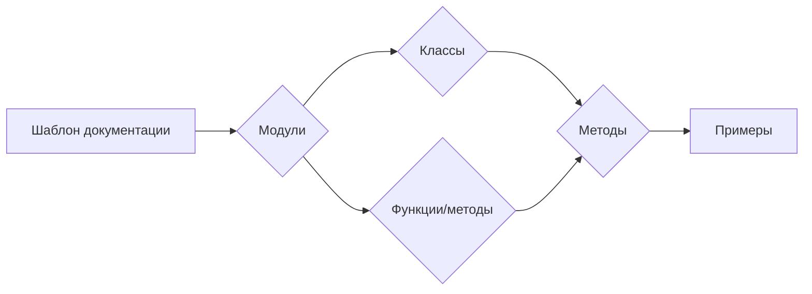

# <algorithm>

**Описание алгоритма:**

Этот код представляет собой шаблон документации для кода на Markdown, описывающий, как необходимо документировать модули, классы, функции и методы. Он не содержит исполняемого кода, а содержит примеры оформления документации в формате Markdown.

**Пошаговая блок-схема:**

1. **Введение:** Описывает структуру и стиль документации кода в Markdown.
2. **Модули:** Описание модуля должно содержать его назначение, примеры использования, используемые платформы и синопсис.
3. **Классы:** Описание класса должно содержать его назначение, атрибуты, методы и их описание. Для каждого метода указываются параметры, возвращаемые значения и примеры использования.
4. **Функции и методы:** Описание функций и методов должно содержать их назначение, параметры, возвращаемые значения и примеры использования.
5. **Комментарии:** Все комментарии в коде должны быть написаны в формате Markdown и объяснять, что делает конкретная часть кода.
6. **Исключения:** Документировать исключения для классов, методов и функций. Указывать, какие исключения могут быть подняты и при каких обстоятельствах.

**Передача данных:**

В данном случае нет передачи данных между функциями или классами, так как это просто шаблон документации. Код демонстрирует, как должна быть структурирована документация, а не как функционирует сам код.

# <explanation>

**1. <input code>**

Код представлен в формате HTML и содержит шаблон документации на Markdown. Он не является исполняемым кодом.

**2. <algorithm>**

Поскольку это шаблон, алгоритм представляет собой описание правил для форматирования документации.

**3. <mermaid>**

**Описание диаграммы:**

Диаграмма представляет собой последовательность: от шаблона документации к описанию модулей, классов и функций. Стрелки показывают, что документация вложенная структура: модули содержат классы, классы содержат методы и все это иллюстрируется примерами использования.

**4. <explanation>**

* **Импорты:** Нет импортов, так как код не исполняемый.

* **Классы:** Нет определённых классов, это шаблон для описания классов.

* **Функции:** Нет определённых функций, это шаблон для описания функций.

* **Переменные:** Нет переменных, нет исполняемого кода.

**Возможные ошибки/улучшения:**

Шаблон корректен, но можно добавить пояснения о структуре Markdown для облегчения понимания.

**Взаимосвязи с другими частями проекта:**

Данный код не связан с конкретными частями проекта. Это самостоятельный шаблон документации, который должен быть применён к коду.

**Вывод:**

Код представляет собой шаблон, который описывает, как должен быть написан код на Markdown, для документирования модулей, классов, функций и методов.