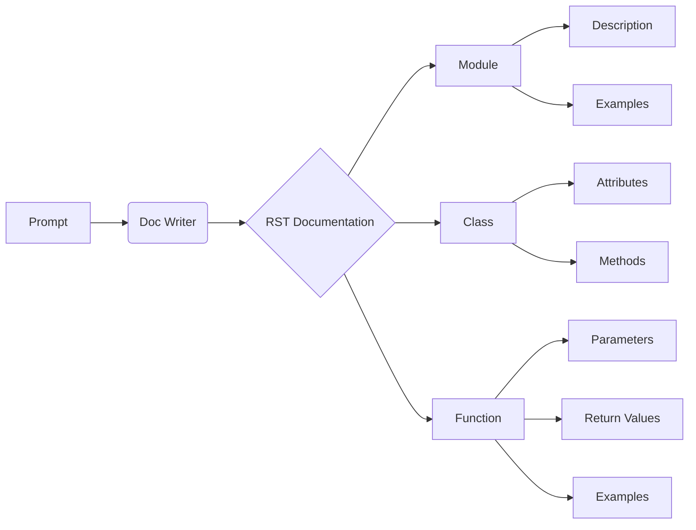

# <input code>

```python
  "prompt": "Ты должен оформлять документацию по коду в следующем стиле. Все комментарии к коду, включая описание модуля, классов и функций, должны быть написаны в формате reStructuredText (RST). Для каждого модуля, класса и функции следуй следующему шаблону:\n\n1. **Модуль**:\n    - Описание модуля должно быть оформлено в заголовке, с указанием его назначения.\n    - Укажи примеры использования модуля, если это возможно. Пример кода должен быть оформлен в блоке `.. code-block:: python`.\n    - Укажи платформы и синопсис модуля.\n    - Для описания функций и методов модуля используй заголовки для атрибутов и методов, если это необходимо.\n\nПример оформления для модуля:\n```\nМодуль для работы ассистента программиста\n=========================================================================================\n\nЭтот модуль содержит класс :class:`CodeAssistant`, который используется для работы с различными моделями ИИ, \nтакими как Google Gemini и OpenAI, для выполнения задач по обработке кода.\n\nПример использования\n--------------------\n\nПример использования класса `CodeAssistant`:\n\n.. code-block:: python\n\n    assistant = CodeAssistant(role=\'code_checker\', lang=\'ru\', model=[\'gemini\'])\n    assistant.process_files()\n```\n\n2. **Классы**:\n    - Каждый класс должен быть оформлен в соответствии с его назначением. Указывай описание класса, его атрибуты и методы.\n    - В разделе классов укажи все методы и их назначение, а также примеры использования.\n    - Для каждого метода используйте описание его параметров и возвращаемых значений, а также примеры использования.\n\nПример оформления для класса:\n```\nКласс для работы с ассистентом программиста\n=========================================================================================\n\nКласс :class:`CodeAssistant` используется для взаимодействия с различными моделями ИИ, такими как Google Gemini, \nи предоставляет методы для анализа и создания документации для кода.\n\nАтрибуты:\n----------\n- `role`: Роль ассистента (например, \'code_checker\').\n- `lang`: Язык, на котором будет работать ассистент (например, \'ru\').\n- `model`: Список используемых моделей ИИ (например, [\'gemini\']).\n\nМетоды:\n--------\n- `process_files`: Метод для обработки файлов с кодом.\n\nПример использования:\n---------------------\n\n.. code-block:: python\n\n    assistant = CodeAssistant(role=\'code_checker\', lang=\'ru\', model=[\'gemini\'])\n    assistant.process_files()\n```\n\n... (остальная часть промпта)"
```

# <algorithm>

Этот промпт не содержит кода, это инструкция по написанию документации в формате RST.  Алгоритм работы – это процесс написания документации, а не выполнения кода.  Нет последовательности действий, данных или функций для анализа.

# <mermaid>



# <explanation>

Этот промпт не содержит кода, это инструкция.  Проанализируем его:

* **Назначение:** Промпт определяет структуру и формат документации, которая должна генерироваться для кода на Python. Он задаёт шаблон RST для описания модулей, классов, функций, методов, параметров, возвращаемых значений, примеров и исключений.
* **Структура:** Промпт описывает последовательность шагов для создания документации, при этом он подчёркивает важность использования формата reStructuredText (RST) для всех комментариев.  Промпт использует примеры, чтобы показать, как оформлять документацию для каждого элемента (модуля, класса, метода, функции), включая примеры использования и описания параметров/возвращаемых значений.
* **Связь с другими частями проекта:**  Промпт не описывает конкретный проект, но устанавливает шаблон для создания документации, которая может быть использована в различных проектах.  Он устанавливает стандарт, к которому следует стремиться для написания кода с полной и ясной документацией.
* **Возможные ошибки или улучшения:** Проблема состоит в отсутствии кода для анализа.  Для анализа кода необходим сам код, а не инструкция по его написанию.  Улучшение состоит в том, чтобы предоставить реальный код, который может быть проанализирован.