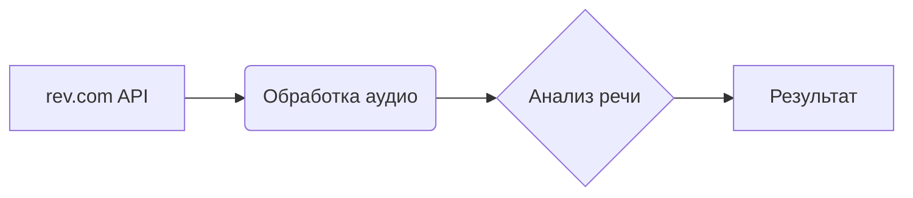

# Анализ кода из файла README.md

## <input code>

```revai (rev.com - модель, которая умеет работать с звуковыми файлами переговоров, совещаний, звонков и т.п.)
# https://www.rev.com/api/docs
# https://docs.rev.ai/resources/code-samples/python/
```

## <algorithm>

Из-за отсутствия кода в формате Python, алгоритм и блок-схема не могут быть построены.  Нет возможности определить последовательность операций и перемещение данных.

## <mermaid>



**Описание диаграммы:**

Диаграмма отображает упрощенную модель взаимодействия с API rev.com.  API rev.com (A) предоставляет функции обработки аудио (B).  Следующим шагом (C) является анализ полученного аудио.  В результате (D) получаются данные, например, транскрипт разговора.

**Зависимости:**

* rev.com API -  основной внешний ресурс, предоставляет возможности для работы со звуковыми файлами.
* Python API - предположительно, будет использоваться для взаимодействия с API rev.com.

## <explanation>

Код в README.md - это *не код*, а комментарии, ссылочные данные на документацию. Он указывает на существование модели rev.com, предназначенной для обработки аудио (переговоры, звонки и т.п.)  И предоставляет ссылки на документацию API этой модели и на примеры кода на Python.

* **Импорты**:  Нет импортов. Код отсутствует, поэтому нет возможности проанализировать импорты и их связь с другими пакетами.
* **Классы**: Нет классов.
* **Функции**: Нет функций.
* **Переменные**: Нет переменных.
* **Возможные ошибки и улучшения**:  Отсутствие кода не позволяет определить возможные ошибки или области улучшения.


**Цепочка взаимосвязей с другими частями проекта**:

В приведённом контексте, проект предполагает использование Python-библиотеки для взаимодействия с API rev.com.  Дополнительно, вероятно, потребуется обработка и использование полученных данных транскрипции (например, для хранения, поиска или дальнейшей обработки).

**Выводы**:

Этот фрагмент README.md описывает внешний ресурс (API rev.com) и предоставляет ссылки на документацию для использования в проекте. Он не содержит кода, поэтому анализ структуры, алгоритмов и логики невозможен.