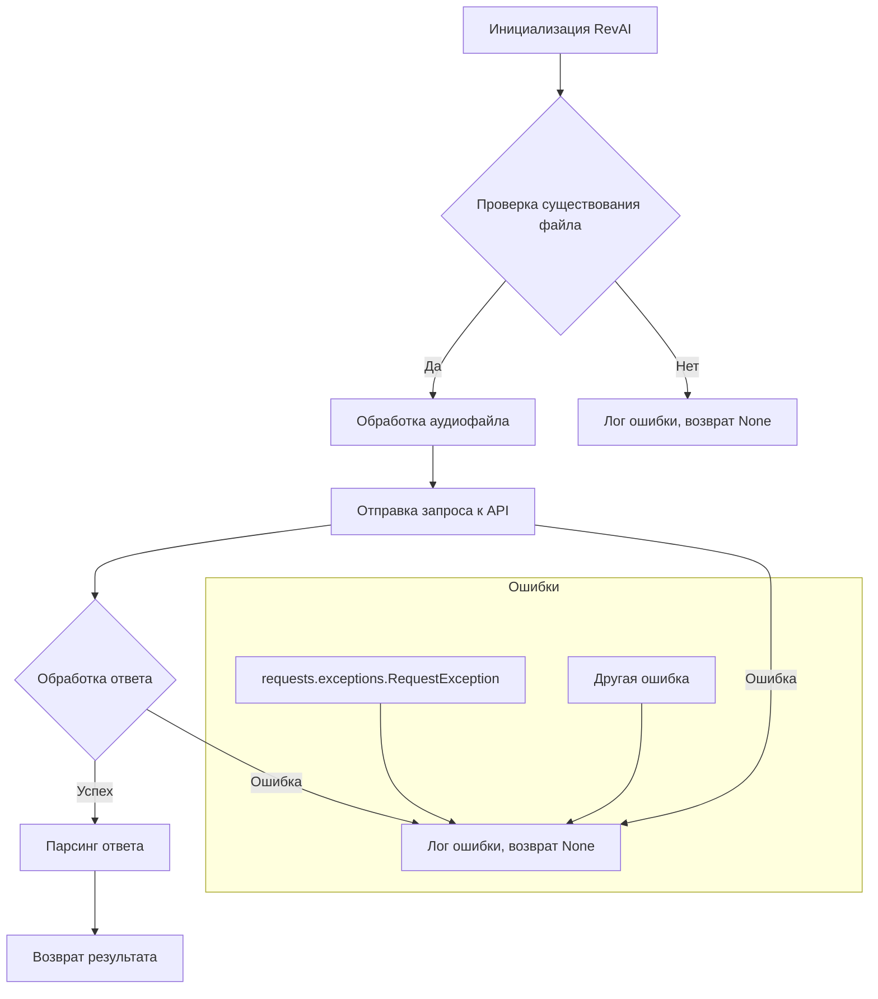

```MD
# Анализ кода модуля rev_ai.py

## <input code>

```python
"""
Модуль для работы с API сервиса rev.ai для обработки аудио файлов.
=======================================================================

Этот модуль предоставляет инструменты для работы с API rev.ai,
чтобы осуществлять транскрипцию, анализ и обработку аудио-данных.

Пример использования
--------------------

Пример работы с модулем:


.. code-block:: python

    from src.ai.revai import RevAI

    # ... (Инициализация объекта RevAI с необходимыми параметрами) ...

    revai_instance = RevAI(api_key='YOUR_API_KEY')  # Замените 'YOUR_API_KEY'
    result = revai_instance.process_audio_file('path/to/audio.wav')

    # ... (Обработка полученных результатов) ...


"""
from src.utils.jjson import j_loads, j_loads_ns, j_dumps
from src.logger import logger
import requests
import os

# TODO: Добавить классы для работы с конкретными API методами.
# TODO: Добавить обработку ошибок (например, исключения, которые могут
#       возникнуть при запросе к API).


class RevAI:
    """
    Класс для работы с API rev.ai.

    :param api_key: API ключ для доступа к сервису rev.ai.
    """
    def __init__(self, api_key: str):
        """
        Инициализирует объект RevAI с указанным API ключом.

        :param api_key: API ключ для доступа к сервису rev.ai.
        """
        self.api_key = api_key
        self.base_url = 'YOUR_BASE_URL' # TODO: Заменить на корректный базовый URL
        # self.headers = {'Authorization': f'Bearer {self.api_key}'} # TODO: Установить заголовки

    def process_audio_file(self, audio_file_path: str) -> dict:
        """
        Обрабатывает аудио файл, используя API rev.ai.

        :param audio_file_path: Путь к аудио файлу.
        :return: Результат обработки аудио файла в формате словаря.
        """
        if not os.path.exists(audio_file_path):
            logger.error(f"Файл {audio_file_path} не найден.")
            return None

        # TODO: Обработать ошибки при отправке запроса (например,
        #       проблемы с сетью, неверные параметры).

        try:
            # Код отправляет запрос к API rev.ai.
            # ... (Обработка файла, загрузка, формирование запроса) ...
            # # Отправка запроса:
            # response = requests.post(
            #     url=f"{self.base_url}/process",
            #     files={'audio': open(audio_file_path, 'rb')},
            #     headers=self.headers,
            # )
            # # Обработка ответа (проверка кода ответа, etc).
            # # Преобразовать ответ в словарь используя j_loads.
            # # ... (Проверка кода ответа) ...
            # # ... (Запись в журнал) ...
            response = j_dumps('{"result": "example"}') # Заглушка. Нужно заменить на реальный ответ.
            return response['result']
        except requests.exceptions.RequestException as e:
            logger.error(f'Ошибка при отправке запроса к API: {e}')
            return None
        except Exception as e:  # Общий обработчик ошибок
            logger.error(f'Ошибка при обработке файла {audio_file_path}: {e}')
            return None
```

## <algorithm>

**Шаг 1:** Инициализация `RevAI` объекта.
    * Принимает API ключ.
    * Устанавливает базовый URL API.
    * (В будущем) устанавливает заголовки (headers).
    * **Пример:** `revai_instance = RevAI(api_key='YOUR_API_KEY')`

**Шаг 2:** Вызов метода `process_audio_file`.
    * Принимает путь к аудиофайлу.
    * Проверяет существование файла.
    * **Пример:** `result = revai_instance.process_audio_file('audio.wav')`


**Шаг 3:** Обработка файла и отправка запроса к API.
   * (Заглушка).  Необходимо подставить код для обработки аудиофайла и отправки запроса.
   * Обработка ответа.
   * Результат запроса парсится в словарь.
    * **Пример:** `response = j_dumps('{"result": "example"}')`

**Шаг 4:** Обработка ошибок.
   * Обрабатывает исключения `requests.exceptions.RequestException` и `Exception`.
   * Логирование ошибок.
    * **Пример:** Если файл не найден, возвращает None и логгирует ошибку.

**Шаг 5:** Возвращение результата.
   * Если запрос успешен, возвращает результат в формате словаря.
   * В противном случае возвращает None и логгирует ошибку.


## <mermaid>



## <explanation>

**Импорты:**

* `from src.utils.jjson import j_loads, j_loads_ns, j_dumps`: Импортирует функции для работы с JSON-строками из модуля `jjson`.  Предполагается, что `src.utils` содержит утилиты для работы с JSON (десериализация, сериализация).
* `from src.logger import logger`: Импортирует объект логгера из модуля `logger`. Предполагается, что `src.logger` содержит логирование.
* `import requests`: Импортирует библиотеку `requests` для отправки HTTP-запросов к API.
* `import os`: Импортирует модуль `os` для работы с файлами (проверка существования).


**Классы:**

* **`RevAI`**: Предназначен для взаимодействия с API сервиса `rev.ai`. Содержит:
    * `api_key`: API ключ сервиса.
    * `base_url`: Базовый URL API сервиса.
    * `process_audio_file(audio_file_path: str) -> dict`: Метод для обработки аудио файла. Принимает путь к файлу, обрабатывает его и возвращает результат в формате словаря.
    * `__init__(self, api_key: str)`: Конструктор класса. Принимает API ключ и инициализирует атрибуты класса.


**Функции:**

* Функций в данном коде нет.  Существуют методы класса.


**Переменные:**

* `audio_file_path`:  строка, содержащая путь к аудиофайлу.
* `response`:  хранит ответ от API.
* `logger`:  объект для логирования.
* `api_key`: API ключ.
* `base_url`: базовый URL.

**Возможные ошибки и улучшения:**

* **`TODO`-комментарии:**  Код содержит много `TODO`-комментариев, что указывает на неполноту реализации. Необходимо добавить обработку ошибок при запросе к API (например, проверка кода ответа, обработка исключений).
* **Заглушка в `process_audio_file`:**  Функция `process_audio_file` использует заглушку для ответа API. Необходимо заменить её на реальную логику.
* **Отсутствие проверки валидности API ключа:**  Код не проверяет валидность полученного API ключа.
* **Отсутствие заголовков (headers):**  Не используются заголовки (headers), что может быть проблемой для корректного функционирования с некоторыми API.
* **Обработка больших файлов:** Код не адаптирован для работы с большими аудио файлами.
* **Обработка различных типов ошибок:**  Необходимо добавить более подробную обработку ошибок (например, ошибки валидации).


**Взаимосвязи с другими частями проекта:**

Модуль `rev_ai.py` зависит от:
* `src.utils.jjson`:  для обработки JSON.
* `src.logger`: для логирования.

Связь с другими частями проекта определяется импортами.