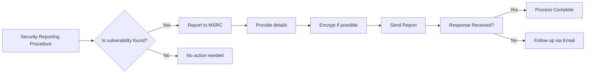

```MD
# Анализ кода SECURITY.md

**1. <input code>**

```
<!-- BEGIN MICROSOFT SECURITY.MD V0.0.9 BLOCK -->

## Security

Microsoft takes the security of our software products and services seriously, which includes all source code repositories managed through our GitHub organizations, which include [Microsoft](https://github.com/Microsoft), [Azure](https://github.com/Azure), [DotNet](https://github.com/dotnet), [AspNet](https://github.com/aspnet) and [Xamarin](https://github.com/xamarin).

If you believe you have found a security vulnerability in any Microsoft-owned repository that meets [Microsoft's definition of a security vulnerability](https://aka.ms/security.md/definition), please report it to us as described below.

## Reporting Security Issues

**Please do not report security vulnerabilities through public GitHub issues.**

Instead, please report them to the Microsoft Security Response Center (MSRC) at [https://msrc.microsoft.com/create-report](https://aka.ms/security.md/msrc/create-report).

If you prefer to submit without logging in, send email to [secure@microsoft.com](mailto:secure@microsoft.com).  If possible, encrypt your message with our PGP key; please download it from the [Microsoft Security Response Center PGP Key page](https://aka.ms/security.md/msrc/pgp).

You should receive a response within 24 hours. If for some reason you do not, please follow up via email to ensure we received your original message. Additional information can be found at [microsoft.com/msrc](https://www.microsoft.com/msrc).

Please include the requested information listed below (as much as you can provide) to help us better understand the nature and scope of the possible issue:

  * Type of issue (e.g. buffer overflow, SQL injection, cross-site scripting, etc.)
  * Full paths of source file(s) related to the manifestation of the issue
  * The location of the affected source code (tag/branch/commit or direct URL)
  * Any special configuration required to reproduce the issue
  * Step-by-step instructions to reproduce the issue
  * Proof-of-concept or exploit code (if possible)
  * Impact of the issue, including how an attacker might exploit the issue

This information will help us triage your report more quickly.

If you are reporting for a bug bounty, more complete reports can contribute to a higher bounty award. Please visit our [Microsoft Bug Bounty Program](https://aka.ms/security.md/msrc/bounty) page for more details about our active programs.

## Preferred Languages

We prefer all communications to be in English.

## Policy

Microsoft follows the principle of [Coordinated Vulnerability Disclosure](https://aka.ms/security.md/cvd).

<!-- END MICROSOFT SECURITY.MD BLOCK -->
```

**2. <algorithm>**

Этот код не содержит алгоритма в традиционном понимании. Он представляет собой текстовую инструкцию по процедуре отчетности о уязвимостях в коде Microsoft.  Блок-схема не требуется.

**3. <mermaid>**



**4. <explanation>**

Этот файл `SECURITY.MD` является частью документации по безопасности репозитория.  Он описывает процедуру, которую необходимо придерживаться при обнаружении потенциальных уязвимостей в коде Microsoft.

* **Импорты:** Нет импортов в классическом понимании. Файл состоит из текстового контента и ссылок.
* **Классы:** Нет классов.
* **Функции:** Нет функций.
* **Переменные:** Нет переменных.
* **Подробное объяснение:**  Документ содержит:
    * **Описание политики безопасности:** Объясняет, что Microsoft серьезно относится к безопасности своего программного обеспечения.
    * **Процедура отчетности о уязвимостях:** Указывает, что отчеты о уязвимостях следует направлять в Microsoft Security Response Center (MSRC) через специальный веб-сайт.
    * **Требования к отчету:** Подробно описывает информацию, которую нужно предоставить в отчете об уязвимости, например, тип уязвимости, местоположение кода, шаги по воспроизведению.
    * **Предпочитаемые языки:** Уточняется, что общение должно быть на английском языке.
    * **Политика:**  Указывается принцип согласованного раскрытия уязвимостей (Coordinated Vulnerability Disclosure).
* **Возможные ошибки или области для улучшений:**  Необходимо отметить, что точная спецификация формата отчета о уязвимости должна быть прописана для достижения наилучшей эффективности.

**Взаимосвязи с другими частями проекта:** Этот файл тесно связан с самим кодом (или репозиториями), в которых могут потенциально присутствовать уязвимости.  Цепочка взаимосвязей: код → потенциальная уязвимость → отчет → решение.  Файл `SECURITY.MD` является элементом системы управления рисками.