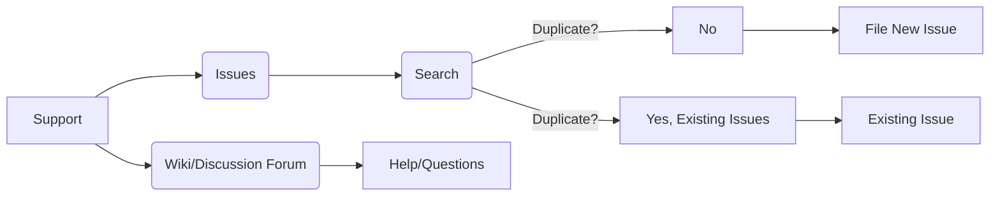

# <input code>

```
# Support

## How to file issues and get help  

This project uses GitHub Issues to track bugs and feature requests. Please search the existing 
issues before filing new issues to avoid duplicates.  For new issues, file your bug or 
feature request as a new Issue.

For help and questions about using this project, please consult our Wiki or post on our
Discussion forum, both right here on GitHub.

## Microsoft Support Policy  

Support for TinyTroupe is limited to the resources listed above.
```

# <algorithm>

Этот код представляет собой документ, описывающий процесс получения поддержки и подачи отчетов об ошибках для проекта TinyTroupe. Алгоритм работы в данном случае отсутствует, так как это не код программы, а описание процесса. Документ содержит информацию о том, как пользователи могут подавать отчеты об ошибках и запрашивать помощь.

# <mermaid>



# <explanation>

Этот код представляет собой markdown-файл, описывающий политику поддержки проекта `TinyTroupe`.  Он не содержит исполняемого кода, а представляет собой документ, описывающий, как пользователи могут получить помощь и как сообщать об ошибках.

**Импорты:** Нет импортируемых модулей, так как это не код программы, а документация.

**Классы:** Нет классов, так как это не код программы.

**Функции:** Нет функций, так как это не код программы.

**Переменные:** Нет переменных, так как это не код программы.

**Возможные ошибки/улучшения:**

* **Недостаток ссылки на конкретные Wiki и форумные страницы:** Документ указывает на "Wiki" и "Discussion forum", но не содержит конкретных ссылок.  Это может затруднить пользователям найти нужные ресурсы.
* **Не указаны другие каналы связи:** Хотя указаны GitHub Issues, Wiki и форум, полезно было бы упомянуть, есть ли еще какие-то каналы связи (например, электронная почта).
* **Не указаны варианты обращения к разработчикам:**  Было бы хорошо добавить информацию, как связаться непосредственно с разработчиками, если нужно.
* **Не описаны типы проблем:** Было бы лучше указать, какие типы проблем и вопросов можно задавать в GitHub Issues, а какие лучше задавать на форуме.


**Взаимосвязи с другими частями проекта:**

Этот документ является частью проекта `TinyTroupe` и предназначен для объяснения, как пользователи могут получить доступ к поддержке и помочь с разработкой. Он подразумевает существование соответствующих GitHub Issues, Wiki и форума, которые являются интегральной частью проекта.