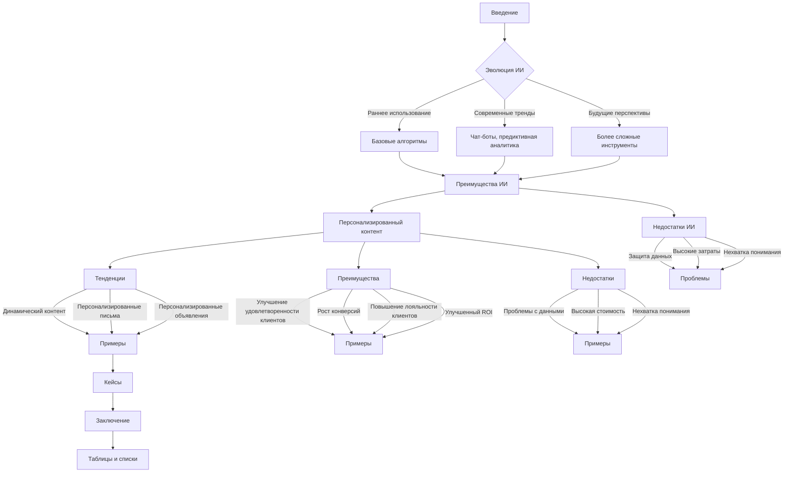

# Анализ кода: "Тенденции в цифровом маркетинге"

**1. <input code>**

```
# Impact of AI on Digital Marketing Startegies

## Introduction

... (текст статьи)

## Tables and Lists

... (таблицы и списки)
```

**2. <algorithm>**

Этот код представляет собой текст статьи о влиянии искусственного интеллекта (ИИ) и персонализированного контента на современный цифровой маркетинг. Алгоритм работы кода — это структурирование информации в виде статьи, включающей введение, обзор эволюции, текущие тренды, преимущества и недостатки использования ИИ и персонализации, кейсы и заключение.  Нет четко определенного алгоритма в смысле выполнения инструкций, так как это просто текстовый документ.

**Пример:**

*   **Введение:** Описывает роль ИИ в современном маркетинге.
*   **Тренды:** Перечисляет тенденции использования ИИ в маркетинге (чаты, предиктивная аналитика, создание контента).
*   **Преимущества:**  Указывает на плюсы применения ИИ, такие как эффективность, персонализация и экономия затрат.

Данные перемещаются между разделами в виде текстовых описаний, иллюстрирующих концепции и идеи.


**3. <mermaid>**



**Диаграмма:** Показывает взаимосвязь между разделами статьи и структуру аргументации. Взаимозависимости: все разделы связаны между собой, описывая разные аспекты темы. Зависимости от других файлов отсутствуют, так как это текстовый документ.

**4. <explanation>**

* **Импорты:** Нет импортов, так как это текстовый документ.

* **Классы:** Нет классов.

* **Функции:** Нет функций.

* **Переменные:** Нет переменных.

* **Возможные ошибки или области для улучшений:**
    * Статья слишком общая и не содержит конкретных примеров и данных.
    * Недостаточно практических советов для применения ИИ в маркетинге.
    * Отсутствует контекст, например, не указаны конкретные инструменты и технологии, упомянутые в статье.
    * Не хватает анализа конкретных кейсов с результатами.

**Цепочка взаимосвязей с другими частями проекта:**  Нет указаний на взаимосвязь с другими частями проекта, так как код представляет собой отдельный текстовый документ.


**Общий вывод:**

Код представляет собой статью, описывающую влияние ИИ и персонализированного контента на цифровой маркетинг. Структура статьи логичная, но требует конкретизации и практических примеров для большей эффективности.