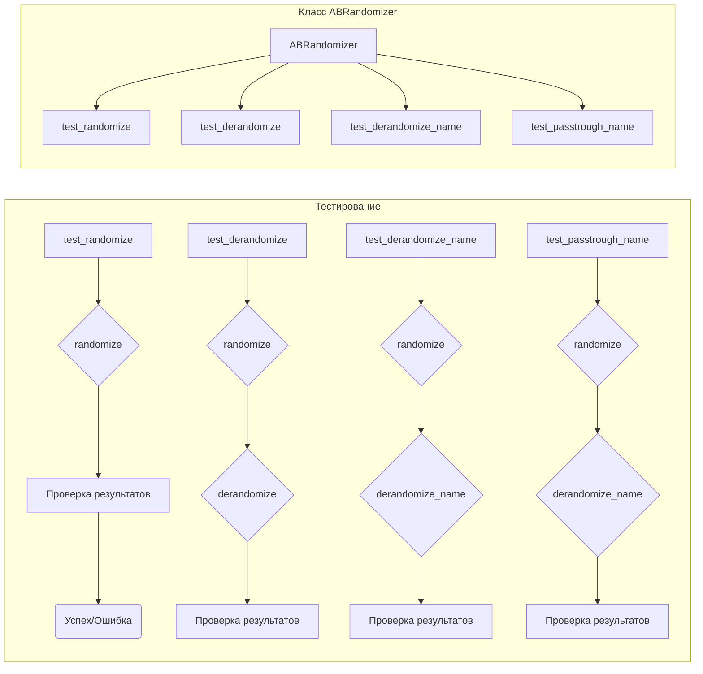

# Анализ кода из файла test_experimentation.py

**1. <input code>**

```python
import pytest

import sys
sys.path.append('../../tinytroupe/')
sys.path.append('../../')
sys.path.append('..')

from testing_utils import *

from tinytroupe.experimentation import ABRandomizer

def test_randomize():
    randomizer = ABRandomizer()
    # run multiple times to make sure the randomization is properly tested
    for i in range(20):
        a, b = randomizer.randomize(i, "option1", "option2")

        if randomizer.choices[i] == (0, 1):
            assert (a, b) == ("option1", "option2")
        elif randomizer.choices[i] == (1, 0):
            assert (a, b) == ("option2", "option1")
        else:
            raise Exception(f"No randomization found for item {i}")

def test_derandomize():
    randomizer = ABRandomizer()

    # run multiple times to make sure the randomization is properly tested
    for i in range(20):
        a, b = randomizer.randomize(i, "option1", "option2")
        c, d = randomizer.derandomize(i, a, b)

        assert (c, d) == ("option1", "option2")

def test_derandomize_name():
    randomizer = ABRandomizer()

    for i in range(20):
        a, b = randomizer.randomize(i, "A", "B")
        real_name = randomizer.derandomize_name(i, a)

        if randomizer.choices[i] == (0, 1):
            assert real_name == "control"
        elif randomizer.choices[i] == (1, 0):
            assert real_name == "treatment"
        else:
            raise Exception(f"No randomization found for item {i}")


def test_passtrough_name():
    randomizer = ABRandomizer(passtrough_name=["option3"])
    a, b = randomizer.randomize(0, "option1", "option2")
    real_name = randomizer.derandomize_name(0, "option3")

    assert real_name == "option3"

def test_intervention_1():
    pass # TODO
```

**2. <algorithm>**

(Блок-схема не представляется возможным. Алгоритм описывается текстом).

**Алгоритм работы функций:**

*   **`test_randomize`:** Генерирует случайные пары (`option1`, `option2`) или (`option2`, `option1`) 20 раз с помощью `ABRandomizer.randomize`. Проверяет корректность результата, сравнивая полученные пары с ожидаемыми, в зависимости от `randomizer.choices`.
*   **`test_derandomize`:** Генерирует случайные пары (`option1`, `option2`) или (`option2`, `option1`) 20 раз с помощью `ABRandomizer.randomize`. Затем, с помощью `ABRandomizer.derandomize`, преобразует результат обратно в исходные данные (`option1`, `option2`) и проверяет корректность.
*   **`test_derandomize_name`:** Генерирует случайные пары ("A", "B") 20 раз с помощью `ABRandomizer.randomize`.  Получает  имя  в  зависимости от  результата `randomizer.choices` (сравнивается с "control" или "treatment"). Проверяет корректность результата.
*   **`test_passtrough_name`:** Создаёт `ABRandomizer` с  списком `passtrough_name`.  Вызывает  `randomize`,  чтобы получить случайные пары.  Вызывает `derandomize_name` для  элемента из  `passtrough_name`,  проверяя  что возвращаемое значение совпадает с исходным значением.
*   **`test_intervention_1`:** Пустая функция, служит для обозначения дальнейших тестов.


**3. <mermaid>**



**4. <explanation>**

*   **Импорты:**
    *   `pytest`:  Библиотека для написания тестов.
    *   `sys`: Модуль для взаимодействия с системными переменными. Используется для добавления каталогов в `sys.path`, что позволяет Python находить модули из других каталогов проекта.
    *   `testing_utils`:  Полагается что содержит вспомогательные функции или классы для тестирования.
    *   `ABRandomizer`: Модуль для рандомизации.
*   **Классы:**
    *   `ABRandomizer`: Класс для рандомизации A/B тестов.  В коде не виден сам класс, но предполагается, что он имеет атрибуты `choices` (содержит результаты рандомизации) и методы `randomize`, `derandomize`, `derandomize_name`. В  тестах используется только внешний интерфейс.
*   **Функции:**
    *   `test_randomize`: Тестирует метод `randomize` класса `ABRandomizer`. Возвращает пары значений, в зависимости от рандомизации.
    *   `test_derandomize`: Тестирует метод `derandomize` класса `ABRandomizer`. Проверяет возможность восстановления исходных значений.
    *   `test_derandomize_name`: Тестирует метод `derandomize_name` класса `ABRandomizer`. Проверяет, что метод возвращает корректное имя.
    *   `test_passtrough_name`: Тестирует обработку специальных случаев имен, которые должны проходить через рандомизацию без изменений.
    *   `test_intervention_1`:  Предполагает будущий тест, пока пропущен.
*   **Переменные:**
    *  `randomizer`: экземпляр класса `ABRandomizer`
    *  `a`, `b`, `c`, `d`: переменные для хранения результатов рандомизации и дерандомизации.
    *  `i`: переменная цикла.
    * `real_name`: Переменная, содержащая  имя, полученное  в результате  обратного преобразования.
    * `passtrough_name`: Список имен, которые должны проходить через рандомизацию без изменений.

**Возможные ошибки или области для улучшений:**

*   Нет проверки корректности `ABRandomizer`. Класс неявно предполагается.
*   В тесте `test_intervention_1` указан `pass`  - требует реализации.
*   Отсутствие информации о том, как работает рандомизация в `ABRandomizer` затрудняет понимание поведения кода.

**Цепочка взаимосвязей:**

Тесты в `test_experimentation.py` проверяют функциональность модуля `ABRandomizer`, который находится в подпапке `experimentation` проекта `tinytroupe`.  Тестирование зависит от функциональности `ABRandomizer`.  Для корректной работы тестирования необходима корректная реализация в модуле `tinytroupe.experimentation`.  В свою очередь тестирование зависит от `testing_utils`.