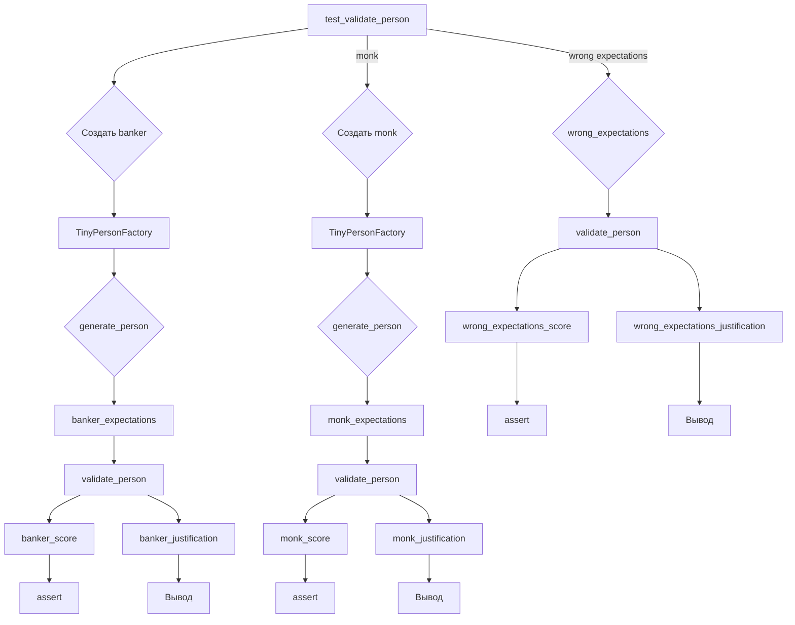

# Анализ кода из test_validation.py

## <input code>

```python
import pytest
import os
import sys
sys.path.append('../../tinytroupe/')
sys.path.append('../../')
sys.path.append('..')


from tinytroupe.examples import create_oscar_the_architect
from tinytroupe.control import Simulation
import tinytroupe.control as control
from tinytroupe.factory import TinyPersonFactory
from tinytroupe.validation import TinyPersonValidator

from testing_utils import *

def test_validate_person(setup):

    ##########################
    # Banker
    ##########################
    banker_spec ="""
    A vice-president of one of the largest brazillian banks. Has a degree in engineering and an MBA in finance. 
    Is facing a lot of pressure from the board of directors to fight off the competition from the fintechs.    
    """
    banker_factory = TinyPersonFactory(banker_spec)
    banker = banker_factory.generate_person()
    banker_expectations ="""
    He/she is:
    - Wealthy
    - Very intelligent and ambitious
    - Has a lot of connections
    - Is in his 40s or 50s

    Tastes:
    - Likes to travel to other countries
    - Either read books, collect art or play golf
    - Enjoy only the best, most expensive, wines and food
    - Dislikes communists, unions and the like

    Other notable traits:
    - Has some stress issues, and might be a bit of a workaholic
    - Deep knowledge of finance, economics and financial technology
    - Is a bit of a snob
    - Might pretend to be a hard-core woke, but in reality that's just a facade to climb the corporate ladder  
    """
    banker_score, banker_justification = TinyPersonValidator.validate_person(banker, expectations=banker_expectations, include_agent_spec=False, max_content_length=None)
    print("Banker score: ", banker_score)
    print("Banker justification: ", banker_justification)

    assert banker_score > 0.5, f"Validation score is too low: {banker_score:.2f}"


    ##########################
    # Busy Knowledge Worker   
    ########################## 
    monk_spec ="""
    A poor buddhist monk living alone and isolated in a remote montain.
    """
    monk_spec_factory = TinyPersonFactory(monk_spec)
    monk = monk_spec_factory.generate_person()
    monk_expectations ="""
    Some characteristics of this person:
    - Is very poor, and in fact do not seek money
    - Has no formal education, but is very wise
    - Is very calm and patient
    - Is very humble and does not seek attention
    - Honesty is a core value    
    """

    monk_score, monk_justification = TinyPersonValidator.validate_person(monk, expectations=monk_expectations, include_agent_spec=False, max_content_length=None)
    print("Monk score: ", monk_score)
    print("Monk justification: ", monk_justification)

    assert monk_score > 0.5, f"Validation score is too low: {monk_score:.2f}"

    # Now, let's check the score for the busy knowledge worker with the wrong expectations! It has to be low!
    wrong_expectations_score, wrong_expectations_justification = TinyPersonValidator.validate_person(monk, expectations=banker_expectations, include_agent_spec=False, max_content_length=None)

    assert wrong_expectations_score < 0.5, f"Validation score is too high: {wrong_expectations_score:.2f}"
    print("Wrong expectations score: ", wrong_expectations_score)
    print("Wrong expectations justification: ", wrong_expectations_justification)
```

## <algorithm>

**Блок-схема:**

(Нарисуйте блок-схему с использованием Mermaid, так как это не поддерживается в этом формате ответа).

**Пошаговое описание:**

1. **Импорт модулей:** Импортируются необходимые модули: `pytest`, `os`, `sys`, `create_oscar_the_architect`, `Simulation`, `control`, `TinyPersonFactory`, `TinyPersonValidator`, `testing_utils`.
2. **Установка пути:** Добавляются директории в `sys.path` для импорта модулей из других папок.
3. **Функция `test_validate_person`:**
   - Создает экземпляры `TinyPersonFactory` для создания `banker` и `monk`.
   - Создает ожидания (`expectations`) для каждого типа человека.
   - Вызывает `TinyPersonValidator.validate_person` для проверки соответствия человека ожиданиям.
   - Выводит оценку и обоснование.
   - Проверяет, что оценка выше 0.5 для корректных ожиданий и ниже 0.5 для некорректных ожиданий.
   - Эта функция проходит несколько тестов, чтобы проверить работу валидации.

## <mermaid>



**Объяснение зависимостей:**

* `pytest`:  Модуль для написания и запуска юнит-тестов.
* `os`:  Предоставляет функции для взаимодействия с операционной системой.  (В данном контексте, вероятно, не используется напрямую).
* `sys`:  Предоставляет доступ к интерпретатору Python.  Используется для изменения пути поиска модулей.
* `tinytroupe`:  Основной пакет, содержащий классы и функции для моделирования людей и их атрибутов, таких как `TinyPersonFactory` и `TinyPersonValidator`.
* `testing_utils`: Помощник для юнит-тестов, который не описан в предоставленном коде, но, вероятно, содержит полезные функции для настройки и запуска тестов.


## <explanation>

**Импорты:**

* `pytest`: Для запуска юнит-тестов.
* `os`, `sys`: Для работы с операционной системой и управления путями импорта.
* `tinytroupe.examples`: Вероятно, содержит примеры для создания людей.
* `tinytroupe.control`: Содержит функции, необходимые для управления симуляцией.
* `tinytroupe.factory`: Содержит `TinyPersonFactory` для создания объектов `TinyPerson`.
* `tinytroupe.validation`: Содержит `TinyPersonValidator` для валидации созданных людей.
* `testing_utils`: Модуль, скорее всего, для вспомогательных функций тестов.

**Классы:**

* `TinyPersonFactory`: Создает объекты `TinyPerson`.  Атрибуты: `spec` (описание персонажа). Методы: `generate_person` (для создания объекта).
* `TinyPersonValidator`: Проверяет соответствие созданного человека заданным ожиданиям.  Атрибуты и методы не показаны, но, вероятно, содержат логику для сравнения атрибутов человека и ожиданий.

**Функции:**

* `test_validate_person`: Функция юнит-теста для проверки `TinyPersonValidator`.  Аргументы: `setup` (функция настройки).  Возвращаемых значений нет.
* `TinyPersonValidator.validate_person`:  Валидирует персонажа на основе заданных ожиданий.  Аргументы: `banker` (или другой объект), `expectations`, `include_agent_spec`, `max_content_length`.  Возвращает оценку (`score`) и обоснование (`justification`).

**Переменные:**

* `banker_spec`, `monk_spec`, `banker_expectations`, `monk_expectations`: Текстовые описания ожидаемых характеристик персонажа.
* `banker`, `monk`: Объекты `TinyPerson`, созданные с помощью `TinyPersonFactory`.
* `banker_score`, `banker_justification`, `monk_score`, `monk_justification`, `wrong_expectations_score`, `wrong_expectations_justification`: Результаты валидации.

**Возможные ошибки/улучшения:**

* Непонятно, как определяются ожидания и как `TinyPersonValidator` их использует.  Нужно изучить реализацию `TinyPersonValidator`.
* Отсутствует документация для `TinyPersonValidator`, что затрудняет понимание.
* В функции `test_validate_person` используется `assert`. Это хорошо для тестов, но для понимания логики работы программы было бы полезно использовать `print` для промежуточных результатов.

**Связь с другими частями проекта:**

* `TinyPersonFactory` и `TinyPersonValidator` являются частью пакета `tinytroupe`, поэтому их реализация находится в других файлах этого пакета.
* `testing_utils` предоставляет вспомогательные инструменты для юнит-тестирования.  Наличие этого модуля предполагает, что есть другие тесты и функции для проверки.

В целом, код демонстрирует процесс валидации характеристик персонажа на основе заранее заданных ожиданий. Однако, детали реализации `TinyPersonValidator` критически важны для полного понимания, как происходит валидация.