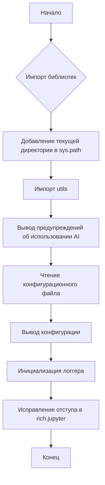
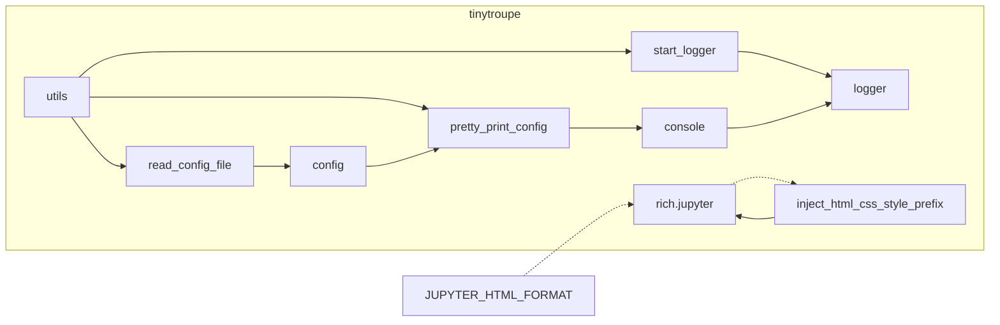

# Анализ кода tinytroupe/__init__.py

## <input code>

```python
import os
import logging
import configparser
import rich # for rich console output
import rich.jupyter

# add current path to sys.path
import sys
sys.path.append('.')
from tinytroupe import utils # now we can import our utils

# AI disclaimers
print(
"""
!!!!
DISCLAIMER: TinyTroupe relies on Artificial Intelligence (AI) models to generate content. 
The AI models are not perfect and may produce inappropriate or inacurate results. 
For any serious or consequential use, please review the generated content before using it.
!!!!
""")

config = utils.read_config_file()
utils.pretty_print_config(config)
utils.start_logger(config)

# fix an issue in the rich library: we don't want margins in Jupyter!
rich.jupyter.JUPYTER_HTML_FORMAT = \
    utils.inject_html_css_style_prefix(rich.jupyter.JUPYTER_HTML_FORMAT, "margin:0px;")
```

## <algorithm>

**Блок-схема:**



**Пример данных:**

* **B:** Импортируются необходимые библиотеки (os, logging, configparser, rich, rich.jupyter).
* **C:**  Текущая директория добавляется в sys.path, позволяя импортировать модули из папки tinytroupe.
* **D:** Импортируется модуль `utils` из пакета `tinytroupe`.
* **F:** Функция `utils.read_config_file()` возвращает словарь или объект, содержащий конфигурацию.
* **G:** Функция `utils.pretty_print_config()` выводит конфигурацию в читабельном формате.
* **H:** Функция `utils.start_logger()` инициализирует логгер с настройками из конфигурации.
* **I:** Изменяется свойство `JUPYTER_HTML_FORMAT` библиотеки `rich.jupyter` для удаления отступов.

## <mermaid>



## <explanation>

**Импорты:**

* `os`, `logging`, `configparser`: Стандартные библиотеки Python для работы с операционной системой, логгированием и чтением конфигурационных файлов.
* `rich`, `rich.jupyter`: Библиотеки для улучшенного форматирования вывода, особенно важны для Jupyter Notebook.  Они добавляют красочную и удобную для чтения консоль.
* `sys`: Для управления модулями и пути.
* `tinytroupe.utils`:  Импортирует модуль `utils` из собственного пакета, содержащий функции для работы с конфигурацией, логгером и стилями rich.

**Классы:**

В данном файле нет классов.  В `utils` вероятно есть классы, отвечающие за хранение и работу с логгером, конфигурацией, и, возможно, другими компонентами.

**Функции:**

* `utils.read_config_file()`: Читает конфигурационный файл (вероятно, с помощью `configparser`) и возвращает объект конфигурации.  Возможные аргументы: имя файла, путь к файлу.
* `utils.pretty_print_config()`:  Выводит конфигурацию в красивом формате.  Аргументы: объект конфигурации (config).
* `utils.start_logger()`: Инициализирует логгер с настройками из конфигурации (config). Аргументы: объект конфигурации (config).
* `utils.inject_html_css_style_prefix()`: Вставляет префикс стилей CSS в строку. Используется для изменения вывода rich-консоли, чтобы убрать отступы в Jupyter.  Аргументы: строка, префикс CSS.


**Переменные:**

* `config`: Хранит объект конфигурации, полученный из `utils.read_config_file()`.

**Возможные ошибки или области для улучшений:**

* **Обработка ошибок:** Код не содержит проверки на наличие файла конфигурации или его корректность. Добавление проверки `try...except` поможет предотвратить сбой программы при отсутствии или поврежденном файле.
* **Документация:** Необходимо добавить подробную документацию к функциям и классам в `utils` для понимания их поведения.
* **Управление зависимостями:**  Если `tinytroupe` является библиотекой, нужно уделить внимание управлению зависимостями (например, с помощью `requirements.txt`), чтобы гарантировать, что пользователи могут легко установить необходимые библиотеки.
* **Конкретные пути:**  Использование абсолютных путей в `sys.path.append('.')` предпочтительнее для избежания проблем с относительными путями, особенно в разных средах выполнения.


**Взаимосвязи с другими частями проекта:**

Файл `tinytroupe/__init__.py` инициализирует основные части проекта:
- Он инициирует чтение конфигурации, что важно для работы остальных модулей `tinytroupe`.
- Он использует `utils`, значит, модуль `utils` содержит необходимые функции для работы с логгированием, конфигурацией.
- Этот файл вероятно запускает основные процессы программы,  устанавливает необходимые настройки (например, логгер) и взаимодействует с моделями AI, находящимися в других частях проекта.  (Более детальную информацию нужно искать в других частях проекта).