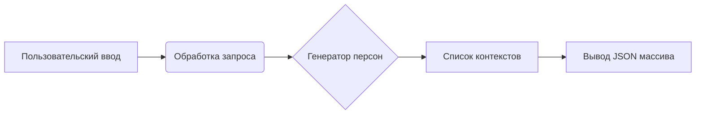

```MD
# Анализ кода generate_person_factory.md

1. **<input code>**

```
Your task is create many contexts that will be used as base to generate a list of persons.
The idea is receive a broad context, with some  details of persons we want to generate, like demographics parameters, physical characteristics, behaviors, believes, etc; and then create many other contexts, more specifics, but derivaded of the more generic one.
Your response must be an array in JSON format. Each element of the array must be a context that will be used to generate a person description.

Example:
  - INPUT:
    Please, generate 3 person(s) description(s) based on the following broad context: Latin American, age between 20 and 40 years old, economic status can vary between poor and rich, it can be religious or not, it can be married or not, it can have children or not, it can be a professional or not, it can be a worker or not
  - OUTPUT:
    ["Mexican person that has formed as lawyer but now works in other are, is single, like sports and movies", "Create a Brazilian person that is a doctor, like pets and the nature and love heavy metal.", "Create a Colombian person that is a lawyer, like to read and drink coffee and is married with 2 children."]
```

2. **<algorithm>**

Этот код не содержит исполняемого алгоритма. Он представляет собой описание задачи для генерации текста.  В нем задан шаблон запроса и ожидаемый формат ответа.  Алгоритм выполнения этой задачи будет зависеть от конкретной реализации системы, которая будет обрабатывать запрос.  Это скорее описание *функциональности*, а не *алгоритма*  в традиционном смысле.

3. **<mermaid>**



4. **<explanation>**

* **Импорты**: Нет импортов, так как это не код программы, а описание задачи.
* **Классы**: Нет классов, так как это не код программы.
* **Функции**: Нет функций, так как это не код программы.
* **Переменные**: Нет переменных, так как это не код программы.

**Описание задачи:**

Код представляет собой описание задачи для генерации персон.  Пользовательский запрос описывает общие черты, которые должны быть учтены для генерации нескольких более конкретных описаний персон. Ожидается, что система, использующая этот запрос, сгенерирует массив контекстов, каждый из которых описывает  отдельную персону с  более узким описанием, основанным на исходном запросе.

**Связь с другими частями проекта:**

Этот код описывает  "входной интерфейс" (prompt) для системы, которая должна включать в себя:
* **Модуль генерации текста:**  Эта система должна принимать описательный запрос, и генерировать описания персон, следуя указанным параметрам.
* **Модуль обработки естественного языка (NLP):** Модуль должен анализировать исходный запрос и выделить значимые детали (национальность, возраст, профессия и т.д.) для дальнейшей генерации.
* **Модуль обработки данных (для конкретной реализации):**  Модуль должен обрабатывать данные о персонах и создавать подробные описания.

**Возможные ошибки/улучшения:**

* **Неопределенность запроса:**  В запросе не достаточно четко определены критерии генерации.  Например, "экономический статус" может иметь разные интерпретации.  Необходимо более точно очертить вариации параметров.
* **Сложность генерации:** Генерация описаний персон, учитывая множество параметров, может быть сложной задачей.  Ошибки в логике генерации могут привести к нелогичным или неправдоподобным результатам.

**В заключение:**

Данный текст является задачей для системы генерации контента.  Для реализации этой задачи необходима программная логика, которая анализирует входные данные, формирует промежуточные контексты для генерации персон и возвращает массив JSON с описаниями.