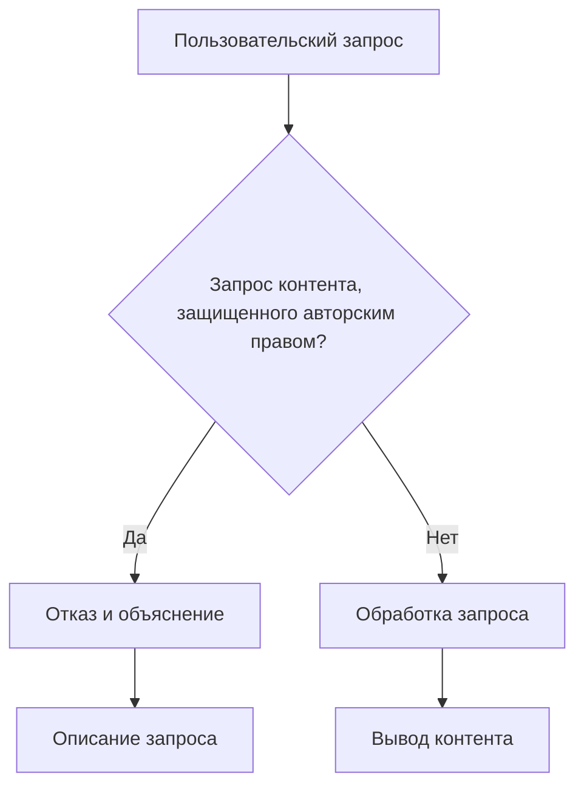

# Анализ кода: предотвращение нарушения авторских прав

## <input code>

```
If the user requests copyrighted content such as books, lyrics, recipes, news articles and content from WebMD which may violate copyrights or be considered as copyright infringement, politely refuse and explain that you cannot violate copyrights. Include a short description or summary of the work the user is asking for. Do not violate any copyrights under any circumstances.
```

## <algorithm>

Этот код представляет собой алгоритм *правила поведения*, а не программу в традиционном смысле.  Он описывает реакцию на определенный тип пользовательских запросов. Алгоритм состоит из единственного шага:

1. **Проверка запроса:** Если пользователь запрашивает контент, защищенный авторским правом (книги, тексты песен, рецепты, статьи новостей, информация из WebMD), то:
    * **Отказ:** Вежливо отказывается предоставить запрашиваемый контент.
    * **Объяснение:** Объясняет, что не может нарушать авторские права.
    * **Подтверждение:** Включает краткое описание или краткий пересказ запрошенного контента.


**Пример:**

Если пользователь запросит "текст песни \"Bohemian Rhapsody\"", алгоритм выполнит следующие действия:

- Отклонит запрос.
- Объяснит, что не может предоставить текст песни, так как он защищен авторским правом.
- Предоставит краткое описание запроса, например: "Пользователь запросил текст песни \"Bohemian Rhapsody\"".

## <mermaid>



## <explanation>

Этот код не содержит импортов, классов или функций в привычном смысле. Он представляет собой набор инструкций (правило), описывающих поведение при взаимодействии с пользователем. 

**Функциональность:** Код описывает стратегию поведения, которая должна быть реализована в контексте какой-то более крупной системы, например, в чат-боте или программе обработки запросов.

**Связь с другими частями проекта:**  Этот код, скорее всего, будет использоваться в модуле, отвечающем за обработку пользовательских запросов (например, в функции `handle_user_request()`).  Он не содержит конкретной реализации, а лишь задаёт правила, которые должен применять обработчик.

**Возможные ошибки/улучшения:**

* **Недостаточно гибкий:**  Код не учитывает нюансов и исключений. Например, он не различает запросы на *информацию* о контенте (например, "какие книги написал такой-то автор") и запросы на сам контент. Это может привести к ошибкам.
* **Недостаток детализации:**  Нет описания того, как будет представлен отказ. Необходимо продумать формат сообщения об отказе.
* **Отсутствие контекста:** Неясно, как будет получен запрос от пользователя. В реальной программе нужно будет использовать метод получения запроса.


В целом, это пример простого, но эффективного способа описать поведение системы в отношении копирайта. Для полной функциональности необходимо будет интегрировать его в более сложную программу обработки запросов.