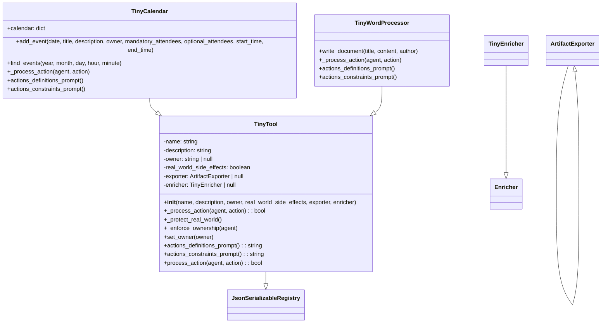

# Анализ кода tinytroupe/tools.py

## <input code>

```python
"""
Tools allow agents to accomplish specialized tasks.
"""
import textwrap
import json
import copy
import logging
logger = logging.getLogger("tinytroupe")
import tinytroupe.utils as utils
from tinytroupe.extraction import ArtifactExporter
from tinytroupe.enrichment import TinyEnricher
from tinytroupe.utils import JsonSerializableRegistry

class TinyTool(JsonSerializableRegistry):

    # ... (остальной код)
```

## <algorithm>

(Блок-схема)

```mermaid
graph TD
    A[__init__(name, description, owner, ...)] --> B{Проверка параметров};
    B -- owner is None --> C[self.owner = None];
    B -- owner is not None --> D[self.owner = owner];
    C --> E[Инициализация атрибутов];
    D --> E;
    E --> F[_process_action(agent, action)];
    F --> G[NotImplementedError];
    F -- action['type'] == 'CREATE_EVENT' --> H[add_event(content)];
    F -- action['type'] == 'WRITE_DOCUMENT' --> I[write_document(**doc_spec)];
    H -- True --> J[Возврат True];
    I -- True --> J;
    F -- False --> K[Возврат False];
    J --> L[Конец метода _process_action];
    K --> L;
    E --> M[Конец __init__];
    M --> N;
    N --> O[process_action(agent, action)];
    O --> P[_protect_real_world()];
    P -- self.real_world_side_effects --> Q[Вывод предупреждения];
    P -- not self.real_world_side_effects --> R;
    R --> S[_enforce_ownership(agent)];
    S -- self.owner is not None and agent.name != self.owner.name --> T[ValueError];
    S -- self.owner is None or agent.name == self.owner.name --> U;
    T --> V[Возврат с ошибкой];
    U --> W[_process_action(agent, action)];
    W --> J;
    V --> L;
```

**Описание:**

1. Конструктор `__init__` устанавливает атрибуты класса.
2. `_process_action` обрабатывает действия агента в зависимости от типа.
3. `_protect_real_world` выводит предупреждение, если инструмент имеет реальные последствия в мире.
4. `_enforce_ownership` проверяет права доступа агента к инструменту.
5. `process_action` вызывает `_protect_real_world`, `_enforce_ownership` и `_process_action`.
6. В `TinyCalendar` метод `add_event` добавляет событие в календарь, проверяя корректность входных данных.
7. В `TinyWordProcessor` метод `write_document` записывает документ, используя `enricher` для обогащения и `exporter` для экспорта.

## <mermaid>



## <explanation>

**Импорты:**

- `textwrap`: Для форматирования строк.
- `json`: Для работы с JSON-данными.
- `copy`: Для создания копий объектов (не используется напрямую, но импортирован).
- `logging`: Для ведения логов. `logger = logging.getLogger("tinytroupe")` создает логгер, связанный с пакетом `tinytroupe`.
- `tinytroupe.utils`: Утилиты, вероятно, содержат вспомогательные функции.
- `tinytroupe.extraction.ArtifactExporter`: Класс для экспорта артефактов.
- `tinytroupe.enrichment.TinyEnricher`: Класс для обогащения контента.
- `tinytroupe.utils.JsonSerializableRegistry`: Базовый класс для сериализации в JSON.


**Классы:**

- `TinyTool`: Абстрактный базовый класс для инструментов.  Определяет общие методы для обработки действий, проверки прав доступа и предупреждения о реальных последствиях.
- `TinyCalendar`: Наследуется от `TinyTool`, реализует календарь.
- `TinyWordProcessor`: Наследуется от `TinyTool`, реализует текстовый процессор.


**Функции:**

- `__init__(...)`: Конструкторы классов. Устанавливают атрибуты и инициализируют внутренние данные.
- `_process_action(...)`: Обрабатывает действия агентов, виртуальный метод, который должен быть переопределен в дочерних классах.
- `_protect_real_world(...)`: Выводит предупреждение о реальных последствиях инструмента.
- `_enforce_ownership(...)`: Проверяет права доступа агента.
- `set_owner(...)`: Устанавливает владельца инструмента.
- `actions_definitions_prompt(...)`: Возвращает подсказки для определений действий.
- `actions_constraints_prompt(...)`: Возвращает подсказки для ограничений действий.
- `process_action(...)`: Обработка действий, включая проверку владельца и вызов `_process_action`.
- `add_event(...)`: Метод класса `TinyCalendar` для добавления события в календарь.
- `write_document(...)`: Метод класса `TinyWordProcessor` для написания документа. Использует `enricher` для обогащения и `exporter` для экспорта результата.

**Переменные:**

- `name`, `description`, `owner`, `real_world_side_effects`, `exporter`, `enricher`: Атрибуты класса `TinyTool`.

**Возможные ошибки/улучшения:**

- Недостаточно проверки корректности входных данных во многих методах (например, в `add_event`).
- Отсутствует валидация `action['type']`.
- `actions_constraints_prompt` для `TinyCalendar` и `TinyWordProcessor` не реализованы полностью.
- Обработка исключений при парсинге JSON в `TinyWordProcessor` может быть улучшена для более понятных сообщений об ошибках.


**Взаимосвязи с другими частями проекта:**

- `TinyTool` использует `JsonSerializableRegistry`, `ArtifactExporter`, и `TinyEnricher` для взаимодействия с другими частями проекта (extraction, enrichment).
- `TinyCalendar` и `TinyWordProcessor` наследуются от `TinyTool`, демонстрируя иерархию и повторное использование кода.
- `utils` предоставляет вспомогательные функции, такие как валидация полей.


**Примечание:** Код требует дополнительных классов, методов и функций для корректной работы, как например `Enricher`,  `JsonSerializableRegistry`,  `ArtifactExporter`,  `utils`.  Следующие шаги разработки должны предполагать создание этих элементов, чтобы код мог работать.