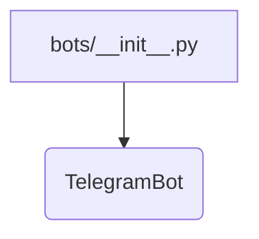
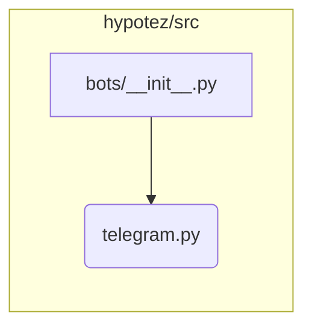

# <input code>

```python
## \file hypotez/src/bots/__init__.py
# -*- coding: utf-8 -*-\
#! venv/Scripts/python.exe
#! venv/bin/python/python3.12

"""
.. module: src.bots 
	:platform: Windows, Unix
	:synopsis:

"""
MODE = 'dev'


from .telegram import TelegramBot
```

# <algorithm>

Этот код является инициализационным модулем для пакета `bots` в проекте `hypotez`.  Он не содержит собственных функциональных блоков, а лишь импортирует другой модуль `TelegramBot`.



В данном случае данные не перемещаются между функциями или классами, так как это лишь модуль импорта.

# <mermaid>




# <explanation>

* **Импорты:** Модуль `hypotez/src/bots/__init__.py` импортирует класс `TelegramBot` из подмодуля `telegram.py`, который, предположительно, находится в той же директории `hypotez/src/bots/`.  Это стандартный импорт в Python, позволяющий использовать функции и классы из других файлов.  Связь между `src.bots` и `src.bots.telegram` очевидна из пути импорта.  Следует отметить, что  `src` - это, скорее всего, корень пакета.
* **Классы:**  Код импортирует класс `TelegramBot`, но не определяет его.  Предполагается, что этот класс находится в файле `hypotez/src/bots/telegram.py` и содержит код для работы с ботом Telegram.  Подробная информация о `TelegramBot` (атрибуты, методы) недоступна, так как этот код не включает его определение.
* **Функции:** Нет определенных функций в данном модуле.  Он просто импортирует класс из другого файла.
* **Переменные:** Переменная `MODE` имеет значение `'dev'`.  Вероятно, она используется для настройки работы бота (например, в режиме разработки или производства).

* **Возможные ошибки и улучшения:**
    * Необходимо проверить, что файл `hypotez/src/bots/telegram.py` существует и содержит определение класса `TelegramBot`. В противном случае произойдет ошибка импорта.
    * Нет примера использования `TelegramBot`. Это указывает на то, что этот код является частью более крупной системы, которая будет использовать импортированный класс для взаимодействия с Telegram.
    * Необходимо документировать назначение переменной `MODE`, чтобы было понятно, как она используется и влияют на поведение программы.


* **Цепочка взаимосвязей:**
Этот модуль является частью пакета `bots`, который, скорее всего, взаимодействует с другими частями проекта (например, с модулями обработки событий, хранения данных).  Взаимодействие будет зависеть от того, как `TelegramBot` используется в других частях проекта.  Без дополнительных деталей это сложно проанализировать.


```