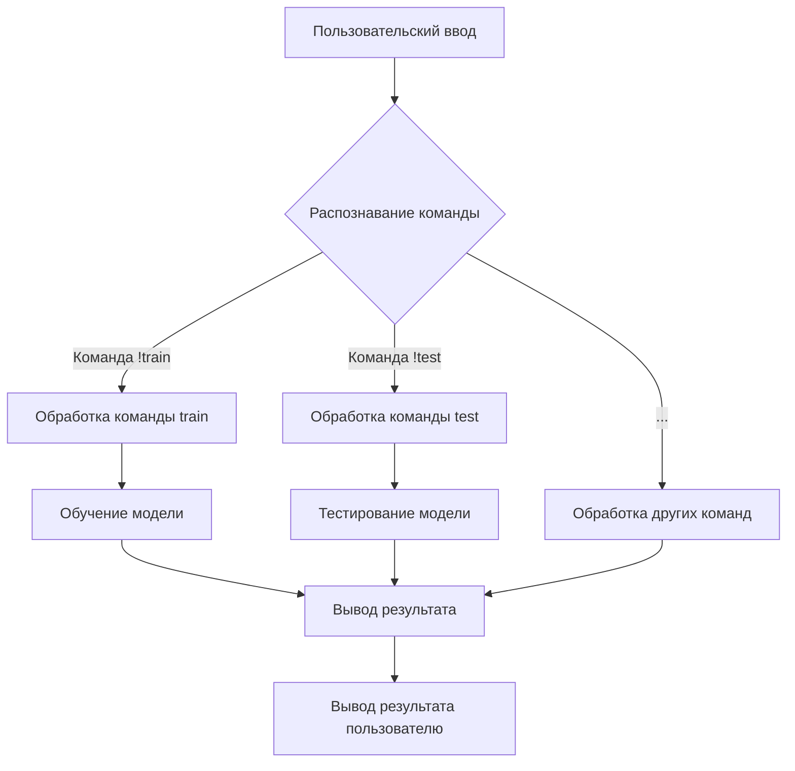

# Анализ кода бота

## <input code>

```
!hi: Greets the user.
!train <data> <data_dir> <positive> <attachment>: Trains the model with the provided data. Use data for a file, data_dir for a directory, or attachment for a file attachment.
!test <test_data>: Tests the model with provided JSON test data.
!test <test_data_dir>: Tests the model with provided JSON test data from a directory.
!archive <directory>: Archives files in the specified directory.
!select_dataset <path_to_dir_positive> <positive>: Selects a dataset for training from the specified directory.
!instruction: Displays this instruction message.
```

## <algorithm>

В данном случае код представляет собой набор команд (или интерактивных инструкций) для бота.  Алгоритм работы – интерпретация входящих команд и выполнение соответствующих действий.  Блок-схема крайне упрощена, так как нет информации о реализации.

**Пример:**

Пользователь вводит `!train my_data.txt my_dir /positive_label.txt`.  Бот интерпретирует команду `!train` и её аргументы.  Затем выполняет действие, связанное с обучением модели (в коде не описано).


**Шаг 1:** Бот получает ввод от пользователя.

**Шаг 2:** Бот распознаёт команду (например, `!train`).

**Шаг 3:** Бот проверяет наличие нужных аргументов для команды.

**Шаг 4:** Бот обрабатывает команду и выполняет соответствующее действие (обучение модели, тестирование и т.д.).

**Шаг 5:** Бот возвращает результат (например, сообщение об успешном выполнении).


## <mermaid>



**Описание диаграммы:**

Пользовательский ввод распознаётся и обрабатывается. Разные команды (`!train`, `!test`, `!archive` и т.д.) ведут к разным подпроцессам (обучение, тестирование, архивирование). В конечном счёте, результат выводится пользователю. Подключаемые зависимости – это реализация функций обучения, тестирования, архивирования, которые находятся за пределами этого фрагмента кода.


## <explanation>

Этот код – это набор команд для бота, написанных в формате, предполагающем интерпретацию (возможно, с использованием определенной системы).  

**Импорты:**  Нет импортов.  Код, по сути, представляет собой список команд.  Чтобы эти команды были применимы, необходима система, которая распознает и выполняет эти команды.

**Классы:**  Нет классов.

**Функции:**  Нет функций в привычном понимании.  Это просто набор команд, определенных для бота.  Каждая команда `!…` фактически определяет действие (процедуру, функцию), которую бот должен выполнить.

**Переменные:**  Нет переменных, объявленных напрямую. Аргументы команд (например, `<data>`, `<data_dir>`) – это параметры, которые определяют конкретное действие, которое нужно выполнить.

**Возможные ошибки/улучшения:**

* **Неопределенная реализация:** Не описано, как именно происходит выполнение команд. Нужно указать, что за система (библиотека, движок) отвечает за интерпретацию и выполнение таких команд.
* **Отсутствие контекста:**  Необходимо знать, в каком окружении и как используется данный код. Это позволит понять, какие данные или ресурсы необходимы для его выполнения.
* **Ошибка с дублированием !test:** Команда `!test` дублируется.  Предположительно, `!test <test_data_dir>` обрабатывает данные из каталога, что полезно.
* **Типизация данных:**  В приведенном коде нет описания типов данных аргументов команд.

**Цепочка взаимосвязей:**

Набор команд `!…` – это, скорее, интерфейс для какой-то более сложной системы (например, чат-бота).  За обработку ввода, интерпретацию и выполнение действий отвечают внутренние компоненты этой системы.  Без дополнительного контекста сложно определить, какие именно части проекта связаны с данным фрагментом кода.