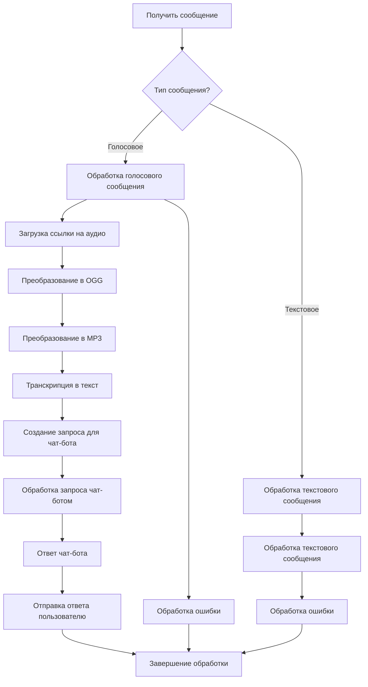

# Анализ кода Telegram бота на Node.js

## <input code>

```javascript
import { Telegraf } from 'telegraf'
import { message } from 'telegraf/filters'
import { code } from 'telegraf/format'
import config from 'config'
import { ogg } from './ogg.js'
import { openai } from './openai.js'
import { removeFile } from './utils.js'

const bot = new Telegraf(config.get('TELEGRAM_TOKEN'))
bot.command('start', async(ctx) : {\n    await ctx.reply(JSON.stringify(ctx.message));\n})\n\nbot.on(message('voice'), async (ctx) : {\n    try {\n        await ctx.reply(code('Сообщение принял. Жду ответ от сервера...'))\n        const link = await ctx.telegram.getFileLink(ctx.message.voice.file_id)\n        const userId = String(ctx.message.from.id)\n        const oggPath = await ogg.create(link.href, userId)\n        const mp3Path = await ogg.toMp3(oggPath, userId)\n        removeFile(oggPath)\n        const text = await openai.transcription(mp3Path)\n        await ctx.reply(code(`запрос: ${text}`))\n        const messages = [{ role: openai.roles.USER, content: text }]\n        const response = await openai.chat(messages)\n        await ctx.reply(response.content)\n    } catch (e) {\n        console.error(`Error while proccessing voice message`, e.message)\n    } \n})\n\nbot.on(message('text'), async (ctx) : {\n    ctx.session ??= INITIAL_SESSION\n    try {\n        await ctx.reply(code('Сообщение принял. Жду ответ от сервера...'))\n        await processTextToChat(ctx, ctx.message.text)\n    } catch (e) {\n        console.log(`Error while voice message`, e.message)\n    }\n})\n\nbot.launch()\nprocess.once('SIGINT', () : bot.stop('SIGINT'))\nprocess.once('SIGTERM', () : bot.stop('SIGTERM'))
```

## <algorithm>



**Пример:** Пользователь отправляет голосовое сообщение. Алгоритм обрабатывает его: 
1. Определяет тип сообщения как голосовое.
2. Загружает ссылку на аудиофайл.
3. Преобразует аудио в OGG формат.
4. Преобразует OGG в MP3.
5. Использует `openai.transcription` для преобразования MP3 в текст.
6. Формирует запрос к `openai.chat` для получения ответа.
7. Отправляет ответ пользователю.


## <mermaid>

```mermaid
graph LR
    subgraph Telegraf Bot
        A[bot] --> B(command('start'));
        B --> C{ctx.reply(JSON.stringify(ctx.message))};
        A --> D(on(message('voice')));
        D --> E{ctx.reply(code('Сообщение принял...'))};
        E --> F[ctx.telegram.getFileLink];
        F --> G[ogg.create];
        G --> H[ogg.toMp3];
        H --> I[removeFile];
        I --> J[openai.transcription];
        J --> K{ctx.reply(code('запрос: ' + text))};
        J --> L[openai.chat];
        L --> M{ctx.reply(response.content)};
        D --> N{Обработка ошибки};
        N --> O[console.error];
        A --> P(on(message('text')));
        P --> Q{ctx.session ??= INITIAL_SESSION};
        Q --> R{ctx.reply(code('Сообщение принял...'))};
        R --> S[processTextToChat];
        P --> T{Обработка ошибки};
        T --> U[console.log];
    end
    subgraph openai
        L --> V[openai.chat];
        J --> W[openai.transcription];
    end
    subgraph ogg
        G --> X[ogg.create];
        H --> Y[ogg.toMp3];
    end
    subgraph utils
        I --> Z[removeFile];
    end
```

**Описание зависимостей:**

Диаграмма показывает взаимосвязи между основными компонентами:

- `Telegraf`:  Основной фреймворк для создания Telegram ботов.
- `config`:  Файл конфигурации, определяющий `TELEGRAM_TOKEN` и другие параметры.
- `ogg`:  Модуль для преобразования аудио в OGG и MP3 форматы.
- `openai`: Модуль для работы с API OpenAI (транскрипция и чат-боты).
- `removeFile`:  Модуль для удаления временных файлов.

## <explanation>

**Импорты:**

- `Telegraf`, `message`, `code`:  Пакеты для создания и обработки сообщений в Telegram боте. `Telegraf` - основной фреймворк, `message` и `code` - фильтры и форматирование, предоставляемые Telegraf.
- `config`:  Модуль для работы с файлом конфигурации `config`.js. Он используется для получения токена телеграм бота.
- `ogg`: Модуль для работы с аудио. Вероятно, включает функции для преобразования аудио в OGG и MP3.
- `openai`: Модуль для работы с API OpenAI. Используется для транскрипции голосовых сообщений и работы с чат-ботом.
- `removeFile`: Модуль для удаления временных файлов. Используется для удаления промежуточных OGG файлов.


**Классы:**

- `Telegraf`:  Создает экземпляр бота, настроенного на получение и обработку сообщений.


**Функции:**

- `bot.command('start')`: Обрабатывает команду `/start` пользователя.
- `bot.on(message('voice'))`: Обрабатывает голосовые сообщения.  Получает аудио, преобразует, отправляет запрос на транскрипцию в OpenAI, обрабатывает ответ и отправляет пользователю.  Ключевой функционал бота.
- `bot.on(message('text'))`: Обрабатывает текстовые сообщения. Вызывает `processTextToChat` для последующей обработки текстовых сообщений.
-  `processTextToChat` (не определен в предоставленном коде):  Функция, которая должна обрабатывать текстовые сообщения.  Необходимо более детально изучить ее реализацию, чтобы понять ее функциональность.

**Переменные:**

- `config.get('TELEGRAM_TOKEN')`: Получает токен Telegram бота из файла `config.js`.
- `userId`: Идентификатор пользователя, полученный из сообщения.
- `oggPath`, `mp3Path`: Пути к временным файлам OGG и MP3.
- `text`: Текстовый эквивалент голосового сообщения.
- `messages`: Массив сообщений для OpenAI, содержащий запрос.
- `response`:  Ответ от OpenAI чат-бота.

**Возможные ошибки/улучшения:**

- Отсутствует реализация `processTextToChat`.  Необходимо добавить ее для обработки текстовых сообщений.
- Нет обработки ошибок при работе с файлами.  Необходимо добавить проверки на корректность открытия, чтения и записи файлов, а так же обработку исключительных ситуаций.
- В `bot.on(message('text'))` отсутствует детальная обработка текстовых запросов.
- Недостаточная информация о `INITIAL_SESSION` и `openai.roles.USER`.  Должны быть определены где-то в коде.
- Отсутствие логирования успешных обработок.  Полезно добавить логирование, чтобы отслеживать успешные и неуспешные обработки сообщений.

**Взаимосвязь с другими частями проекта:**

- `ogg.js`: Обеспечивает функциональность для работы с аудио (конвертация).
- `openai.js`:  Реализует взаимодействие с API OpenAI.
- `utils.js`: Предоставляет вспомогательные функции, включая `removeFile` для удаления временных файлов.


В целом, код структурирован хорошо, но нуждается в доработке для обработки текстовых сообщений, улучшенной обработки ошибок и добавлении дополнительных проверок.