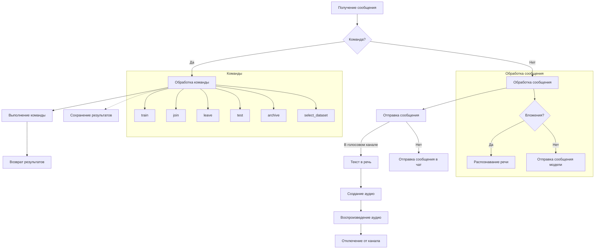
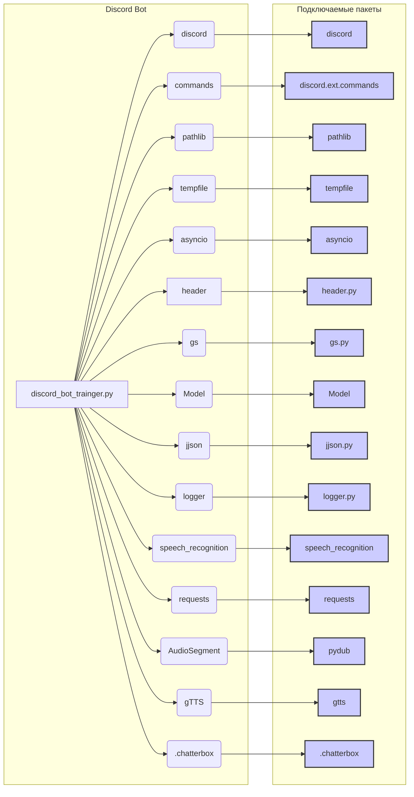

# <input code>

```python
## \file hypotez/src/bots/discord/discord_bot_trainger.py
# -*- coding: utf-8 -*-\n#! venv/Scripts/python.exe
#! venv/bin/python/python3.12

"""
.. module: src.bots.discord 
	:platform: Windows, Unix
	:synopsis:

"""
MODE = 'dev'


"""
	:platform: Windows, Unix
	:synopsis:

"""


"""
	:platform: Windows, Unix
	:synopsis:

"""


"""
  :platform: Windows, Unix

"""
"""
  :platform: Windows, Unix
  :platform: Windows, Unix
  :synopsis:
"""MODE = 'dev'
  
""" module: src.bots.discord """


import discord
from discord.ext import commands
from pathlib import Path
import tempfile
import asyncio
import header
from src import gs
from src.ai.openai.model.training import Model
from src.utils.jjson import j_loads_ns, j_loads_ns, j_dumps
from src.logger import logger
import speech_recognition as sr  # Библиотека для распознавания речи
import requests  # Для скачивания файлов
from pydub import AudioSegment  # Библиотека для конвертации аудио
from gtts import gTTS  # Библиотека для текстового воспроизведения
from .chatterbox import *

# Указываем путь к ffmpeg
path_to_ffmpeg = str(fr"{gs.path.bin}\\ffmpeg\\bin\\ffmpeg.exe")
AudioSegment.converter = path_to_ffmpeg

# Command prefix for the bot
PREFIX = '!'

# Create bot object
intents = discord.Intents.default()
intents.message_content = True
intents.voice_states = True
bot = commands.Bot(command_prefix=PREFIX, intents=intents)

# Create model object
model = Model()

@bot.event
async def on_ready():
    """Called when the bot is ready."""
    logger.info(f'Logged in as {bot.user}')

@bot.command(name='hi')
async def hi(ctx):
    """Welcome message."""
    logger.info(f'hi({ctx})')
    await ctx.send('HI!')
    return True

# ... (other commands) ...

# ... (other commands) ...

async def text_to_speech_and_play(text, channel):
    # ... (implementation) ...

@bot.event
async def on_message(message):
    # ... (implementation) ...

if __name__ == "__main__":
    bot.run(gs.credentials.discord.bot_token)
```

# <algorithm>



**Пример:**

Пользователь отправляет сообщение `!train` с аудио-вложением.  Алгоритм обрабатывает его следующим образом:

1.  **Получение сообщения:** Bot получает сообщение от пользователя.
2.  **Команда?**: Проверяется, начинается ли сообщение с префикса `!` (команда).
3.  **Обработка команды**: Если это команда `!train`, алгоритм переходит в блок `train`.
4.  **train**: Извлекается вложение.
5.  **Распознавание речи (если есть вложение)**: Если вложение — аудио, оно распознаётся.
6.  **Выполнение команды**: Модель тренируется с полученными данными.
7.  **Возврат результатов**: Модель возвращает ID задачи обучения.
8.  **Отправка сообщения в чат**:  Бот отправляет сообщение пользователю с ID задачи.


# <mermaid>



# <explanation>

**Импорты**:

- `discord`, `commands`: для взаимодействия с Discord API и создания команд бота.
- `pathlib`, `tempfile`, `asyncio`: для работы с файлами, временными файлами и асинхронными операциями.
- `header`:  Необходим для работы с каким-то внутренним модулем,  его назначение не понятно без просмотра файла `header.py`.
- `gs`:  Скорее всего, внутренний модуль для доступа к конфигурационным данным или ресурсам проекта.  `gs.credentials.discord.bot_token` - пример доступа к токену Discord бота.
- `Model`: класс для работы с моделью обучения.
- `j_loads_ns`, `j_dumps`: Функции для работы с JSON, предположительно для сериализации/десериализации данных.  Эти функции находятся в файле `jjson.py`.
- `logger`: для ведения журналов.
- `speech_recognition`: для распознавания речи.
- `requests`: для скачивания файлов.
- `AudioSegment`: для работы с аудиофайлами.
- `gTTS`: для преобразования текста в речь.
- `.chatterbox`:  Скорее всего, внутренний модуль, содержащий дополнительные функции для взаимодействия с ботом.

**Классы**:

- `Model`: Класс для работы с моделью.  Необходим для тренировки, тестирования и управления моделью.  Подробная информация о его методах (`train`, `predict`, `handle_errors`, `save_job_id`, `select_dataset_and_archive`, `archive_files`) необходима для полного понимания.

**Функции**:

- `on_ready()`: Инициализирующая функция, вызываемая при запуске бота. Записывает информацию в лог.
- `hi(ctx)`: Команда приветствия.
- `join(ctx)`: Подключает бота к голосовому каналу пользователя.
- `leave(ctx)`: Отключает бота от голосового канала.
- `train(ctx, data, data_dir, positive, attachment)`: Тренирует модель. Получает данные (`data`), директорию данных (`data_dir`), флаг `positive` и вложение (`attachment`). Сохраняет ID задачи в логе.
- `test(ctx, test_data)`: Тестирует модель. Принимает тестовые данные в формате JSON.
- `archive(ctx, directory)`: Архивирует файлы в указанном каталоге.
- `select_dataset(ctx, path_to_dir_positive, positive)`: Выбирает набор данных для обучения и архивирует его.
- `instruction(ctx)`: Выводит инструкции из файла `bot_instruction.md`.
- `correct(ctx, message_id, correction)`:  Получает исправление для предыдущего ответа.  Записывает исправление в `corrections_log.txt`
- `feedback(ctx, feedback_text)`: Получает обратную связь о модели.
- `getfile(ctx, file_path)`: Отправляет файл в Discord.

**Переменные**:

- `MODE`: Свидетельствует о том, что у бота есть режим работы.
- `PREFIX`: Префикс команды для бота.
- `path_to_ffmpeg`: Путь к исполняемому файлу ffmpeg.
- `intents`: Объект для определения намерений Discord бота.
- `bot`: Объект Discord бота.

**Возможные ошибки и улучшения**:

- Отсутствует обработка ошибок при распознавании речи.
- `j_loads_ns` и `j_loads` выглядят идентично; возможно, имеется ошибка в имени.
-  В коде используется `AudioSegment.converter`. Лучше использовать более изящный подход к работе с аудио.
- Файл `corrections_log.txt` должен быть достаточно безопасным при записи данных (проверки на корректность).
- В коде отсутствует проверка наличия файла `bot_instruction.md`.
- Необходим детальный осмотр функций `recognizer` и `text_to_speech_and_play` и  возможности ошибок во время использования этих функций (недостаточно информации для оценки).

**Взаимосвязи с другими частями проекта**:

Код взаимодействует с другими частями проекта через импорты (`gs`, `Model`, `jjson`, `logger`, `chatterbox`).  Для полного понимания потребуется изучить структуру проекта и содержимое файлов, на которые ссылаются эти импорты. Например, `gs` указывает на наличие файлов, управляющих конфигурацией.