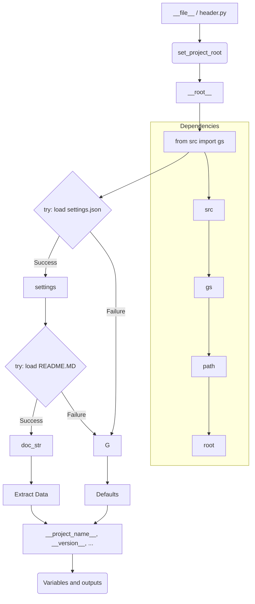

```MD
# <input code>

```python
## \file hypotez/src/bots/discord/header.py
# -*- coding: utf-8 -*-
#! venv/Scripts/python.exe
#! venv/bin/python/python3.12

"""
.. module: src.bots.discord 
	:platform: Windows, Unix
	:synopsis:

"""


"""
	:platform: Windows, Unix
	:synopsis:

"""


"""
	:platform: Windows, Unix
	:synopsis:

"""


"""
  :platform: Windows, Unix

"""
"""
  :platform: Windows, Unix
  :platform: Windows, Unix
  :synopsis:
"""
  
""" module: src.bots.discord """

import sys
import json
from packaging.version import Version

from pathlib import Path
def set_project_root(marker_files=('__root__')) -> Path:
    """
    Finds the root directory of the project starting from the current file's directory,
    searching upwards and stopping at the first directory containing any of the marker files.

    Args:
        marker_files (tuple): Filenames or directory names to identify the project root.
    
    Returns:
        Path: Path to the root directory if found, otherwise the directory where the script is located.
    """
    __root__:Path
    current_path:Path = Path(__file__).resolve().parent
    __root__ = current_path
    for parent in [current_path] + list(current_path.parents):
        if any((parent / marker).exists() for marker in marker_files):
            __root__ = parent
            break
    if __root__ not in sys.path:
        sys.path.insert(0, str(__root__))
    return __root__


# Get the root directory of the project
__root__ = set_project_root()
"""__root__ (Path): Path to the root directory of the project"""

from src import gs

settings:dict = None
try:
    with open(gs.path.root / 'src' /  'settings.json', 'r') as settings_file:
        settings = json.load(settings_file)
except (FileNotFoundError, json.JSONDecodeError):
    ...

doc_str:str = None
try:
    with open(gs.path.root / 'src' /  'README.MD', 'r') as settings_file:
        doc_str = settings_file.read()
except (FileNotFoundError, json.JSONDecodeError):
    ...


__project_name__ = settings.get("project_name", 'hypotez') if settings  else 'hypotez'
__version__: str = settings.get("version", '')  if settings  else ''
__doc__: str = doc_str if doc_str else ''
__details__: str = ''
__author__: str = settings.get("author", '')  if settings  else ''
__copyright__: str = settings.get("copyrihgnt", '')  if settings  else ''
__cofee__: str = settings.get("cofee", "Treat the developer to a cup of coffee for boosting enthusiasm in development: https://boosty.to/hypo69")  if settings  else "Treat the developer to a cup of coffee for boosting enthusiasm in development: https://boosty.to/hypo69"
```

# <algorithm>

**Шаг 1:**  Импортирует необходимые модули: `sys`, `json`, `Version` из `packaging` и `Path` из `pathlib`.  
**Пример:** `import sys`, `import json`

**Шаг 2:** Определяет функцию `set_project_root` для поиска корневой директории проекта.
   - Принимает кортеж `marker_files` с файлами или каталогами, указывающими на корень проекта.
   - Начинает поиск с текущей директории.
   - Перебирает родительские директории, пока не найдет директорию содержащую хотя бы один файл из `marker_files`.
   - Если корневой каталог найден, добавляет его в `sys.path`.
   - Возвращает найденную директорию (`Path`).
   **Пример:** Если `marker_files` содержит `pyproject.toml`, и `__file__` указывает на `hypotez/src/bots/discord/header.py`, то `set_project_root` найдет директорию `hypotez`.

**Шаг 3:** Вызывает функцию `set_project_root` для получения корневой директории проекта. Сохраняет результат в переменной `__root__`.
**Пример:** `__root__ = set_project_root()`

**Шаг 4:** Импортирует модуль `gs` из `src`.
**Пример:** `from src import gs`

**Шаг 5:** Пытается загрузить настройки из файла `settings.json` в директории `src`.
**Пример:** `settings = json.load(settings_file)`

**Шаг 6:** Пытается загрузить строку документации из файла `README.MD` в директории `src`.
**Пример:** `doc_str = settings_file.read()`

**Шаг 7:** Извлекает данные из загруженных настроек, присваивая значения соответствующим переменным, используя метод `get()`. В случае если `settings` не существует, то используется значение по умолчанию.
**Пример:** `__project_name__ = settings.get("project_name", 'hypotez') if settings else 'hypotez'`


# <mermaid>



**Объяснение зависимостей в диаграмме:**

- `header.py` зависит от функции `set_project_root` для определения корневой директории.
- `header.py` импортирует модуль `gs` из пакета `src`.
- Модуль `gs` импортирует модуль `path` - возможно, для работы с путями к файлам.
- Пакет `src` содержит файл `settings.json` и `README.MD`.
- `header.py` использует `json` и `pathlib` для работы с файлами.


# <explanation>

**Импорты:**

- `sys`:  Используется для манипуляций с путями и добавления корневой директории в `sys.path`.
- `json`:  Для загрузки настроек из файла `settings.json`.
- `packaging.version`:  Возможно, используется для проверки версий, но конкретного использования нет.
- `pathlib`: Для работы с путями к файлам.

**Классы:**

- Нет определенных классов в данном коде.

**Функции:**

- `set_project_root(marker_files)`: Находит корневой каталог проекта, начиная с текущего файла и поднимаясь вверх по директориям.  Алгоритм поиска описан в разделе "Алгоритм работы". Важно, что она корректирует `sys.path`, добавляя в него найденный корневой каталог. Это необходимо для импорта модулей из других частей проекта.

**Переменные:**

- `MODE`, `__root__`, `settings`, `doc_str`, `__project_name__`, `__version__`, `__doc__`, `__details__`, `__author__`, `__copyright__`, `__cofee__`: Определены как глобальные переменные.


**Возможные ошибки и улучшения:**

- **Обработка ошибок:**  Блоки `try...except` для загрузки настроек и документации - хорошо, но можно добавить более информативные сообщения об ошибках (например, `print(f"Ошибка загрузки настроек: {e}")`).
- **Улучшение кода:**  Можно сделать функцию `set_project_root` более универсальной, передавая путь к файлу, а не корневой каталог (при этом передача пути к файлу в методе `__file__` может быть не эффективной).
- **Использование `Path`:**  Код использует `Path` для работы с файлами, что хорошо, но можно использовать `Path` и для построения путей к файлам настроек и README, это сделает код более компактным и читаемым.
- **Типизация:**  Добавление аннотаций типов делает код более самодокументирующим и позволяет использовать статическую проверку типов.
- **Более понятные имена переменных:** Несколько переменных имеют длинные имена (например, `__cofee__`).  Использование более коротких и понятных имён (например, `project_name`) улучшит читаемость.


**Взаимосвязи с другими частями проекта:**

Код явно зависит от модуля `gs`, который, скорее всего, предоставляет функции для работы с путями к файлам внутри проекта.  `gs` используется для получения корневого каталога.  Код также зависит от файла `settings.json`, содержащего настройки, и файла `README.MD` с текстовой документацией.  Указанные зависимости предполагают, что эти файлы существуют и содержат необходимую информацию.