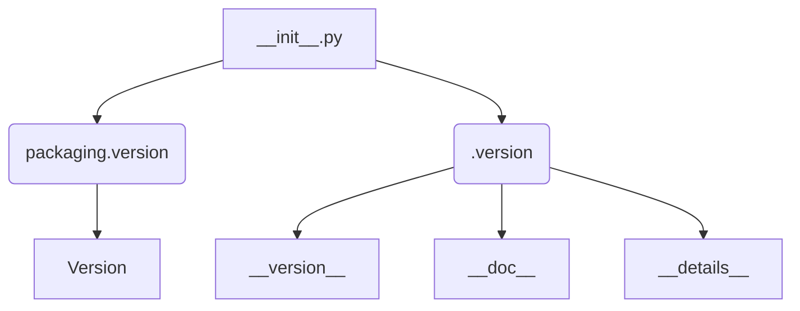

# <input code>

```python
## \file hypotez/src/category/_examples/__init__.py
# -*- coding: utf-8 -*-\

#! venv/bin/python/python3.12

"""
.. module: src.category._examples 
	:platform: Windows, Unix
	:synopsis:

"""


"""
	:platform: Windows, Unix
	:synopsis:

"""


"""
	:platform: Windows, Unix
	:synopsis:

"""


"""
  :platform: Windows, Unix

"""
"""
  :platform: Windows, Unix
  :platform: Windows, Unix
  :synopsis:
"""
  
""" module: src.category._examples """


""" @namespace src.category._examples """


""" """
...

from packaging.version import Version
from .version import __version__, __doc__, __details__
```

# <algorithm>

Код представляет собой модуль инициализации, `__init__.py`, для пакета `src.category._examples`.  В нем отсутствуют сложные алгоритмы, но присутствуют стандартные действия по импорту.

**Пошаговая блок-схема:**

1. **Импорт:** Модуль импортирует функцию `Version` из пакета `packaging.version`.  
2. **Импорт:** Модуль импортирует переменные `__version__`, `__doc__` и `__details__` из подмодуля `version`.  `version` находится в подпапке `./version` внутри папки  `src/category/_examples`.

**Примеры:**

* **Шаг 1:** При импорте `Version` из `packaging.version` доступна функция обработки версий, например, для сравнения.
* **Шаг 2:** При импорте `__version__` из `.version`, доступна переменная, содержащая версию модуля `src.category._examples`.

**Перемещение данных:**

В данном случае нет передачи данных между функциями/классами, только импорт.


# <mermaid>



**Объяснение диаграммы:**

* `__init__.py` импортирует из `packaging.version` функцию `Version`.
* `__init__.py` импортирует `__version__`, `__doc__` и `__details__` из `./version`.
* Все эти компоненты (функция `Version` и переменные `__version__`, `__doc__`, `__details__`) находятся в отдельной части проекта.

# <explanation>

* **Импорты:**
    * `from packaging.version import Version`: Импортирует функцию `Version` из пакета `packaging`.  `packaging` - пакет, предназначенный для работы с версиями пакетов Python.  Он необходим, вероятно, для обработки или сравнения версий в коде.
    * `from .version import __version__, __doc__, __details__`: Импортирует переменные `__version__`, `__doc__` и `__details__` из файла `version.py` в текущем каталоге.  Это стандартный подход для определения метаданных (версия, документация и т. д.) для модуля.


* **Классы:**
    * Нет определенных классов.

* **Функции:**
    * Нет определенных функций.

* **Переменные:**
    * ``: Переменная, вероятно, определяет режим работы (например, разработка, производство).  Использование подобной переменной, без дальнейшего использования, показывает, что, скорее всего, эта переменная нужна для управления логикой модуля, а не для использования в текущем файле `__init__.py`.

* **Возможные ошибки или области для улучшений:**
    * Отсутствие документации внутри кода, кроме документации docstrings (как пример, в `__init__.py`). Добавьте подробные комментарии к переменной `MODE` (значение, смысл, использование), если это необходимо для понимания.


* **Взаимосвязи с другими частями проекта:**
    * `packaging` — внешний пакет, который используется для работы с версиями Python-пакетов.
    * `.version` — подмодуль, в котором определены переменные, необходимые для текущего модуля.


**Выводы:**

Модуль `__init__.py` выполняет чистое инициализационное действие, импортируя элементы из внешнего пакета и подмодулей.  Он является частью структурированного проекта, предполагающего разделение логики на модули и подмодули.