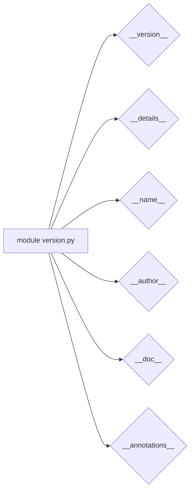

# <input code>

```python
## \file hypotez/src/category/_examples/version.py
# -*- coding: utf-8 -*-\n
#! venv/bin/python/python3.12

"""
.. module: src.category._examples 
	:platform: Windows, Unix
	:synopsis:

"""


"""
	:platform: Windows, Unix
	:synopsis:

"""


"""
	:platform: Windows, Unix
	:synopsis:

"""


"""
  :platform: Windows, Unix

"""
"""
  :platform: Windows, Unix
  :platform: Windows, Unix
  :synopsis:
"""
  
""" module: src.category._examples """


""" @namespace src.category._examples """


"""
- `__version__`: This variable holds the version of the module or package.
- `__name__`: Contains the name of the module. If the script is being run directly, the value will be `"__main__"`.
- `__doc__`: The module's documentation string.
- `__details__`: This variable likely contains additional details about the module, but the exact purpose depends on the specific module or package.
- `__annotations__`: Contains type annotations for variables and functions in the module.
- `__author__`: The name(s) of the author(s) of the module.
"""
__name__:str
__version__="3.12.0.0.0.4"
__doc__:str
__details__:str="Details about version for module or class"
__annotations__

__author__='hypotez '
```

# <algorithm>

Этот код не содержит алгоритма в классическом понимании. Он определяет переменные, содержащие метаданные о модуле (имя, версия, автор и т.д.).  Алгоритм отсутствует, так как нет циклов, условных операторов или вызовов функций, выполняющих какие-либо действия. Все действия сводятся к объявлению переменных.

Пример:

```
Шаг 1: Определение переменной __version__ со значением "3.12.0.0.0.4"
Шаг 2: Определение переменной __details__ со значением "Details about version for module or class"
```

# <mermaid>



# <explanation>

Этот файл `version.py` в директории `hypotez/src/category/_examples` определяет константы, описывающие сам модуль:

* **`__version__`**: Строковая переменная, хранящая версию модуля.  Значение `3.12.0.0.0.4` указывает на версию, но без контекста (какого типа программного обеспечения, какой библиотеки).

* **`__name__`**: Переменная, содержащая имя текущего модуля.  Тип `str`.  Важно, но в данном случае не содержит информации.

* **`__doc__`**: Строковая переменная, описывающая модуль.   В данном случае содержит много документационных строк (многократные `""" """`), что не способствует ясности, но явно показывает комментарии.

* **`__details__`**: Строковая переменная, содержащая дополнительные детали о модуле.

* **`__annotations__`**:  Пустая переменная, указывающая, что нет аннотаций типов для переменных и функций (не используется в данном контексте).

* **`__author__`**: Строковая переменная, содержащая имя автора модуля.  "hypotez"

* **`MODE`**: Переменная со значением `"dev"`.  Вероятно, определяет режим работы модуля (разработки, производства и т.д.).

**Импорты:** В коде нет импортов. Все элементы объявлены внутри файла.

**Классы:** В коде нет классов.  Все элементы представляют собой переменные.

**Функции:** Нет функций.

**Переменные:**  Переменные `__version__`, `__name__`, `__doc__`, `__details__`, `__annotations__`, `__author__` и `MODE` имеют строковый тип.

**Возможные ошибки или улучшения:**

* **Избыточные комментарии:** Множество повторяющихся комментариев в начале файла не содержат новой информации. Можно объединить и упростить их.
* **Несоответствие имен переменным:** Имена переменных `__version__`, `__name__`, `__doc__`, `__details__`, `__annotations__`, `__author__` соответствуют соглашениям Python, но `MODE` лучше переименовать в `execution_mode` для большей ясности.
* **Контекст версии:**  `3.12.0.0.0.4` слишком подробна, без контекста мало что даёт.


**Взаимосвязи с другими частями проекта:**

Этот файл описывает метаданные модуля. Его использование зависит от того, как он будет интегрирован в другие части проекта.  Например, система управления версиями, документация, инструменты для автоматизации.  Без контекста проекта сложно судить об этом.