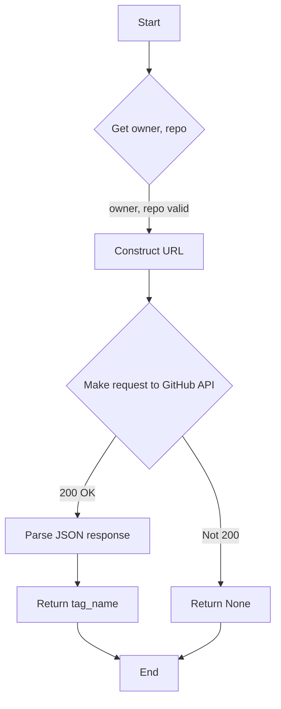
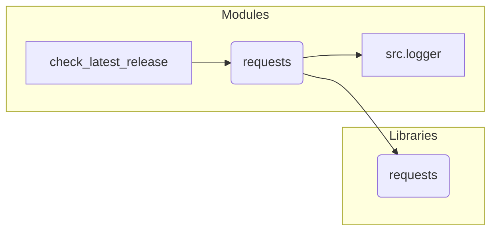

```MD
1. **<input code>**:

```python
## \file hypotez/src/check_release.py
# -*- coding: utf-8 -*-
#! venv/Scripts/python.exe
#! venv/bin/python/python3.12

"""
.. module: src 
	:platform: Windows, Unix
	:synopsis:

"""


import requests
from src.logger import logger

def check_latest_release(owner: str, repo: str):
    """Check the latest release version of a GitHub repository.

    Args:
        owner (str): The owner of the repository.
        repo (str): The name of the repository.

    Returns:
        str: The latest release version if available, else None.
    """
    url = f'https://api.github.com/repos/{owner}/{repo}/releases/latest'
    response = requests.get(url)

    if response.status_code == 200:
        latest_release = response.json()
        return latest_release['tag_name']
    else:
        #logger.error(f"Error fetching data: {response.status_code}")
        #TODO: Код не проверен
        return
```

2. **<algorithm>**:



**Пример:**

Если `owner` = "octocat" и `repo` = "Spoon-Knife", то `url` будет `https://api.github.com/repos/octocat/Spoon-Knife/releases/latest`. Запрос отправляется к GitHub API, если ответ HTTP 200, то из JSON ответа извлекается `tag_name` (например, "v1.0.0") и возвращается.  Если ответ не 200, то функция возвращает `None`.

3. **<mermaid>**:



**Объяснение диаграммы:**

Функция `check_latest_release` использует модуль `requests` для взаимодействия с GitHub API и `src.logger` для логирования. `requests` - внешний модуль, а `src.logger` - это модуль, вероятно, созданный в текущем проекте (`src`).  Зависимости `requests` и `src.logger` показываются в виде подграфов.

4. **<explanation>**:

* **Импорты**:
    * `requests`: Библиотека для отправки HTTP-запросов.  Она необходима для взаимодействия с GitHub API. Импортируется напрямую, без использования `src.`.
    * `src.logger`: Вероятно, содержит функцию или класс для логирования ошибок. `src` означает, что этот модуль находится в подпапке `src` текущего проекта.  Его использование позволяет записывать сообщения об ошибках или другие важные данные в лог.

* **Классы**: Нет определённых классов.

* **Функции**:
    * `check_latest_release(owner: str, repo: str)`:
        * Принимает на вход две строки: `owner` (владелец репозитория) и `repo` (название репозитория).
        * Формирует URL для запроса к GitHub API.
        * Отправляет GET-запрос на этот URL используя `requests.get()`.
        * Проверяет код ответа (`response.status_code`). Если код 200, то парсит JSON ответ.
        * Извлекает значение `tag_name` из результата `response.json()`.
        * Возвращает значение `tag_name` или `None`, если запрос неудачен.


* **Переменные**:
    * `MODE`: Строковая переменная, содержащая значение 'dev'.  Скорее всего, используется для выбора режима работы.
    * `url`: Строковая переменная, содержащая сгенерированный URL запроса.
    * `response`: Объект класса `requests.Response`, хранящий результат запроса.
    * `latest_release`: Словарь, содержащий данные последней версии релиза.


* **Возможные ошибки/улучшения**:

    * **Обработка ошибок:**  Код содержит комментарий `#TODO: Код не проверен`.  Важно добавить подробную обработку ошибок (`try...except` блоков) для перехвата и логирования исключений, например, если API недоступен или произошла ошибка при парсинге JSON.  Сейчас, если происходит ошибка (код ответа не 200), функция просто возвращает `None`. Нужно дополнить проверкой на исключения (`requests` или `JSON`).
    * **Логирование:** Комментарий `#logger.error(...)` предполагает, что `src.logger` должен использоваться для логирования ошибок. Необходимо его разблокировать и использовать.
    * **Обработка пустого ответа:** Функция должна обрабатывать случай, когда у репозитория нет релизов. API GitHub может вернуть пустой ответ в этом случае.
    * **Увеличение читабельности:**  Можно добавить несколько дополнительных `print`-ов для отладки, или использовать `logging` вместо `print`.  Возможно, будет полезно разбить код на более мелкие функции для улучшения читабельности.
    * **Типизация:** Возможно, стоит использовать аннотации типов (типизация) и для `latest_release`, если известно, что это словарь или объект.


**Цепочка взаимосвязей с другими частями проекта**:

Функция `check_latest_release` взаимодействует с модулем `src.logger` для логирования и, вероятно, используется другими частями проекта, например, для обновления информации о версии приложения.